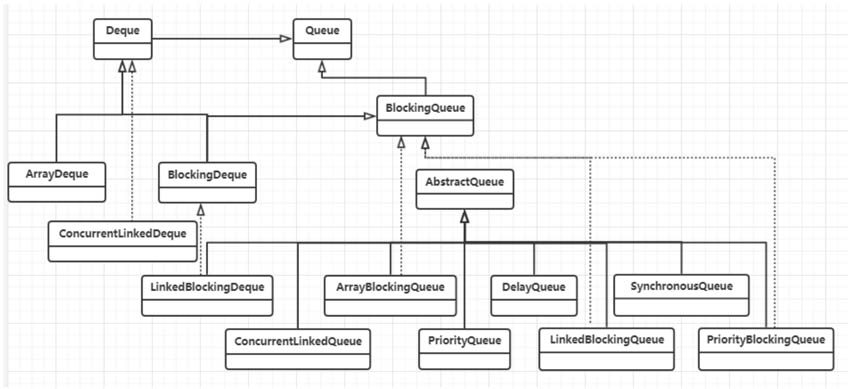

 # Java基础

## 接口和抽象类

### 接口

接口是对行为的抽象，是抽象方法的集合，利用接口可以达到API定义和实现的分离。

接口可以**多继承**

可以定义接口域（变量）、default默认实现、接口方法

```java
//接口
public interface InterFaceTest {
    // 接口中的域将被自动的设置为 public final static
    public final static int a = 1;
    
	//jdk 1.8可以定义default方法
    public default void abc() {
        System.out.println("sss");
    }
    //接口中的方法自动被设置为public，所以当接口和抽象类同时定义了同名，
    //同参数方法时，当抽象类方法访问权限低于public时会报错（默认方法冲突）
    public void move();
    
    //jdk 1.8 支持接口定义静态方法
    public static void get(){
        System.out.println("get");
    }
    //当然静态方法的接口是不行的
    //public static void set(); 这种会报错
}
//函数式接口 常见于Runnable等
//注意函数式接口只能由一个抽象方法 default和static方法不影响，因为已经有了实现
@FunctionalInterface//注解只是做检查用，检查是否符合函数式接口，如果是函数式接口，加不加都可以。
public interface FunInterFace {
    void speak();

    default void helloDefault() {
        System.out.println("helloDefault");
    }

    static void helloStatic() {
        System.out.println("helloStatic");
    }

    //会报错，因为函数式接口只能有一个抽象方法
    //void hello();
}
```

### 抽象类

抽象类是不能实例化的类，用abstract修饰，主要目的是代码复用（常见于模板模式）

```java
public abstract class Father {

    private String name;

    public void setName(String name) {
        this.name = name;
    }

    public String getName() {
        return name;
    }
}
```

### 解决默认方法冲突

如果先在接口中将一个方法定义为default，然后又在一个超类中或另一个接口中定义了同样的方法

1) 超类优先 

2) 接口冲突 必须覆盖这个方法来解决冲突

## 继承实现

> 对象加载初始化顺序（底层是JVM决定的）：

**静态变量->静态初始化块** （同样在第一次主动调用时初始化，且初始化一次）

类变量->初始化块->构造器 （这部分属于实例化）

> 对于继承关系（对应JVM的类加载，初始化）：

父类 静态变量 静态初始化块

子类 静态变量 静态初始化块

**上面这些其实是在类加载，初始化第一次主动调用类变量时就已经初始化**

**下面这些属于实例化类**

父类 变量初始化块

父类 构造器

子类 变量初始化块

子类 构造器

### 访问控制符

private 仅本类可见

protected 本包，子类，本类可见

public 所有类可见

无修饰符 默认本包可见 (当子类不在同一个包下，不可见)

### 方法调用

结合JVM invoke 动态绑定(这个是底层实现原理) 《深入理解JVM虚拟机》302页

`invokestatic` `invokespecial` `invokevirtual` `invokeinterface` `invokedynamic`

具体表象：《Java核心技术 卷I》155页

下面假设要调用x.f（args），隐式参数x声明为类C的一个对象。下面是调用过程的详细描述：

1）**编译器查看对象的声明类型和方法名。**假设调用x.f（param），且隐式参数x声明为C类的对象。需要注意的是：有可能存在多个名字为f，但参数类型不一样的方法。例如，可能存在方法f（int）和方法f（String）。编译器将会一一列举所有C类中名为f的方法和其超类中访问属性为public且名为f的方法（超类的私有方法不可访问）。

至此，编译器已获得所有可能被调用的候选方法。

2）接下来，**编译器将查看调用方法时提供的参数类型**。如果在所有名为f的方法中存在一个与提供的参数类型完全匹配，就选择这个方法。这个过程被称为**重载解析**（overloading resolution）。例如，对于调用x.f（“Hello”）来说，编译器将会挑选f（String），而不是f（int）。由于允许类型转换（int可以转换成double，Manager可以转换成Employee，等等），所以这个过程可能很复杂。如果编译器没有找到与参数类型匹配的方法，或者发现经过类型转换后有多个方法与之匹配，就会报告一个错误。

至此，编译器已获得需要调用的方法名字和参数类型。

3）如果是private方法、static方法、final方法（有关final修饰符的含义将在下一节讲述）或者构造器，那么编译器将可以准确地知道应该调用哪个方法，我们将这种调用方式称为**静态绑定**（static binding）。与此对应的是，**调用的方法依赖于隐式参数的实际类型**，并且在**运行时实现动态绑定**。在我们列举的示例中，编译器采用动态绑定的方式生成一条调用f（String）的指令。

4）当程序运行，并且采用动态绑定调用方法时，虚拟机一定调用与x所引用对象的实际类型最合适的那个类的方法。假设x的实际类型是D，它是C类的子类。如果D类定义了方法f（String），就直接调用它；否则，**将在D类的超类中寻找**f（String），以此类推。

每次调用方法都要进行搜索，时间开销相当大。因此，虚拟机预先为每个类创建了一个方法表（method table），其中列出了所有方法的签名和实际调用的方法。这样一来，在真正调用方法的时候，虚拟机仅查找这个表就行了。在前面的例子中，虚拟机搜索D类的方法表，以便寻找与调用f（Sting）相匹配的方法。这个方法既有可能是D.f（String），也有可能是X.f（String），这里的X是D的超类。这里需要提醒一点，如果调用super.f（param），编译器将对隐式参数超类的方法表进行搜索。

## IO 

### 网络编程

- 服务器实例化一个 `ServerSocket` 对象，表示通过服务器上的端口通信。
- 服务器调用 `ServerSocket` 类的 accept() 方法，该方法将一直等待，直到客户端连接到服务器上给定的端口。
- 服务器正在等待时，一个客户端实例化一个 Socket 对象，指定服务器名称和端口号来请求连接。
- Socket 类的构造函数试图将客户端连接到指定的服务器和端口号。如果通信被建立，则在客户端创建一个 Socket 对象能够与服务器进行通信。
- 在服务器端，accept() 方法返回服务器上一个新的 socket 引用，该 socket 连接到客户端的 socket。

对于NIO来说 `ServerSocketChannel` 也是如此，监听端口，新建一个 `SocketChannel` 引用。

因此java多路复用` epoll`实际指的是 `Selector.select` 方法（调用`Linux`的`epoll`函数），用轮询等方法轮询这些Channel事件，进行管理。实际上 `ServerSocketChannel SocketChannel DatagramChannel` 这些类都实现了 `SelectableChannel` 抽象类(只有实现该抽象类的Channel才能注册到Selector，`FileChannel` 没有实现，不能被Selector 多路复用)。

[selector介绍](http://ifeve.com/selectors/)

### 各种 IO

(同步、异步、阻塞、非阻塞)

这里复制了2次，即物理设备到内核缓冲区，内核缓冲区到用户缓冲区

- 客户端请求：Linux通过网卡读取客户端的请求数据，将数据读取到内核缓冲区。
-  获取请求数据：Java服务器通过read系统调用，从Linux内核缓冲区读取数据，再送入Java进程缓冲区。
-  服务器端业务处理：Java服务器在自己的用户空间中处理客户端的请求。
-  服务器端返回数据：Java服务器完成处理后，构建好的响应数据，将这些数据从用户缓冲区写入内核缓冲区。这里用到的是write系统调用。
-  发送给客户端：Linux内核通过网络IO，将内核缓冲区中的数据写入网卡，网卡通过底层的通信协议，会将数据发送给目标客户端。


### 多路复用IO (epoll)

- 选择器注册。在这种模式中，首先，将需要read操作的目标socket网络连接，提前注册到select/epoll选择器中，Java中对应的选择器类是Selector类。然后，才可以开启整个IO多路复用模型的轮询流程。
- 就绪状态的轮询。通过选择器的查询方法，查询注册过的所有socket连接的就绪状态。通过查询的系统调用，内核会返回一个就绪的socket列表。当任何一个注册过的socket中的数据准备好了，内核缓冲区有数据（就绪）了，内核就将该socket加入到就绪的列表中。
  当用户进程调用了select查询方法，那么整个线程会被阻塞掉。
- 用户线程获得了就绪状态的列表后，根据其中的socket连接，发起read系统调用，用户线程阻塞。内核开始复制数据，将数据从内核缓冲区复制到用户缓冲区。
- 复制完成后，内核返回结果，用户线程才会解除阻塞的状态，用户线程读取到了数据，继续执行。

```bash
# linux指令
ps -ef|grep java # 查看所有java的pid
# 每个pid对应/proc下一个文件夹
cd /proc
cd /{pid}
# 文件描述符在fd文件夹下
cd fd
# 这样就能看到所有IO的对文件描述符的操作
```


见[nettystudy](../nettystudy)

Java NIO

redis -> epoll

nginx -> epoll

netty -> epoll

tomcat -> epoll

rocketMQ -> netty

kafka -> netty

### BIO 阻塞IO


[code](./src/main/java/BIO)

### NIO 非阻塞IO


[code](./src/main/java/NIO)

### AIO 异步非阻塞IO

- 当用户线程发起了read系统调用，立刻就可以开始去做其他的事，用户线程不阻塞。
- 内核就开始了IO的第一个阶段：准备数据。等到数据准备好了，内核就会将数据从内核缓冲区复制到用户缓冲区（用户空间的内存）。
- 内核会给用户线程发送一个信号（Signal），或者回调用户线程注册的回调接口，告诉用户线程read操作完成了。
- 用户线程读取用户缓冲区的数据，完成后续的业务操作


[code](./src/main/java/AIO)

### Java NIO 和 BIO

- BIO是面向流的，NIO是面向缓冲区的

OIO是面向字节流或字符流的，在一般的OIO操作中，我们以流式的方式顺序地从一个流（Stream）中读取一个或多个字节，因此，我们不能随意地改变读取指针的位置。而在NIO操作中则不同，NIO中引入了Channel（通道）和Buffer（缓冲区）的概念。读取和写入，只需要从通道中读取数据到缓冲区中，或将数据从缓冲区中写入到通道中。NIO不像OIO那样是顺序操作，可以随意地读取Buffer中任意位置的数据。

- BIO阻塞，NIO非阻塞
- BIO没有选择器，NIO有

#### 部分Linux命令

`nc localhost port` 连接

`strace -ff -o out /usr/xxx/java TestSocket` -ff抓取 -o 输出到out 追踪操作系统调用

`ulimit -SHn 1000000` 设置文件打开数量配置（仅在当前用户环境有效） 一般netty和ElasticSearch都应该配置

 其中 -S为==软性极限值== -H表示==硬性极限值== $2^{20}$为最大值 

终极解除Linux系统的最大文件打开数量的限制，可以通过编辑Linux的极限配置文件`/etc/security/limits.conf`来解决，修改此文件，加入如下内容：

    soft nofile 1000000 
    hard nofile 1000000
soft nofile表示软性极限，hard nofile表示硬性极限。

避免超过==1024==的连接导致 `Socket/File:Can’t open so many files` 

`netstat -natp` 查看网络端口连接（监听）状态

`/proc/pid/fd` linux万物皆文件，proc下一个进程一个文件

#### BIO NIO 多路复用器（select， poll， epoll）Linux底层

BIO阻塞

accept(2,... 处阻塞

read(5,... 处阻塞

NIO非阻塞 
底层调用`system.call`  `socket`  

`fcntl (O_Non-BLOCK)` 

accept()立即返回 -1 或 具体客户端

read()立即返回 -1 或 具体数据

多路复用

[Linux IO](https://segmentfault.com/a/1190000003063859)

select() jdk1.4前采用，单个进程能够监视的文件描述符数量linux默认为1024

轮询文件描述符。

epoll() 事件驱动不轮询 epoll使用一个文件描述符管理多个描述符，将用户关系的文件描述符的事件存放到内核的一个事件表中，这样在用户空间和内核空间的copy只需一次。

```java
socket.configureBlocking(false);
while(){
    client = socket.accpet()//不阻塞
    client.configureBlocking(false);
    list.add(client)
    for(Socket s: list){
        s.read()//不阻塞
    }
}
```
Java NIO 就是`select()`利用epoll多路复用器，对每一个事件,Key,自主的进行read

`epoll_create`

`epoll_wait`

`epoll_ctl`

### zero copy

[知乎](https://zhuanlan.zhihu.com/p/78869158)

传统数据流 如IO最开始的图，拷贝了4次


零拷贝减少了数据从内核空间到用户空间的复制，数据直接在内核空间中移动（ 通过调用Linux `sendfile`方法） 


### Reactor模式

[Doug Lea 的 Scalable IO of Java](http://gee.cs.oswego.edu/dl/cpjslides/nio.pdf)

主要由两大角色组成：Reactor反应器线程、Handlers处理器

- Reactor线程的职责，负责响应IO事件，并且分发到Handlers处理器。

- Handlers处理器的职责，非阻塞执行业务处理逻辑

> Connection Per Thread

BIO 通常由于阻塞，采用一个线程处理一个链接的模式(Connection Per Thread) 早期tomcat 缺点在于：

对应大量链接，需要耗费大量线程资源，对线程资源要求太高。

线程创建、销毁、切换代价大。

> Reactor

Reactor反应器：负责查询IO事件，当检测到一个IO事件，将其发送给相应的Handler处理器去处理。这里的IO事件，就是NIO中选择器监控的通道IO事件。
Handler处理器：与IO事件（或者选择键）绑定，负责IO事件的处理。完成真正的连接建立、通道的读取、处理业务逻辑、负责将结果写出到通道等。

> 单线程Reactor

```java
 //单线程Reactor模式 采用以下两种函数来完成
 selectionKey.attach(new AcceptorHandler()); // 塞入处理类
 selectionKey.attachment(); // 取出处理类
```

单线程Reactor模式下，反应器Reactor和处理器Handler都执行在同一个线程上，当其中一个Handler阻塞时，
会导致其他所有的Handler都无法执行。当被阻塞的Handler不仅仅负责输入和输出处理的业务，还包括负责监听连接的
`AcceptorHandler`，一旦被阻塞，会导致整个服务不能接收新的连接，使得服务器变得不可用。

> 多线程Reactor

（1）将负责输入输出处理的`IOHandler`处理器的执行，放入独立的线程池中。这样，业务处理线程与负责服务监听和IO事件查询的反应器线程相隔离，避免服务器的连接监听受到阻塞。
（2）如果服务器为多核的CPU，可以将反应器线程拆分为多个子反应器`（SubReactor）`线程；同时，引入多个选择器，每一个`SubReactor`子线程负责一个选择器。这样，充分释放了系统资源的能力；也提高了反应器管理大量连接，提升选择大量通道的能力。

## 细节

### 栈（运算）

[你真的了解 i++, ++i 和 i+++++i 以及 i+++i++ 吗？](http://blog.itpub.net/31561266/viewspace-2222093/)

[关于自增变量的一道面试题 int i = 1;i=i++结果是多少?](https://www.fznjava.cn/300.html)

```java
i = 1;
i += i++; //这个比较容易记错
System.out.println(i);
```

[code](./src/main/java/MainTest.java)


## proxy 动态代理

[code](./src/main/java/proxy)

## reference 四种引用：

[code](./src/main/java/reference)

- 强引用 Strong Reference `A a = new A();`
- 软引用 Soft Reference `SoftReference<Object> m = new SoftReference<>(new Object());`

    在使用软引用时，如果内存的空间足够，软引用就能继续被使用，而不会被垃圾回收器回收；只有在内存空间不足时，软引用才会被垃圾回收器回收

- 弱引用 Weak Reference `WeakReference<Object> o = new WeakReference<>(new Object());`
  
    JVM 进行垃圾回收，一旦发现弱引用对象，无论当前内存空间是否充足，都会将弱引用回收。
    目前已知用在了TreadLocal map中
    
- 虚引用 Phantom Reference

## serializable 序列化

Java序列化必须实现Serializable接口，具体仅做标记用，其中@Transient 标记该变量不参与序列化

序列化还有 `Json` 方式以及 `protoBuf` 等等可以实现

## Redis

[jedis](./src/main/java/jedis)

## JVM虚拟机

### 垃圾收集器

分代收集：

- 弱分代假说 绝大多数的对象都是朝生夕灭的

- 强分代假说 熬过越多次垃圾收集过程的对象就越难消亡

####  根节点枚举：

##### GC Roots

（**全局性引用**、**执行上下文** 即 常量、类静态属性、栈帧中本地变量表）

- 虚拟机栈（栈帧中本地变量表）中引用的对象。 线程中被调用的方法堆栈中使用到的参数、局部变量、临时变量等。
- 方法区中类静态属性引用的对象。Java类的引用类型静态变量。
- 方法区中常量引用的对象。字符串常量池里的引用。
- 本地方法栈JNI(Native)引用的对象
- 虚拟机中内部引用
- 同步锁(synchronized)持有的对象
- 反应Java虚拟机内部情况的JMXBean、JVMTI中注册的回调、本地代码缓存等。

需要暂停用户线程（目前所有收集器 G1、CMS、ZGC等）

`OopMap` (`Oop` 普通对象指针)一旦类加载动作完成，就会把对象内什么偏移量上是什么类型的数据计算出来。之后直接扫描引用

##### 安全点


## Collection框架

[collection框架概览](https://www.cnblogs.com/bingyimeiling/p/10255037.html)

分为Collection和Map两类


### List

#### ArrayList

数组实现，随机访问效率高O(1)，读快写慢（写可能涉及元素移动）

```java
private transient Object[] elementData;//数据域

private int size;//当前list长度 elementData的length必然大于等于size

protected transient int modCount=0;//继承自AbstractList，记录了ArrayList结构性变化的次数 包括add、remove、addAll、removeRange、clear。

private static final int MAX_ARRAY_SIZE=Integer.MAX_VALUE-8;//数组长度上限，-8是防止vm内存溢出错误
```

注意这里`elementData`被transient修饰，但是序列化却能正常的序列化和反序列化。

那么为什么不直接用`elementData`来序列化，而采用上面的方式来实现序列化呢？主要的原因是`elementData`是一个缓存数组，为了性能的考虑，它通常会预留一些容量，当容量不足时会扩充容量，因此，可能会有大量的空间没有实际存储元素。采用上面的方式来实现序列化可以保证只序列化实际有值的那些元素，而不序列化整个数组。（通过重写`writeObject`方法被序列化方法反射调用）

默认创建长度为10 `public ArrayList()` 方法

**容量修正**主要是两个方向：**多余和不足**。

这里涉及的关键方法是 `grow(int)`，该方法的`int`参数指定了“本次扩容所允许的最小容量”。在`ArrayList`里，除了外部直接调用`ensureCapacity`方法间接地调用外，`grow`只会被`add`或`addAll`触发。此时，所需要的最小容量一定是超出当前`elementData`的长度的。

`grow`的逻辑很简单。首先，找出当前容量，把新容量设置为旧容量的**1.5倍**，如果新容量比可用最小容量（形参）要小，那么设置新容量为最小容量；如果新容量比极限容量常量要大，那么设置为极限容量常量和最大的整型数中的大值。接着，使用该新容量初始化一个新的数组，将原有`elementData`中的元素**等位复制**过去。

```java
    private void grow(int minCapacity) {
        // overflow-conscious code
        int oldCapacity = elementData.length;
        int newCapacity = oldCapacity + (oldCapacity >> 1);//这里，1.5倍
        if (newCapacity - minCapacity < 0)
            newCapacity = minCapacity;
        if (newCapacity - MAX_ARRAY_SIZE > 0)
            newCapacity = hugeCapacity(minCapacity);
        // minCapacity is usually close to size, so this is a win:
        elementData = Arrays.copyOf(elementData, newCapacity);//旧的复制到新的
    }
```

`remove` 可以传入`int`和Object，通过`System.arrayCopy`方法吧index之后的数据向前移动，返回被删除元素。

`removeAll` 调用`batchRemove(Collection,boolean)` 

```java
//complement中true表示retainAll false表示removeAll 
private boolean batchRemove(Collection<?> c, boolean complement) {
        final Object[] elementData = this.elementData;
        int r = 0, w = 0;//r是读取过的索引，w是写入过的索引
        boolean modified = false;
        try {
            for (; r < size; r++)
                if (c.contains(elementData[r]) == complement)
                    elementData[w++] = elementData[r];//其实就是双指针，r 一直往后走，w 只保存留下的元素
        } finally {
            // Preserve behavioral compatibility with AbstractCollection,
            // even if c.contains() throws.
            if (r != size) {
                System.arraycopy(elementData, r,
                                 elementData, w,
                                 size - r);
                w += size - r;
            }
            if (w != size) {
                // clear to let GC do its work
                for (int i = w; i < size; i++)
                    elementData[i] = null;//把剩下的 w 之后的变为null
                modCount += size - w;
                size = w;
                modified = true;
            }
        }
        return modified;
    }
```

迭代器

迭代器遍历和for循环get遍历时间复杂度相同O(n) 但是迭代器较for循环较慢，因为有很多判断`hasNext`，`next()`方法等，在大数据量下明显。

`modCount`是用来统计`ArrayList`修改次数的，`expectedModCount`则是在`Iteractor`初始化时记录的`modCount`的值。每次`Iteractor.next()`方法调用时，都会调用`checkForComnodification()`方法检查`ArrayList`是否被修改，如果发现List被修改，那么就会抛出异常。实现fail-fast机制

```java
if(modCount != expectedModCount) throw new ConcurrentModificationException();
```

#### LinkedList

顺序访问、写块读慢

```java
transient int size = 0;//标记序列大小

transient Node<E> first;//链表头结点

transient Node<E> last;//链表尾节点

//与ArrayList相同，通过重写wirteObject和 readObject方法来序列化对象
```

构造方法无需初始化任何对象

```java
private static class Node<E> {
    E item;
    Node<E> next;//后继
    Node<E> prev;//前驱

    Node(Node<E> prev, E element, Node<E> next) {
        this.item = element;
        this.next = next;
        this.prev = prev;
    }
}
```

get方法，通过遍历（优化了的）

```java
Node<E> node(int index) {
    // assert isElementIndex(index);

    if (index < (size >> 1)) {//判断index是在前半还是后半，在按顺序查找
        Node<E> x = first;
        for (int i = 0; i < index; i++)
            x = x.next;
        return x;
    } else {
        Node<E> x = last;
        for (int i = size - 1; i > index; i--)
            x = x.prev;
        return x;
    }
}
```

### Queue

先进先出 `AbstractQueue、ArrayBlockingQueue、Concurrent LinkedQueue、LinkedBlockingQueue、DelayQueue、LinkedList、PriorityBlockingQueue、PriorityQueue`和`ArrayDqueue`。



#### PriorityQueue

```java
transient Object[] queue;//存值数组
private int size = 0;//元素数量
private final Comparator<? super E> comparator;//比较器，可以为null，null时 E 必须实现Comparable接口
```

扩容：

```java
private void grow(int minCapacity) {
    int oldCapacity = queue.length;
    // Double size if small; else grow by 50%
    int newCapacity = oldCapacity + ((oldCapacity < 64) ?
                                     (oldCapacity + 2) :
                                     (oldCapacity >> 1));//长度小，扩容一倍 oldCapacity+oldCapacity+2 长度长则1.5被
    // overflow-conscious code 溢出效验
    if (newCapacity - MAX_ARRAY_SIZE > 0)
        newCapacity = hugeCapacity(minCapacity);
    queue = Arrays.copyOf(queue, newCapacity);
}
```

heapify方法和最小堆（小顶堆） **标准的建堆操作**

建堆时间复杂度 $O(log_2n)$

小顶堆，完全二叉树，上升和下沉操作，堆顶是最小元素

数组 左孩子下标 $left(i) = 2*i+1$ 右孩子下标 $right = left(i)+1$

```java
private void heapify() {
    for (int i = (size >>> 1) - 1; i >= 0; i--)//从后往前遍历对每个元素进行下沉
        siftDown(i, (E) queue[i]);
}
private void siftDown(int k, E x) {
    if (comparator != null)
        siftDownUsingComparator(k, x);
    else
        siftDownComparable(k, x);
}

private void siftDownComparable(int k, E x) {
    Comparable<? super E> key = (Comparable<? super E>)x;
    int half = size >>> 1;        // loop while a non-leaf 只查找非叶子节点
    while (k < half) {
        int child = (k << 1) + 1; //左孩子 2 * i + 1
        Object c = queue[child];
        int right = child + 1; //右孩子 left + 1
        //取左右孩子中较小/大（通过compareTo来调整可以）的那个
        if (right < size &&
            ((Comparable<? super E>) c).compareTo((E) queue[right]) > 0)
            c = queue[child = right];
        //父节点比最小孩子小，说明满足小顶堆，结束循环
        if (key.compareTo((E) c) <= 0)
            break;
        //否则交换父节点和最小孩子的位置，继续沉降
        queue[k] = c;
        k = child;
    }
    queue[k] = key;
}
```

上浮

```java
//offer()调用，往size处添加，即添加到最后
private void siftUpComparable(int k, E x) {
    Comparable<? super E> key = (Comparable<? super E>) x;
    while (k > 0) {
        int parent = (k - 1) >>> 1; //找到父节点
        Object e = queue[parent];
        //父节点较小/大时，满足循环，终止循环
        if (key.compareTo((E) e) >= 0)
            break;
        //否则和父节点交换，继续上浮
        queue[k] = e;
        k = parent;
    }
    queue[k] = key;
}
```

poll()函数

同样标准的获取操作，即交换头尾，重新维护堆

```java
public E poll() {
    if (size == 0)
        return null;
    int s = --size;
    modCount++;
    E result = (E) queue[0];//获取队头
    E x = (E) queue[s];//获取队尾
    queue[s] = null;//清理队尾
    if (s != 0)//头尾不同，即表示size!=1
        siftDown(0, x);//重新把尾部塞入堆中
    return result;
}
```

### Map

#### HashMap

[Java集合之HashMap详解](https://www.fznjava.cn/286.html)

当且仅当`hashCode`和`equals`对比一直的对象，才会被`HashMap`当做同一个对象

##### Java7版本

头插法，不能保证原有的顺序，会导致在多线程环境下形成一个环形链表，从而造成死锁

单向链表数组

长度始终保持**2的n次方**

```java
transient Entry<K,V>[] table;//储存数据的核心成员变量

transient int size;//键值对中数量

final float loadFactor;//负载因子，决定table扩容量

////////////////////////////常量/////////////////////////////////////////////

static final int DEFAULT_INITIAL_CAPACITY = 16;//默认的初始化容量，保持2的n次方

static final int MAXIMUM_CAPACITY = 1 << 30;//最大容量

static final float DEFAULT_LOAD_FACTOR = 0.75f;//默认负载因子
```

Node链表节点

```java
//拉链法处理哈希冲突，Node实现Entry接口，只有next指针指向下一个节点
static class Node<K,V> implements Map.Entry<K,V> {
    final int hash;
    final K key;
    V value;
    Node<K,V> next;

    Node(int hash, K key, V value, Node<K,V> next) {
        this.hash = hash;
        this.key = key;
        this.value = value;
        this.next = next;
    }

    public final K getKey()        { return key; }
    public final V getValue()      { return value; }
    public final String toString() { return key + "=" + value; }

    public final int hashCode() {
        return Objects.hashCode(key) ^ Objects.hashCode(value);
    }

    public final V setValue(V newValue) {
        V oldValue = value;
        value = newValue;
        return oldValue;
    }

    public final boolean equals(Object o) {
        if (o == this)
            return true;
        if (o instanceof Map.Entry) {
            Map.Entry<?,?> e = (Map.Entry<?,?>)o;
            if (Objects.equals(key, e.getKey()) &&
                Objects.equals(value, e.getValue()))
                return true;
        }
        return false;
    }
}
```

indexFor()

```java
static int indexFor(int h,int length){
    return h & (length-1);
}
```

h&(length-1) 有什么意义呢？

h 是目标key值的`hashCode`，该`hashCode`最终要被换算为table中的指定下标，那么，如果不发生扩容，那么`hashCode`应当是不能超出length-1的。由此，需要把`hashCode`进行一定变换，保留不超出length的特征值，也即是hash表的冲突处理。

&（与运算）是如何实现这个功能的呢？

这里就涉及了length的特殊性，在之前介绍成员变量的时候有提及过，table的长度一定是2的幂。在二进制表示里，可以认为length一定满足1 << x。也即是10,1000,100000这样的二进制形式。那么length-1，自然就是高位全部为0，低位全部为1的二进制形式。

与运算的特性是：1&1=1，1&0=0，0&1=0。
那么，h&(length-1)的意义就很明确了，假如h>length-1，计算后，超出的位数归零，没有超出的位数不变，举例：

1111 0010 1010 & 0000 1111 1111 = 0000 0010 1010

也即是高位全部归零，而低位保持不变，等同于对h取余，保证计算后的index不会超出table的长度范围。
即是：h小于length-1的时候，取h；h大于length-1的时候，取余数。**相当于对length取余（取余底层是除法实现的，比较慢），不过在当length为2的幂时刚刚好可以用&length-1的方式**。

hash()

```java
final int hash(Object k){
    int h = 0;
    if (useAltHashing){//启用替代的哈希松散算法
        /*
        1 当处理String类型数据时，直接调用sun.misc.Hashing.stringHash32(String)方法来获取最终的哈希值。
        2 当处理其他类型数据时，提供一个相对于HashMap事例唯一且不变的随机值hashSeed作为hashCode计算的初始量。
        */
        
        if(k instanceof String){
            return sun.misc.Hashing.stringHash32((String) k);
        }
        h = hashSeed;//随机值
    }
    h ^= k.hashCode();
    h ^= (h >>> 20) ^ (h >>> 12);
    return h ^ (h >>> 7) ^ ( h>>>4 );
}
```

松散哈希 

松散哈希是指数值尽可能平衡分布的hashCode，在Java语言中，一般会认为hashCode是一个int值，int是一个32bit整型数，比如一个八位十六进制数：1A47F1C0，比之C790 0000就要松散。

解释：C790 0000 如果填入默认容量为16 即 0001 0000 那么 16-1 即 0000 1111 如果后4位都是 0000 （如 000A 0000 ~ FFFF 0000） 那么就会导致**哈希碰撞**计算结果全部为index 0

之后的 **异或操作** 和 **无符号右移**操作，则是把**高位的数据和低位的数据**特性混合起来，使hashCode更加离散。

复习异或操作：

$0\wedge0=0 ; 1\wedge1=0$ 

$0\wedge1 =1; 1\wedge0=1$

##### Java8版本

**尾插法**

Entry变Node，Node有子类 TreeNode

HashMap中的内部类


计算HashCode的Hash方法

做了简化，这是一个经验性质的改进，之前版本采用的多次位移异或计算方式与这种实现方式相比，并不能避免太多的哈希碰撞，反倒增加了计算次数。**HashMap的效率问题主要还是出在链表部分的遍历上**。因此提高链表遍历的效率就能够提高HashMap的效率。所以改为红黑树，而hash方法做了简化。

高16位与低16位做异或操作（java中hash值是int型，32位）

```java
static final int hash(Object key) {
    int h;
    return (key == null) ? 0 : (h = key.hashCode()) ^ (h >>> 16);
}
```

putVal

TREEIFY_THRESHOLD固定为8的原因 $O(log_2N)$ 和 $O(N)$ 之间当数值较小时，查找效率差别不大，Java8决定7为阈值。


```java
final V putVal(int hash, K key, V value, boolean onlyIfAbsent,
               boolean evict) {
    Node<K,V>[] tab; Node<K,V> p; int n, i;
    if ((tab = table) == null || (n = tab.length) == 0)
        n = (tab = resize()).length;
    //计算下标值 和java7相同 (n-1) & hash
    if ((p = tab[i = (n - 1) & hash]) == null)
        tab[i] = newNode(hash, key, value, null);//当下标位置没有节点的时候，直接增加一个链表节点
    else {
        Node<K,V> e; K k;
        if (p.hash == hash &&
            ((k = p.key) == key || (key != null && key.equals(k))))
            e = p;
        else if (p instanceof TreeNode)//当下标位置为树节点时，增加一个树节点
            e = ((TreeNode<K,V>)p).putTreeVal(this, tab, hash, key, value);
        else {
            for (int binCount = 0; ; ++binCount) {//遍历链表
                if ((e = p.next) == null) {
                    //遍历到链表尾，新增一个节点
                    p.next = newNode(hash, key, value, null);
                    //TREEIFY_THRESHOLD常量，固定为 8
                    if (binCount >= TREEIFY_THRESHOLD - 1) // -1 for 1st 如果链表深度达到或超过建树阈值
                        treeifyBin(tab, hash);//重构链表为树
                    break;
                }
                //根据hash和key判断是否重复，以决定替代某个节点还是新增节点
                if (e.hash == hash &&
                    ((k = e.key) == key || (key != null && key.equals(k))))
                    break;
                p = e;
            }
        }
        if (e != null) { // existing mapping for key
            V oldValue = e.value;
            if (!onlyIfAbsent || oldValue == null)
                e.value = value;
            afterNodeAccess(e);
            return oldValue;
        }
    }
    ++modCount;
    if (++size > threshold)//如果尺寸超过负载因子*容量，就扩容
        resize();
    afterNodeInsertion(evict);
    return null;
}

final TreeNode<K,V> putTreeVal(HashMap<K,V> map, Node<K,V>[] tab,
                                       int h, K k, V v) {
            Class<?> kc = null;
            boolean searched = false;
            TreeNode<K,V> root = (parent != null) ? root() : this;
            for (TreeNode<K,V> p = root;;) {
                int dir, ph; K pk;
                if ((ph = p.hash) > h)
                    dir = -1;
                else if (ph < h)
                    dir = 1;
                else if ((pk = p.key) == k || (k != null && k.equals(pk)))
                    return p;
                else if ((kc == null &&
                          (kc = comparableClassFor(k)) == null) ||
                         (dir = compareComparables(kc, k, pk)) == 0) {
                    if (!searched) {
                        TreeNode<K,V> q, ch;
                        searched = true;
                        if (((ch = p.left) != null &&
                             (q = ch.find(h, k, kc)) != null) ||
                            ((ch = p.right) != null &&
                             (q = ch.find(h, k, kc)) != null))
                            return q;
                    }
                    dir = tieBreakOrder(k, pk);
                }

                TreeNode<K,V> xp = p;
                if ((p = (dir <= 0) ? p.left : p.right) == null) {
                    Node<K,V> xpn = xp.next;
                    TreeNode<K,V> x = map.newTreeNode(h, k, v, xpn);
                    if (dir <= 0)
                        xp.left = x;
                    else
                        xp.right = x;
                    xp.next = x;
                    x.parent = x.prev = xp;
                    if (xpn != null)
                        ((TreeNode<K,V>)xpn).prev = x;
                    moveRootToFront(tab, balanceInsertion(root, x));
                    return null;
                }
            }
        }
```

重构链表为树：

```java
final void treeifyBin(Node<K,V>[] tab, int hash) {
    int n, index; Node<K,V> e;
    if (tab == null || (n = tab.length) < MIN_TREEIFY_CAPACITY)
        resize();
    else if ((e = tab[index = (n - 1) & hash]) != null) {
        TreeNode<K,V> hd = null, tl = null;
        do {
            TreeNode<K,V> p = replacementTreeNode(e, null);
            if (tl == null)
                hd = p;
            else {
                p.prev = tl;
                tl.next = p;
            }
            tl = p;
        } while ((e = e.next) != null);
        if ((tab[index] = hd) != null)
            hd.treeify(tab);
    }
}
```

resize扩容

1. 重新规划table长度和阈值，它主要遵循以下的逻辑：
   - 当数据数量（size）超出扩容阈值时，进行扩容：把table的容量增加到旧容量的**两倍**。
   - 如果新的table容量小于默认的初始化容量16，那么将table容量重置为16，阈值重新设置为新容量和加载因子（默认0.75）之积。
   - 如果新的table容量超出或等于最大容量（1<<30），那么**将阈值调整为最大整型数**，并且return，终止整个resize过程。注意，由于size不可能超过最大整型数，所以之后不会再触发扩容。
2. 重新排列数据结点，该操作遍历table上的每一个结点，对它们分别进行处理：
   - 如果结点为null，那么不进行处理。
   - 如果结点不为null且没有next结点，那么重新计算该结点的hash值，存入新的table中。
   - 如果结点为树结点(TreeNode)，那么调用该树结点的split方法处理，该方法用于对红黑树进行调整，如果红黑树太小，则将其退化为链表。
   - 如果以上条件都不满足，那么说明结点为链表结点。根据hashcode计算出来的下标不会超出table容量，超出的位数会被设为0，而resize进行扩容后，table容量发生了变化，同一个链表里有部分结点的下标也应当发生变化。所以，需要把链表拆成两部分，分别为hashCode超出旧容量的链表和未超出容量的链表。对于hash&oldCap==0的部分，不需要做处理；反之，则需要被存放到新的下标位置上，公式如下所示：
     **新下标=原下标+旧容量**；
     该等式是个巧算，利用了位运算以及容量必然是2的指数的特性。

```java
final Node<K,V>[] resize() {
    Node<K,V>[] oldTab = table;
    int oldCap = (oldTab == null) ? 0 : oldTab.length;
    int oldThr = threshold;
    int newCap, newThr = 0;
    if (oldCap > 0) {
        //旧容量超过最大，就不扩容了
        if (oldCap >= MAXIMUM_CAPACITY) {
            threshold = Integer.MAX_VALUE;
            return oldTab;//直接返回
        }
        //扩容后（扩容两倍）小于最大，大于默认容量16的话，就正常的扩容两倍
        else if ((newCap = oldCap << 1) < MAXIMUM_CAPACITY &&
                 oldCap >= DEFAULT_INITIAL_CAPACITY)
            newThr = oldThr << 1; // double threshold
    }
    else if (oldThr > 0) // initial capacity was placed in threshold
        newCap = oldThr;
    else {               // zero initial threshold signifies using defaults
        newCap = DEFAULT_INITIAL_CAPACITY;//如果就容量<=0就用默认16
        newThr = (int)(DEFAULT_LOAD_FACTOR * DEFAULT_INITIAL_CAPACITY);//阈值等于 0.75*16 默认值
    }
    if (newThr == 0) {
        float ft = (float)newCap * loadFactor;
        newThr = (newCap < MAXIMUM_CAPACITY && ft < (float)MAXIMUM_CAPACITY ?
                  (int)ft : Integer.MAX_VALUE);
    }
    threshold = newThr;
    @SuppressWarnings({"rawtypes","unchecked"})
        Node<K,V>[] newTab = (Node<K,V>[])new Node[newCap];
    table = newTab;
    if (oldTab != null) {
        //遍历table每个节点，分别处理
        for (int j = 0; j < oldCap; ++j) {
            Node<K,V> e;
            //如果是null就不处理了
            if ((e = oldTab[j]) != null) {
                //如果不是null，将oldTab=null（垃圾回收）
                oldTab[j] = null;
                if (e.next == null)//没有next节点
                    newTab[e.hash & (newCap - 1)] = e;//重新计算index值，存入新table
                else if (e instanceof TreeNode)//如果是TreeNode
                    //split用于对红黑树进行调整
                    ((TreeNode<K,V>)e).split(this, newTab, j, oldCap);
                	//如果红黑树太小就变回链表
                else { // preserve order
                    //如果是链表
                    Node<K,V> loHead = null, loTail = null;
                    Node<K,V> hiHead = null, hiTail = null;
                    Node<K,V> next;
                    do {
                        next = e.next;
                        if ((e.hash & oldCap) == 0) {
                            if (loTail == null)
                                loHead = e;
                            else
                                loTail.next = e;
                            loTail = e;
                        }
                        else {
                            if (hiTail == null)
                                hiHead = e;
                            else
                                hiTail.next = e;
                            hiTail = e;
                        }
                    } while ((e = next) != null);
                    if (loTail != null) {
                        loTail.next = null;
                        newTab[j] = loHead;
                    }
                    if (hiTail != null) {
                        hiTail.next = null;
                        newTab[j + oldCap] = hiHead;
                    }
                }
            }
        }
    }
    return newTab;
}
```