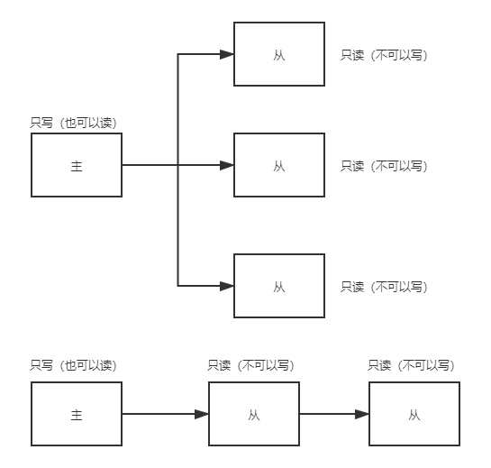

## Redis
### 常用5种数据结构

#### list

#### set

#### zset

#### string

#### hash

-------------------

### 三种特殊的数据类型

#### geospatial

地理空间 可以用来存地理位置(经纬度) 基于zset 可以用zset指令

#### Hyperloglog

Hyperloglog基数统计算法

#### Bitmaps

位储存 统计用户信息，活跃，不活跃，登录打卡。

### 事务

redis单条命令保证原子性，但是事务不保证原子性，没有隔离性一说。

redis到事务:

- 开启事务 multi

- 命令入队
- 执行事务 exec

- 取消事务 discard

```bash
127.0.0.1:6379> multi
OK
127.0.0.1:6379> set k1 v1
QUEUED
127.0.0.1:6379> set k2 v2
QUEUED
127.0.0.1:6379> get k2
QUEUED
127.0.0.1:6379> set k3 v3
QUEUED
127.0.0.1:6379> exec
1) OK
2) OK
3) "v2"
4) OK
```

编译型异常（命令错误，所有命令都不执行）

```bash
127.0.0.1:6379> multi
OK
127.0.0.1:6379> set k1 v1
QUEUED
127.0.0.1:6379> set k1
(error) ERR wrong number of arguments for 'set' command
127.0.0.1:6379> set k2 v2
QUEUED
127.0.0.1:6379> set k3 v3
QUEUED
127.0.0.1:6379> exec
(error) EXECABORT Transaction discarded because of previous errors.
127.0.0.1:6379> get k2
(nil)
127.0.0.1:6379> get k3
(nil)
```

运行时异常 如果事务队列中存在语法性，那么执行命令的时候，其他命令是可以正常执行的

```bash
127.0.0.1:6379> set k1 v1
OK
127.0.0.1:6379> multi
OK
127.0.0.1:6379> incr k1
QUEUED
127.0.0.1:6379> set k2 v2
QUEUED
127.0.0.1:6379> exec
1) (error) ERR value is not an integer or out of range
2) OK
127.0.0.1:6379> get k2
"v2"
```

监视 watch

单线：

```bash
127.0.0.1:6379> set money 100
OK
127.0.0.1:6379> set out 0
OK
127.0.0.1:6379> watch money #监控money对象
OK
127.0.0.1:6379> multi #事务正常结束
OK
127.0.0.1:6379> decrby money 20
QUEUED
127.0.0.1:6379> incrby out 20
QUEUED
127.0.0.1:6379> exec
1) (integer) 80
2) (integer) 20
```

多线：

```bash
# 线程1
127.0.0.1:6379> watch money # 监控money对象
OK
127.0.0.1:6379> multi
OK
127.0.0.1:6379> DECRBY money 10
QUEUED
127.0.0.1:6379> INCRBY out 10
QUEUED
127.0.0.1:6379> exec # 执行前另一个线程修改money值
(nil)
```

```bash
# 线程2
127.0.0.1:6379> get money
"80"
127.0.0.1:6379> set money 1000
OK
```

使用watch可以当作乐观锁

```bash
127.0.0.1:6379> UNWATCH # 解锁
OK
127.0.0.1:6379> watch money
OK
```

### redis.conf

#### 单位：

```bash
# Redis configuration file example.
#
# Note that in order to read the configuration file, Redis must be
# started with the file path as first argument:
#
# ./redis-server /path/to/redis.conf 加载配置文件

# Note on units: when memory size is needed, it is possible to specify
# it in the usual form of 1k 5GB 4M and so forth:
# 可以设置的单位
# 1k => 1000 bytes
# 1kb => 1024 bytes 
# 1m => 1000000 bytes    
# 1mb => 1024*1024 bytes
# 1g => 1000000000 bytes
# 1gb => 1024*1024*1024 bytes
#
# units are case insensitive so 1GB 1Gb 1gB are all the same.对大小写不敏感

```

#### 包含其他配置文件

```bash
################################## INCLUDES ###################################

# Include one or more other config files here.  This is useful if you
# have a standard template that goes to all Redis servers but also need
# to customize a few per-server settings.  Include files can include
# other files, so use this wisely.
#
# Notice option "include" won't be rewritten by command "CONFIG REWRITE"
# from admin or Redis Sentinel. Since Redis always uses the last processed
# line as value of a configuration directive, you'd better put includes
# at the beginning of this file to avoid overwriting config change at runtime.
#
# If instead you are interested in using includes to override configuration
# options, it is better to use include as the last line.
# 类似spring可以包含其他配置文件
# include /path/to/local.conf
# include /path/to/other.conf
```

#### 网络配置

```bash
# 綁定的ip
bind 127.0.0.1
# 保护模式
protected-mode yes
# 端口
port 6379
```

#### 通用配置

```bash
# 以守护进程的方式运行 默认no
daemonize yes
# 如果以后台方式运行，需要指定一个pid文件
pidfile /var/run/redis_6379.pid
# 日志级别
# Specify the server verbosity level.
# This can be one of:
# debug (a lot of information, useful for development/testing) 就是debug
# verbose (many rarely useful info, but not a mess like the debug level)
# notice (moderately verbose, what you want in production probably) 生产环境
# warning (only very important / critical messages are logged)
loglevel notice
logfile "" # 日志的文件名
# 数据库的数量 默认16
# Set the number of databases. The default database is DB 0, you can select
# a different one on a per-connection basis using SELECT <dbid> where
# dbid is a number between 0 and 'databases'-1
databases 16
```

#### 快照

```bash
################################ SNAPSHOTTING  ################################
#
# Save the DB on disk:
#
#   save <seconds> <changes>
```

持久化，在规定时间内，执行了多少次操作，则会持久化到文件 .rdb.aof

redis内存数据库

```bash
# 如果900秒内，至少有1个key进行了修改，就进行持久化操作
save 900 1
# 如果900秒内，至少有10个key进行了修改，就进行持久化操作
save 300 10
# 如果60秒内，至少有10000个key进行了修改，就进行持久化操作
save 60 10000

# 持久化出错是否继续保存
stop-writes-on-bgsave-error yes 
# 是否压缩rdb文件
rdbcompression yes
# 保存rdb的错误校验
rdbchecksum yes
# rdb文件保存目录
dir ./
```

#### 主从复制 REPLICATION

```bash
################################# REPLICATION #################################

# Master-Replica replication. Use replicaof to make a Redis instance a copy of
# another Redis server. A few things to understand ASAP about Redis replication.
#
#   +------------------+      +---------------+
#   |      Master      | ---> |    Replica    |
#   | (receive writes) |      |  (exact copy) |
#   +------------------+      +---------------+
#
# 1) Redis replication is asynchronous, but you can configure a master to
#    stop accepting writes if it appears to be not connected with at least
#    a given number of replicas.
# 2) Redis replicas are able to perform a partial resynchronization with the
#    master if the replication link is lost for a relatively small amount of
#    time. You may want to configure the replication backlog size (see the next
#    sections of this file) with a sensible value depending on your needs.
# 3) Replication is automatic and does not need user intervention. After a
#    network partition replicas automatically try to reconnect to masters
#    and resynchronize with them.
#
# replicaof <masterip> <masterport>
replicaof <masterip> <masterport> # 主机 主机端口

masterauth <master-password> # 如果有密码配置上密码
```

#### 安全 SECURITY

```bash
################################## SECURITY ###################################

# Warning: since Redis is pretty fast an outside user can try up to
# 1 million passwords per second against a modern box. This means that you
# should use very strong passwords, otherwise they will be very easy to break.
# Note that because the password is really a shared secret between the client
# and the server, and should not be memorized by any human, the password
# can be easily a long string from /dev/urandom or whatever, so by using a
# long and unguessable password no brute force attack will be possible.

# Redis ACL users are defined in the following format:
#
#   user <username> ... acl rules ...
#
# For example: 设置密码
#
#   user worker +@list +@connection ~jobs:* on >ffa9203c493aa99

```

```bash
#设置密码的指令
127.0.0.1:6379> config get requirepass # 获取密码
127.0.0.1:6379> config set requirepass "123456" #设置密码
127.0.0.1:6379> auth "123456" # 重新登录
```

#### Client限制 CLIENTS

```bash
maxclients 10000 # redis客户端最大访问连接限制
```
#### MEMORY MANAGEMENT

```bash
############################## MEMORY MANAGEMENT ################################

maxmemory <bytes> # 最大内存限制

# volatile-lru -> Evict using approximated LRU, only keys with an expire set.
# allkeys-lru -> Evict any key using approximated LRU.
# volatile-lfu -> Evict using approximated LFU, only keys with an expire set.
# allkeys-lfu -> Evict any key using approximated LFU.
# volatile-random -> Remove a random key having an expire set.
# allkeys-random -> Remove a random key, any key.
# volatile-ttl -> Remove the key with the nearest expire time (minor TTL)
# noeviction -> Don't evict anything, just return an error on write operations.

# LRU means Least Recently Used
# LFU means Least Frequently Used

maxmemory-policy noeviction # 超过最大内存的处理策略
```

#### (AOF)  APPEND ONLY MODE

将所有命令都记录下来，history，恢复时将所有命令都重新执行一遍（日志）

以日志的形式记录每个写操作，将redis执行过的指令记录下来。只许追加不许改写

```bash
# 默认不开启aof模式，默认使用rdb方式持久化
appendonly no #手动配置yes开启

# The name of the append only file (default: "appendonly.aof")

appendfilename "appendonly.aof"

# appendfsync always # 有修改就同步
appendfsync everysec # 每秒同步，可能会丢失这一秒的数据
# appendfsync no # 不同步
```

```shell
meerkatx@ubuntu:/usr/local/bin$ ls
appendonly.aof  redis-benchmark  redis-check-rdb  redisconfig     redis-server
dump.rdb        redis-check-aof  redis-cli        redis-sentinel
```

```bash
###如果文件出错

root@ubuntu:/usr/local/bin# vim appendonly.aof 
root@ubuntu:/usr/local/bin# redis-server redisconfig/redis.conf 
7135:C 11 Jul 2020 15:26:13.050 # oO0OoO0OoO0Oo Redis is starting oO0OoO0OoO0Oo
7135:C 11 Jul 2020 15:26:13.050 # Redis version=6.0.5, bits=64, commit=00000000, modified=0, pid=7135, just started
7135:C 11 Jul 2020 15:26:13.050 # Configuration loaded
root@ubuntu:/usr/local/bin# redis-cli
Could not connect to Redis at 127.0.0.1:6379: Connection refused
not connected> 

# 修复重启
root@ubuntu:/usr/local/bin# redis-check-aof --fix appendonly.aof 
0x              6e: Expected prefix '*', got: 'a'
AOF analyzed: size=119, ok_up_to=110, diff=9
This will shrink the AOF from 119 bytes, with 9 bytes, to 110 bytes
Continue? [y/N]: y
Successfully truncated AOF
```

### 持久化 rdb 

主从复制 一般放在子机器中

==快照==

触发机制：

- save规则满足情况下
- 执行flushall
- 退出redis

备份会自动生成

如何恢复rdb文件，放到redis启动目录就可以，启动的时候会自动检查dump.rdb恢复其中数据

```bash
127.0.0.1:6379> config get dir
1) "dir"
2) "/usr/local/bin"
```

适合大规模数据恢复

对数据完整性要求不高


需要一定时间间隔进程操作，如果redis以外宕机，最后一次修改就没了

fork进程会占用一定内存空间

### 发布订阅

用于构建即时通信应用，网络聊天室，实时广播，实时提醒等

订阅，关注系统，实时消息系统

复杂的场景会用消息中间件 MQ kafka

```bash
# 第一个终端订阅消息 xx
127.0.0.1:6379> SUBSCRIBE xx
Reading messages... (press Ctrl-C to quit)
1) "subscribe"
2) "xx"
3) (integer) 1
1) "message" # massage即收到的消息
2) "xx"
3) "hello"

# 第二个终端发布消息 xx hello

127.0.0.1:6379> PUBLISH xx hello
(integer) 1
```

### redis spring boot整合

springbootlearn

### 主从复制

主从复制是，将一台redis服务器的数据复制到其他redis服务器，前者称为主节点(master/leader)，后者称为从节点(slave/follower)；数据的复制是单向的，只能由主节点到从节点。master以写为主，salve以读为主 （**读写分离**）

默认情况下，每台redis服务器都是主节点

redis集群起码三台（**哨兵模式**）通过修改三个不同的配置文件搭建伪集群

```bash
127.0.0.1:6379> info replication # 查看当前库的信息
# Replication
role:master # 角色
connected_slaves:0 # 当前连接的从机
master_replid:e67de434ba19a71116424fb52ac20bccef30c0a7
master_replid2:0000000000000000000000000000000000000000
master_repl_offset:0
second_repl_offset:-1
repl_backlog_active:0
repl_backlog_size:1048576
repl_backlog_first_byte_offset:0
repl_backlog_histlen:0
```

#### 配置

> 从机设置 `SLAVEOF localhost 6379 #### 设置为是 6379 的从机`

```bash
127.0.0.1:6381> info replication
# Replication
role:master
connected_slaves:0
master_replid:613904fd51c1fafba690cb2fd2b6a07fa69f0f68
master_replid2:0000000000000000000000000000000000000000
master_repl_offset:0
second_repl_offset:-1
repl_backlog_active:0
repl_backlog_size:1048576
repl_backlog_first_byte_offset:0
repl_backlog_histlen:0
127.0.0.1:6381> SLAVEOF localhost 6379 #### 设置为是 6379 的从机
OK
127.0.0.1:6381> info replication
# Replication
role:slave  ### 信息变了 slave
master_host:localhost
master_port:6379
master_link_status:up
master_last_io_seconds_ago:6
master_sync_in_progress:0
slave_repl_offset:0
slave_priority:100
slave_read_only:1
connected_slaves:0
master_replid:06582ff45a8b133cf6f3c93ad4a515bff0bad9d2
master_replid2:0000000000000000000000000000000000000000
master_repl_offset:0
second_repl_offset:-1
repl_backlog_active:1
repl_backlog_size:1048576
repl_backlog_first_byte_offset:1
repl_backlog_histlen:0
```

> 主机中可以看到从机的信息：

```bash
127.0.0.1:6379> info replication
# Replication
role:master
connected_slaves:2
slave0:ip=127.0.0.1,port=6381,state=online,offset=238,lag=1
slave1:ip=127.0.0.1,port=6380,state=online,offset=238,lag=0
master_replid:06582ff45a8b133cf6f3c93ad4a515bff0bad9d2
master_replid2:0000000000000000000000000000000000000000
master_repl_offset:238
second_repl_offset:-1
repl_backlog_active:1
repl_backlog_size:1048576
repl_backlog_first_byte_offset:1
repl_backlog_histlen:238

```

```bash
# 从机不能写
127.0.0.1:6381> set k2 v2
(error) READONLY You can't write against a read only replica.
```

#### 断开

主机断开，从机依旧连接到主机，但是无法写。如果主机回来了，主机再写，从机就依然能读到新写入的数据。

如果是实用命令行配置的主从，那么重启就会变成主机。只要变为从机，立马就会从主机中获取值。

- 全量复制 slave服务在接收到数据库文件数据后，将其存盘并加载到内存
- 增量复制 master继续将新的所有收集到的修改命令一次传给slave完成同步

slave启动成功连接到master后会发送一个sync同步命令 master 接到命令，启动后台存盘进程，同时收集所有接收到的用于修改数据集命令，在后台进程执行完毕之后，master将传送到整个数据文件到slave，并完成一次完全同步。

只要重新连接master，一次完全同步（全量复制）将被自动执行，我们的数据可以在从机中看到

#### 主从的两种模型

两种都能主从复制



但是在工作中不会这样搞

