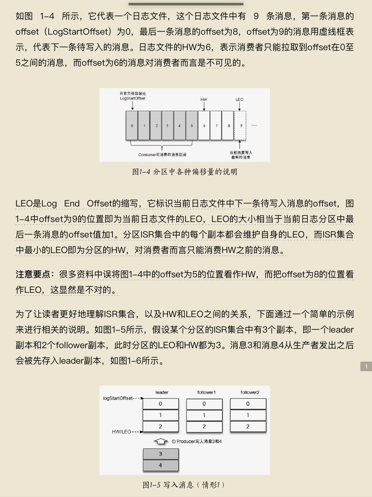
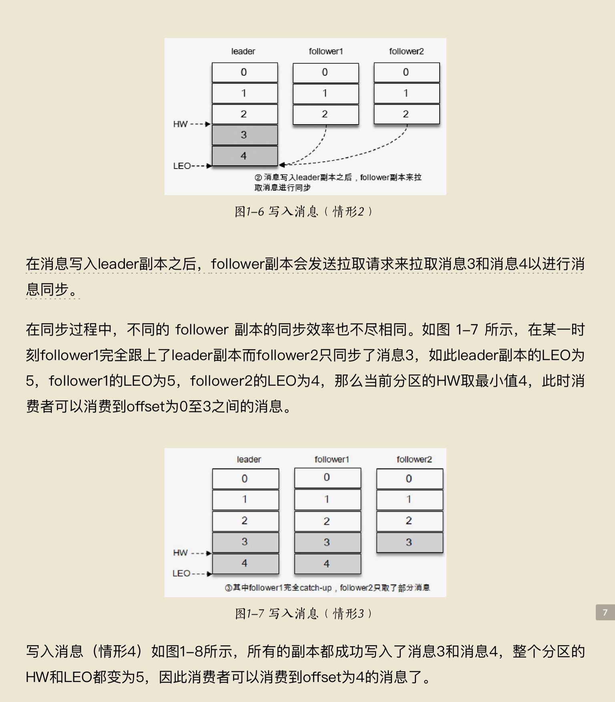
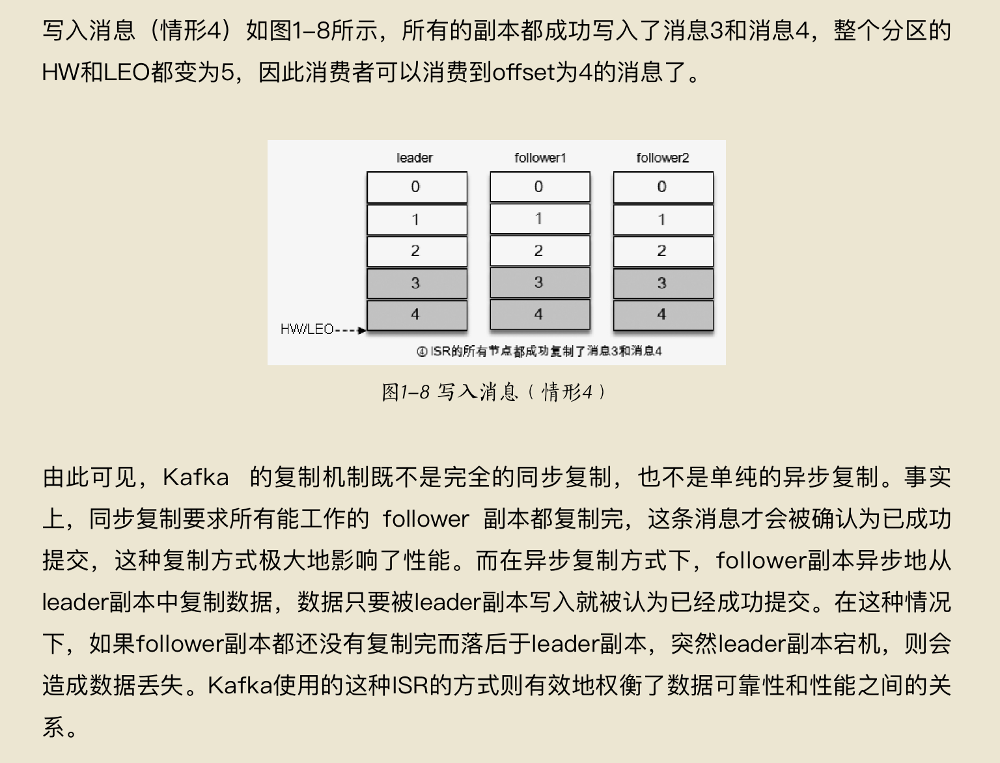

# Kafka

- 消息系统：Kafka 和传统的消息系统（也称作消息中间件）都具备系统解耦、冗余存储、流量削峰、缓冲、异步通信、扩展性、可恢复性等功能。与此同时，Kafka 还提供了大多数消息系统难以实现的消息顺序性保障及回溯消费的功能。
- 存储系统：Kafka 把消息持久化到磁盘，相比于其他基于内存存储的系统而言，有效地降低了数据丢失的风险。也正是得益于Kafka 的消息持久化功能和多副本机制，我们可以把Kafka作为长期的数据存储系统来使用，只需要把对应的数据保留策略设置为“永久”或启用主题的日志压缩功能即可。
- 流式处理平台：Kafka 不仅为每个流行的流式处理框架提供了可靠的数据来源，还提供了一个完整的流式处理类库，比如窗口、连接、变换和聚合等各类操作。

## 配置文件

```bash
############################# Server Basics #############################
# 设置kafka节点唯一ID
broker.id=0

############################# Socket Server Settings #############################

# The address the socket server listens on. It will get the value returned from 
# java.net.InetAddress.getCanonicalHostName() if not configured.
#   FORMAT:
#     listeners = listener_name://host_name:port
#   EXAMPLE:
#     listeners = PLAINTEXT://your.host.name:9092
# 非SASL模式配置kafka集群
listeners=PLAINTEXT://:9092

# Hostname and port the broker will advertise to producers and consumers. If not set, 
# it uses the value for "listeners" if configured.  Otherwise, it will use the value
# returned from java.net.InetAddress.getCanonicalHostName().
#advertised.listeners=PLAINTEXT://your.host.name:9092

# Maps listener names to security protocols, the default is for them to be the same. See the config documentation for more details
#listener.security.protocol.map=PLAINTEXT:PLAINTEXT,SSL:SSL,SASL_PLAINTEXT:SASL_PLAINTEXT,SASL_SSL:SASL_SSL

# The number of threads that the server uses for receiving requests from the network and sending responses to the network
# 设置网络请求处理线程数
num.network.threads=3

# The number of threads that the server uses for processing requests, which may include disk I/O
# 设置磁盘IO请求处理线程数
num.io.threads=8

# The send buffer (SO_SNDBUF) used by the socket server
# 设置发送buffer字节数
socket.send.buffer.bytes=102400

# The receive buffer (SO_RCVBUF) used by the socket server
# 设置接收buffer字节数
socket.receive.buffer.bytes=102400

# The maximum size of a request that the socket server will accept (protection against OOM)
# 设置最大请求字节数
socket.request.max.bytes=104857600


############################# Log Basics #############################

# A comma separated list of directories under which to store log files
# 设置消息记录储存路径
log.dirs=/tmp/kafka-logs

# 设置kafka的主题分区数
num.partitions=1

# The number of threads per data directory to be used for log recovery at startup and flushing at shutdown.
# This value is recommended to be increased for installations with data dirs located in RAID array.
num.recovery.threads.per.data.dir=1

############################# Internal Topic Settings  #############################
# The replication factor for the group metadata internal topics "__consumer_offsets" and "__transaction_state"
# For anything other than development testing, a value greater than 1 is recommended to ensure availability such as 3.
offsets.topic.replication.factor=1
transaction.state.log.replication.factor=1
transaction.state.log.min.isr=1

############################# Log Flush Policy #############################

# Messages are immediately written to the filesystem but by default we only fsync() to sync
# the OS cache lazily. The following configurations control the flush of data to disk.
# There are a few important trade-offs here:
#    1. Durability: Unflushed data may be lost if you are not using replication.
#    2. Latency: Very large flush intervals may lead to latency spikes when the flush does occur as there will be a lot of data to flush.
#    3. Throughput: The flush is generally the most expensive operation, and a small flush interval may lead to excessive seeks.
# The settings below allow one to configure the flush policy to flush data after a period of time or
# every N messages (or both). This can be done globally and overridden on a per-topic basis.

# The number of messages to accept before forcing a flush of data to disk
#log.flush.interval.messages=10000

# The maximum amount of time a message can sit in a log before we force a flush
#log.flush.interval.ms=1000

############################# Log Retention Policy #############################

# The following configurations control the disposal of log segments. The policy can
# be set to delete segments after a period of time, or after a given size has accumulated.
# A segment will be deleted whenever *either* of these criteria are met. Deletion always happens
# from the end of the log.

# 设置主题保留时间
log.retention.hours=168

# A size-based retention policy for logs. Segments are pruned from the log unless the remaining
# segments drop below log.retention.bytes. Functions independently of log.retention.hours.
#log.retention.bytes=1073741824

# The maximum size of a log segment file. When this size is reached a new log segment will be created.
log.segment.bytes=1073741824

# The interval at which log segments are checked to see if they can be deleted according
# to the retention policies
log.retention.check.interval.ms=300000

############################# Zookeeper #############################

# Zookeeper connection string (see zookeeper docs for details).
# This is a comma separated host:port pairs, each corresponding to a zk
# server. e.g. "127.0.0.1:3000,127.0.0.1:3001,127.0.0.1:3002".
# You can also append an optional chroot string to the urls to specify the
# root directory for all kafka znodes.
# 设置zookeeper连接地址
zookeeper.connect=localhost:2181

# 设置zookeeper连接超时时间
zookeeper.connection.timeout.ms=18000


############################# Group Coordinator Settings #############################

# The following configuration specifies the time, in milliseconds, that the GroupCoordinator will delay the initial consumer rebalance.
# The rebalance will be further delayed by the value of group.initial.rebalance.delay.ms as new members join the group, up to a maximum of max.poll.interval.ms.
# The default value for this is 3 seconds.
# We override this to 0 here as it makes for a better out-of-the-box experience for development and testing.
# However, in production environments the default value of 3 seconds is more suitable as this will help to avoid unnecessary, and potentially expensive, rebalances during application startup.
group.initial.rebalance.delay.ms=0

```

## Hello, Kafka!

创建一个主题

```bash
[root@ubuntu:~] kafka-topics.sh --zookeeper localhost:2181 --create --topic topic-demo --replication-factor 1 --partitions 1
Created topic topic-demo.
```

其中 `--zookeeper` 指定了 `kafka` 连接的`zookeeper`服务地址，`--topic` 指定了所要创建主题的名称，`--replication` 指定了副本因子，`–-partitions` 指定了分区个数，`--create` 创建主题的动作指令

`--describe`展示主题更多信息

```bash
[root@ubuntu:~] kafka-topics.sh -zookeeper localhost:2181 --describe --topic topic-demo
Topic: topic-demo	PartitionCount: 1	ReplicationFactor: 1	Configs: 
	Topic: topic-demo	Partition: 0	Leader: 0	Replicas: 0	Isr: 0
```

消费者

```bash
[root@ubuntu:~] kafka-console-consumer.sh  localhost:9092 --topic topic-demo
hello kafka
hello, kafka!
```

`--bootstrap-server`指定了连接的`kafka`集群地址，`–-topic`指定了消费者订阅的主题。

生产者

```bash
[root@ubuntu:~] kafka-console-producer.sh --broker-list localhost:9092 --topic topic-demo
>hello kafka
>hello, kafka!
>
```

`--broker-list` 指定了连接的`kafka`集群地址，`–-topic`指定了消费者订阅的主题。

## spring boot + kafka

demo：

```yaml
# KafkaAutoConfiguration
spring:
  kafka:
    bootstrap-servers: 192.168.10.133:9092
    consumer:
      group-id: 0
      key-deserializer: org.apache.kafka.common.serialization.StringDeserializer
      value-deserializer: org.apache.kafka.common.serialization.StringDeserializer
    producer:
      key-serializer: org.apache.kafka.common.serialization.StringSerializer
      value-serializer: org.apache.kafka.common.serialization.StringSerializer
      batch-size: 65536
      buffer-memory: 524288
```

生产者

```java
@Component
public class KafkaSender {

    @Autowired
    private KafkaTemplate<String,String> kafkaTemplate;

    /**
     * 发送消息到kafka
     */
    public void sendChannelMess(String channel, String message){
        kafkaTemplate.send(channel,message);
    }
}
```

消费者

```java
@Component
public class KafkaConsumer {
    @KafkaListener(topics = {"demo"})
    public void receiveMessage(String message) {
        // KafkaListenerAnnotationBeanPostProcessor 读取kafkaListener注解类
        System.out.println(message);
    }
}
```

Controller

```java
@Controller
@Slf4j
@RequestMapping("/hello")
public class HelloController {

    @Autowired
    public RedisTemplate redisTemplate;//调用redis

    @Autowired
    private KafkaSender kafkaSender;

    @Autowired
    private UserService userService;

    
    @RequestMapping("/send")
    public String send(Model model){
        kafkaSender.sendChannelMess("demo","hello,kafka");
        return "/index.html";
    }
}
```

## 基本概念

1. Producer：生产者，也就是发送消息的一方。生产者负责创建消息，然后将其投递到Kafka中。
2. Consumer：消费者，也就是接收消息的一方。消费者连接到Kafka上并接收消息，进而进行相应的业务逻辑处理。采用的是 **pull** 拉取的形式
3. Broker：服务代理节点。对于Kafka而言，Broker可以简单地看作一个独立的Kafka服务节点或Kafka服务实例。大多数情况下也可以将Broker看作一台Kafka服务器，前提是这台服务器上只部署了一个Kafka实例。一个或多个Broker组成了一个Kafka集群。一般而言，我们更习惯使用首字母小写的broker来表示服务代理节点。

### 主题 分区

在Kafka中还有两个特别重要的概念—主题（Topic）与分区（Partition）。Kafka中的消息以主题为单位进行归类，生产者负责将消息发送到特定的主题（发送到Kafka集群中的每一条消息都要指定一个主题），而消费者负责订阅主题并进行消费

**主题**是一个逻辑上的概念，它还可以细分为多个分区，一个分区只属于单个主题，很多时候也会把分区称为**主题分区**（Topic-Partition）。同一主题下的不同分区包含的消息是不同的，分区在存储层面可以看作一个可追加的日志（Log）文件，消息在被追加到分区日志文件的时候都会分配一个特定的**偏移量**（offset）。offset是消息在分区中的唯一标识，Kafka通过它来保证消息在分区内的顺序性，不过offset并不跨越分区，也就是说，Kafka保证的是**分区有序**而不是主题有序。

每一条消息被发送到broker之前，会根据分区规则选择存储到哪个具体的分区。如果分区规则设定得合理，所有的消息都可以均匀地分配到不同的分区中。如果一个主题只对应一个文件，那么这个文件所在的机器 I/O 将会成为这个主题的性能瓶颈，而分区解决了这个问题。在创建主题的时候可以通过指定的参数来设置分区的个数，当然也可以在主题创建完成之后去修改分区的数量，通过增加分区的数量可以实现水平扩展。

Kafka 为分区引入了**多副本（Replica）机制**，通过增加副本数量可以提升容灾能力。同一分区的不同副本中保存的是相同的消息（在同一时刻，副本之间并非完全一样），副本之间是“一主多从”的关系，其中leader副本负责处理读写请求，follower副本只负责与leader副本的消息同步。副本处于不同的broker中，当leader副本出现故障时，从follower副本中重新选举新的leader副本对外提供服务。Kafka通过多副本机制实现了故障的自动转移，当Kafka集群中某个broker失效时仍然能保证服务可用。

### AR ISR OSR

分区中的**所有副本统称为AR**（Assigned Replicas）。所有与leader副本保持一定程度同步的副本（包括leader副本在内）组成 **ISR**（In-Sync Replicas），ISR集合是AR集合中的一个子集。消息会先发送到leader副本，然后follower副本才能从leader副本中拉取消息进行同步，同步期间内follower副本相对于leader副本而言会有一定程度的滞后。前面所说的“一定程度的同步”是指可忍受的滞后范围，这个范围可以通过参数进行配置。与leader副本**同步滞后过多**的副本（不包括leader副本）组成 **OSR**（Out-of-Sync Replicas），由此可见，**AR=ISR+OSR**。在正常情况下，所有的 follower 副本都应该与 leader 副本保持一定程度的同步，即 AR=ISR，OSR集合为空。

leader副本负责维护和跟踪ISR集合中所有follower副本的滞后状态，当follower副本落后太多或失效时，leader副本会把它从ISR集合中剔除。如果OSR集合中有follower副本“追上”了leader副本，那么leader副本会把它从OSR集合转移至ISR集合。默认情况下，当leader副本发生故障时，只有在ISR集合中的副本才有资格被选举为新的leader，而在OSR集合中的副本则没有任何机会（不过这个原则也可以通过修改相应的参数配置来改变）。

### HW LEO

ISR与HW和LEO也有紧密的关系。HW是High Watermark的缩写，俗称高水位，它标识了一个特定的消息偏移量（offset），消费者只能拉取到这个offset之前的消息。







## 参考文献

《深入理解kafka》