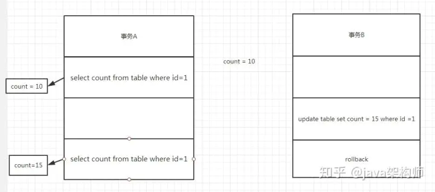
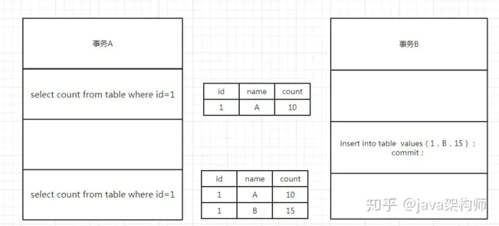
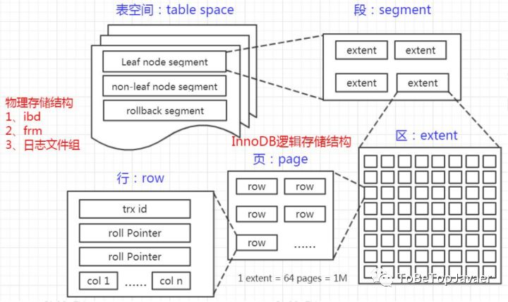
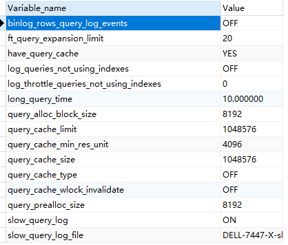
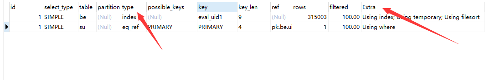
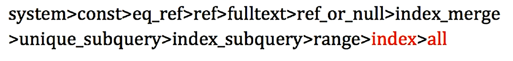
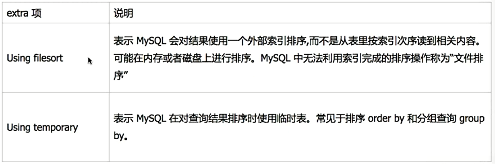

# MySql

## 博客

[Mysql整体架构和sql执行过程](https://mp.weixin.qq.com/s/PEk97JyIlUexuAjFr2pmiw)

[深入底层剖析Mysql索引](https://mp.weixin.qq.com/s/WDeYmrfgPHqg-fGI17qLcw)

[深入底层剖析Mysql各种锁机制（面试必问）](https://mp.weixin.qq.com/s/WgcLdEfjFE3CsWV4FgOefw)

[MySQL 事务机制](https://mp.weixin.qq.com/s/3Zk9Np5c9K0ENz64Y6E92g)

[MySQL 三万字精华总结 + 面试100 问](https://juejin.im/post/6850037271233331208)

## 解析优化

[MySQL 是怎样运行的：从根儿上理解 MySQL](https://juejin.im/book/6844733769996304392)

查询缓存、语法解析、查询优化

#### 查询缓存

`MySQL`服务器程序处理查询请求的过程会把刚刚处理过的查询请求和结果`缓存`起来，如果下一次有一模一样的请求过来，直接从缓存中查找结果。这个查询缓存可以在不同客户端之间共享，也就是说如果客户端A刚刚查询了一个语句，而客户端B之后发送了同样的查询请求，那么客户端B的这次查询就可以直接使用查询缓存中的数据。

当然，`MySQL`服务器并没有人聪明，如果两个查询请求在任何字符上的不同（例如：空格、注释、大小写），都会导致缓存不会命中。另外，如果查询请求中包含某些系统函数、用户自定义变量和函数、一些系统表，如 mysql 、information_schema、 performance_schema 数据库中的表，那这个请求就不会被缓存。以某些系统函数举例，可能同样的函数的两次调用会产生不一样的结果，比如函数`NOW`，每次调用都会产生最新的当前时间，如果在一个查询请求中调用了这个函数，那即使查询请求的文本信息都一样，那不同时间的两次查询也应该得到不同的结果，如果在第一次查询时就缓存了，那第二次查询的时候直接使用第一次查询的结果就是错误的！

不过既然是缓存，那就有它缓存失效的时候。MySQL的缓存系统会监测涉及到的每张表，只要该表的结构或者数据被修改，如对该表使用了`INSERT`、 `UPDATE`、`DELETE`、`TRUNCATE TABLE`、`ALTER TABLE`、`DROP TABLE`或 `DROP DATABASE`语句，那使用该表的所有高速缓存查询都将变为无效并从高速缓存中删除！

> 虽然查询缓存有时可以提升系统性能，但也不得不因维护这块缓存而造成一些开销，比如每次都要去查询缓存中检索，查询请求处理完需要更新查询缓存，维护该查询缓存对应的内存区域。从MySQL 5.7.20开始，不推荐使用查询缓存，并在MySQL 8.0中删除。

#### 语法解析

如果查询缓存没有命中，接下来就需要进入正式的查询阶段了。因为客户端程序发送过来的请求只是一段文本而已，所以`MySQL`服务器程序首先要对这段文本做分析，判断请求的语法是否正确，然后从文本中将要查询的表、各种查询条件都提取出来放到`MySQL`服务器内部使用的一些数据结构上来。

> 这个从指定的文本中提取出我们需要的信息本质上算是一个编译过程，涉及词法解析、语法分析、语义分析等阶段

#### 查询优化

语法解析之后，服务器程序获得到了需要的信息，比如要查询的列是哪些，表是哪个，搜索条件是什么等等，但光有这些是不够的，因为我们写的`MySQL`语句执行起来效率可能并不是很高，`MySQL`的优化程序会对我们的语句做一些优化，如外连接转换为内连接、表达式简化、子查询转为连接吧啦吧啦的一堆东西。优化的结果就是生成一个执行计划，这个执行计划表明了应该使用哪些索引进行查询，表之间的连接顺序是啥样的。我们可以使用`EXPLAIN`语句来查看某个语句的执行计划。

### 存储引擎

截止到服务器程序完成了查询优化为止，还没有真正的去访问真实的数据表，`MySQL`服务器把数据的存储和提取操作都封装到了一个叫`存储引擎`的模块里。我们知道`表`是由一行一行的记录组成的，但这只是一个逻辑上的概念，物理上如何表示记录，怎么从表中读取数据，怎么把数据写入具体的物理存储器上，这都是`存储引擎`负责的事情。为了实现不同的功能，`MySQL`提供了各式各样的`存储引擎`，不同`存储引擎`管理的表具体的存储结构可能不同，采用的存取算法也可能不同。

> 为什么叫`引擎`呢？因为这个名字更拉风～ 其实这个存储引擎以前叫做`表处理器`，后来可能人们觉得太土，就改成了`存储引擎`的叫法，它的功能就是接收上层传下来的指令，然后对表中的数据进行提取或写入操作。

为了管理方便，人们把`连接管理`、`查询缓存`、`语法解析`、`查询优化`这些并不涉及真实数据存储的功能划分为`MySQL server`的功能，把真实存取数据的功能划分为`存储引擎`的功能。各种不同的存储引擎向上边的`MySQL server`层提供统一的调用接口（也就是存储引擎API），包含了几十个底层函数，像"读取索引第一条内容"、"读取索引下一条内容"、"插入记录"等等。

所以在`MySQL server`完成了查询优化后，只需按照生成的执行计划调用底层存储引擎提供的API，获取到数据后返回给客户端就好了。

常用存储引擎

|  存储引擎   |                 描述                 |
| :---------: | :----------------------------------: |
|  `ARCHIVE`  | 用于数据存档（行被插入后不能再修改） |
| `BLACKHOLE` |    丢弃写操作，读操作会返回空内容    |
|    `CSV`    |  在存储数据时，以逗号分隔各个数据项  |
| `FEDERATED` |            用来访问远程表            |
|  `InnoDB`   |    具备外键支持功能的事务存储引擎    |
|  `MEMORY`   |             置于内存的表             |
|   `MERGE`   |   用来管理多个MyISAM表构成的表集合   |
|  `MyISAM`   |       主要的非事务处理存储引擎       |
|    `NDB`    |        MySQL集群专用存储引擎         |

最常用的就是`InnoDB`和`MyISAM`，有时会提一下`Memory`。其中`InnoDB`是`MySQL`默认的存储引擎，存储引擎对于某些功能的支持情况：

|                Feature                | MyISAM | Memory  | InnoDB | Archive |  NDB  |
| :-----------------------------------: | :----: | :-----: | :----: | :-----: | :---: |
|            B-tree indexes             |  yes   |   yes   |  yes   |   no    |  no   |
|     Backup/point-in-time recovery     |  yes   |   yes   |  yes   |   yes   |  yes  |
|       Cluster database support        |   no   |   no    |   no   |   no    |  yes  |
|           Clustered indexes           |   no   |   no    |  yes   |   no    |  no   |
|            Compressed data            |  yes   |   no    |  yes   |   yes   |  no   |
|              Data caches              |   no   |   N/A   |  yes   |   no    |  yes  |
|            Encrypted data             |  yes   |   yes   |  yes   |   yes   |  yes  |
|          Foreign key support          |   no   |   no    |  yes   |   no    |  yes  |
|       Full-text search indexes        |  yes   |   no    |  yes   |   no    |  no   |
|     Geospatial data type support      |  yes   |   no    |  yes   |   yes   |  yes  |
|      Geospatial indexing support      |  yes   |   no    |  yes   |   no    |  no   |
|             Hash indexes              |   no   |   yes   |   no   |   no    |  yes  |
|             Index caches              |  yes   |   N/A   |  yes   |   no    |  yes  |
|          Locking granularity          | Table  |  Table  |  Row   |   Row   |  Row  |
|                 MVCC                  |   no   |   no    |  yes   |   no    |  no   |
|          Query cache support          |  yes   |   yes   |  yes   |   yes   |  yes  |
|          Replication support          |  yes   | Limited |  yes   |   yes   |  yes  |
|            Storage limits             | 256TB  |   RAM   |  64TB  |  None   | 384EB |
|            T-tree indexes             |   no   |   no    |   no   |   no    |  yes  |
|             Transactions              |   no   |   no    |  yes   |   no    |  yes  |
| Update statistics for data dictionary |  yes   |   yes   |  yes   |   yes   |  yes  |

## 事务

### 事务特性

原子性（Atomicity）、一致性（Consistency）、隔离性（Isolation）、持久性（Durability） ACID

### 事务隔离级别

| 隔离级别                     | 脏读   | 不可重复读 | 幻读   |
| ---------------------------- | ------ | ---------- | ------ |
| 未提交读（read uncommitted） | 可能   | 可能       | 可能   |
| 提交读（read committed）     | 不可能 | 可能       | 可能   |
| 可重复读（repetition read）  | 不可能 | 不可能     | 可能   |
| 串行化（serializable）       | 不可能 | 不可能     | 不可能 |

### 脏读



第一步，事务A获取到id=1的count=10，第二步，事务B将id=1的count修改成了15但是没有commit，第三步，事务A又获取了一遍id=1的count的值，发现此时count=15，第四步，事务B回滚后，count又变成了10，但是事务A却已经读到脏数据count=10。

### 不可重复读


不可重复读和脏读的区别就是 **读到的修改的数据是否提交**。

### 幻读




幻读和不可重复读都是一个事务读取到另一个事务的已经提交后的数据，区别在于不可重复读是针对于update和delete，而幻读是针对于insert。

事务A在第二次读取到了事务B新增并且已经commit的数据，所以在第二次事务A读到两条数据，这个结果就叫做幻读。

## MVCC

在InnoDB中，给每行增加两个隐藏字段来实现MVCC，一个用来记录数据行的创建时间，另一个用来记录行的过期时间（删除时间）。

在实际操作中，存储的并不是时间，而是事务的版本号，每开启一个新事务，事务的版本号就会递增。

## 锁机制

表级锁、行级锁、页面锁

### 表锁

锁中粒度最大的一种锁，表示当前的操作对整张表加锁，资源开销比行锁少，不会出现死锁的情况，但是发生锁冲突的概率很大。并发性能差

MyISAM和InnoDB都支持

InnoDB支持表锁，但默认行锁，而且**只有在查询或者其他SQL语句通过索引**才会使用行锁。

**InnoDB之所以可以锁行，是因为Innodb的主索引结构上，既存储了主键值，又直接存储了行数据，可以方便的锁住行数据，而MyIsam索引指向另一片数据文件，没有办法精确锁住数据段**

### 行锁

锁中粒度最小的一种锁，因为锁的粒度很小，所以发生资源争抢的概率也最小，并发性能最大，但是也会造成死锁，每次加锁和释放锁的开销也会变大。

**行锁是基于索引实现的**

InnoDB支持

### 共享锁（S锁，读锁）

多个事务对于同一数据可以共享一把锁，都能访问到数据，但是只能读不能修改。

```sql
select ... lock in share mode
```

### 排他锁（x锁，写锁）

一个事务获取了一个数据行的排他锁，其他事务就不能再获取该行的其他锁

```sql
select ... for update
```

### 意向共享锁、意向排他锁

表级锁

意向共享锁（IS）：事务想要在获得表中某些记录的共享锁，需要在表上先加意向共享锁。

意向互斥锁（IX）：事务想要在获得表中某些记录的互斥锁，需要在表上先加意向互斥锁。

当一个事务在需要获取资源的锁定时，如果该资源已经被排他锁占用，则数据库会自动给该事务申请一个该表的意向锁。如果自己需要一个共享锁定，就申请一个意向共享锁。如果需要的是某行（或者某些行）的排他锁定，则申请一个意向排他锁。

### 乐观锁

不是数据库自带的

在表中的数据进行操作时(更新)，先给数据表加一个**版本(version)**字段，每操作一次，将那条记录的版本号加1。也就是先查询出那条记录，获取出version字段,如果要对那条记录进行操作(更新),则先判断此刻version的值是否与刚刚查询出来时的version的值相等，如果相等，则说明这段期间，没有其他程序对其进行操作，则可以执行更新，将version字段的值加1；如果更新时发现此刻的version值与刚刚获取出来的version的值不相等，则说明这段期间已经有其他程序对其进行操作了，则不进行更新操作。

```sql
SELECT data AS old_data, version AS old_version FROM …;

//根据获取的数据进行业务操作，得到new_data和new_version

UPDATE SET data = new_data, version = new_version WHERE version = old_version

if (updated row > 0) {

// 乐观锁获取成功，操作完成

} else {

// 乐观锁获取失败，回滚并重试

}
```

### 悲观锁

依靠锁机制（排他）

```sql
关闭自动提交后，我们需要手动开启事务。
set autocommit=0;
//1.开始事务

begin; 或者 start transaction;

//2.查询出商品信息，然后通过for update锁定数据防止其他事务修改 排它锁

select status from t_goods where id=1 for update;

//3.根据商品信息生成订单

insert into t_orders (id,goods_id) values (null,1);

//4.修改商品status为2

update t_goods set status=2;

//4.提交事务

commit; --执行完毕，提交事务
```

优点：保证了数据处理时的安全性。

缺点：加锁造成了开销增加，并且增加了**死锁的机会**。降低了并发性。

### 间隙锁

```sql
show variables like 'innodb_locks_unsafe_for_binlog'; # 查看是否开启间隙锁 OFF为开启

SELECT * FROM table WHERE id = 8 FOR UPDATE;

----此时，（7,11）就会被锁定

SELECT * FROM table WHERE id BETWEN 2 AND 5 FOR UPDATE;

----此时，（1,4）和（4,7）就会被锁定
```

间隙锁，作用于 **非唯一索引** 上，主要目的，就是为了防止其他事务在间隔中插入数据，以导致“ **不可重复读** ”。

1. 在普通索引列上，**不管是何种查询，只要加锁，都会产生间隙锁，这跟唯一索引不一样；**
2. 在普通索引跟唯一索引中，数据间隙的分析，数据行是优先根据普通索引排序，再根据唯一索引排序。

### 记录锁

记录锁，它封锁索引记录，作用于 **唯一索引 **上

```sql
select * from t where id=1 for update;
它会在id=1的索引记录上加锁，以阻止其他事务插入，更新，删除id=1的这一行。
需要说明的是：
select * from t where id=4;
则是快照读(SnapShot Read)，它并不加锁，不影响其他事务操作该数据
```

### 临键锁

临键锁，作用于**非唯一索引**上，是记录锁与间隙锁的组合 封锁范围，既包含索引记录，又包含索引之前的区间

UPDATE table SET name = 'javaHuang' WHERE age = 4;

SELECT * FROM table WHERE age = 4 FOR UPDATE;

这两个语句都会锁定（2,4]，(4,7)这两个区间。

即， InnoDB 会获取该记录行的 临键锁 ，并同时获取该记录行下一个区间的间隙锁。

临键锁的出现是为了innodb在rr隔离级别下，解决 **幻读** 问题

### 查看所有锁

```sql
SELECT * FROM INFORMATION_SCHEMA.INNODB_TRX;--查看正在被锁的事务
kill trx_mysql_thread_id；--（trx_mysql_thread_id列的值）
```

### update会锁表么

分两种情况：带索引和不带索引

> 没有索引

运行命令：

```sql
begin;# 开启事务
```

然后运行命令：

```sql
update tb_user set phone=11 where name="c1"; # 修改，先别commit事务。
```

再开一个窗口，直接运行命令：

```sql
update tb_user set phone=22 where name="c2";
```

会发现命令卡住了，但是当前面一个事务通过commit提交了，命令就会正常运行结束，说明是被锁表了。

> 给name字段加索引

```sql
create index index_name on tb_user(name);
```

然后继续如1里面的操作，也就是一个开启事务，运行

```sql
update tb_user set phone=11 where name="c1"; # 先不提交
```

然后另一个运行

```sql
update tb_user set phone=22 where name="c2";
```

发现命令不会卡住，说明没有锁表

但是如果另一个也是update tb_user set phone=22 where name="c1";更新同一行，说明是锁行了

3.总结

如果没有索引，所以update会锁表，如果加了索引，就会锁行

## 索引

数据库索引，是数据库管理系统（DBMS）中一个排序的数据结构，以协助快速查询、更新数据库表中数据。

**普通（Normal）**：也叫非唯一索引，是最普通的索引，没有任何的限制。

**唯一（Unique）**：唯一索引要求键值不能重复。另外需要注意的是，主键索引是一种特殊的唯一索引，它还多了一个限制条件，要求键值不能为空。主键索引用 primay key创建。

**全文（Fulltext）**：针对比较大的数据，比如我们存放的是消息内容，有几 KB 的数据的这种情况，如果要解决 like 查询效率低的问题，可以创建全文索引。只有文本类型的字段才可以创建全文索引，比如 char、varchar、text。其中mysql5.6版本InnoDB开始支持全文索引



数据结构：B+树 和 Hash表

模糊查询是否走索引

- 后通配 “abc%” 走索引 
- 前通配 “%abc”走全表 
- where 条件 in 或 or 不走索引

## 优化慢查询

具体场景具体分析：

### 慢日志

根据慢日志定位慢查询SQL（阿里Druid）

```sql
show variables like '%quer%'; #查看慢日志开启状态

set global long_query_time = 1;#设置慢查询时间

show status like '%slow_queries%'; 
```



slow_query_log - > ON 说明开启了慢查询日志

long_query_time -> 查询时间超过10s进行记录


### Explain

explain分析慢sql

```sql
EXPLAIN SELECT
	count( su.name )
FROM
	bus_evaluate be LEFT JOIN sys_user su on be.uid1= su.id
GROUP BY
	su.name DESC
```



#### type：

最优到最差



all全表扫描

#### Extra



## 日志

默认日志以文件存在数据库根目录下

### error log

启动、运行、停止等相关信息

### general log

运行的所有SQL语句或MySQL命令

### binary log

对数据库执行的所有更新语句（不包括select和show语句）

### slow log

执行时间超过long_query_time设置值的SQL语句，或没有使用索引的SQL

## sql语句

查看索引

```sql
select index from 'sys_user'
```

查看当前服务器支持的存储引擎

```sql
show engines;
```

查看是否开启自动提交

```sql
select @@autocommit; # 如果是1 说明开启了自动提交
```

Having和Where

```sql
SELECT
	uid,
	sum( total ) 
FROM
	bus_evaluate_ret_singleteacher 
GROUP BY
	uid 
HAVING
	SUM( total ) >= 90
```

WHERE和HAVING的区别在于：

> where 子句的作用是对查询结果进行分组前，将不符合where条件的行去掉，即在分组之前过滤数据，where条件中不能包含聚组函数，使用where条件过滤出特定的行。

> having 子句的作用是筛选满足条件的组，即在分组之后过滤数据，条件中经常包含聚组函数，使用having 条件过滤出特定的组，也可以使用多个分组标准进行分组。

## 主从复制

### 主从复制作用

复制解决的基本问题是让一台服务器的数据与其他服务器保持同步，一台主库的数据可以同步到多台备库上，备库本身也可以被配置成另外一台服务器的主库。主库和备库之间可以有多种不同的组合方式。

MySQL 支持两种复制方式：基于行的复制和基于语句的复制，基于语句的复制也称为逻辑复制，从 MySQL 3.23 版本就已存在，基于行的复制方式在 5.1 版本才被加进来。这两种方式都是通过在主库上记录二进制日志、在备库重放日志的方式来实现异步的数据复制。因此同一时刻备库的数据可能与主库存在不一致，并且无法包装主备之间的延迟。

MySQL 复制大部分是向后兼容的，新版本的服务器可以作为老版本服务器的备库，但是老版本不能作为新版本服务器的备库，因为它可能无法解析新版本所用的新特性或语法，另外所使用的二进制文件格式也可能不同。

复制解决的问题：数据分布、负载均衡、备份、高可用性和故障切换、MySQL 升级测试。

### 主从复制步骤

① 在主库上把数据更改记录到二进制日志（bin log）中。② 备库将主库的日志复制到自己的中继日志中。 ③ 备库读取中继日志中的事件，将其重放到备库数据之上。

第一步是在主库上记录二进制日志，每次准备提交事务完成数据更新前，主库将数据更新的事件记录到二进制日志中。MySQL 会按事务提交的顺序而非每条语句的执行顺序来记录二进制日志，在记录二进制日志后，主库会告诉存储引擎可以提交事务了。

下一步，备库将主库的二进制日志复制到其本地的中继日志中。备库首先会启动一个工作的 IO 线程，IO 线程跟主库建立一个普通的客户端连接，然后在主库上启动一个特殊的二进制转储线程，这个线程会读取主库上二进制日志中的事件。它不会对事件进行轮询。如果该线程追赶上了主库将进入睡眠状态，直到主库发送信号量通知其有新的事件产生时才会被唤醒，备库 IO 线程会将接收到的事件记录到中继日志中。

备库的 SQL 线程执行最后一步，该线程从中继日志中读取事件并在备库执行，从而实现备库数据的更新。当 SQL 线程追赶上 IO 线程时，中继日志通常已经在系统缓存中，所以中继日志的开销很低。SQL 线程执行的时间也可以通过配置选项来决定是否写入其自己的二进制日志中。

## 注意事项

不要听信你看到的关于优化的“绝对真理”，包括本文所讨论的内容，而应该是在实际的业务场景下通过测试来验证你关于执行计划以及响应时间的假设。

- 单条查询最后添加 LIMIT 1，停止全表扫描。

- 对于char(4) 或者vachar(4)，无论是中文还是英文都是存储四个字符，注意是字符而不是字节。 

- 如果一个字段未int类型，此类型只有0、1两个状态，需要为此建立索引吗？过度索引，影响更新速度，必须在唯一性较高的字段上建立非聚集索引。 

- 在创建表的时候如果在业务中能保证非null的字段，建议明确标示not null 因为mysql中对null需要特殊的标示。使用not null 字段更节省空间。对接下来的索引构建也有好处。

- count(*) 和count(name) name 代表某个字段，可以为NULL。在mysql中count(*)会把null统计进去、而count(name) 不会。如果统计的字段中含有null，这个两个统计的结果是不同的。

- 在sql语句等号左边用函数，会使该查询在该字段无法使用索引。如LENGTH(str) 函数。

- 索引也是需要存储到物理空间的，经常增删的表不适合建太多的索引，因为索引的维护会很耗时间。一张表最多建立15个索引。索引的长度越小越好，索引是有序的。如果查询Max（）之类用索引的话，连表都不用查询了，快得飞起。

- mysql中null不参与比较运算，name <>'小米' 得出的结果中不包含 name=null的情况。在业务不能保证某字段是否为null的情况，写代码的时候需要注意null的坑。保证取得的数据是对而全，然后再考虑查询速率问题。

- MySQL InnoDB默认行级锁。行级锁都是基于索引的，如果一条SQL语句用不到索引是不会使用行级锁的，会使用表级锁把整张表锁住，这点需要注意。

- 对整数类型指定宽度，比如INT(11)，没有任何卵用。INT使用32位（4个字节）存储空间，那么它的表示范围已经确定，所以INT(1)和INT(20)对于存储和计算是相同的。

- UNSIGNED表示不允许负值，大致可以使正数的上限提高一倍。比如TINYINT存储范围是-128 ~ 127，而UNSIGNED TINYINT存储的范围却是0 - 255。

- 通常来讲，没有太大的必要使用DECIMAL数据类型。即使是在需要存储财务数据时，仍然可以使用BIGINT。比如需要精确到万分之一，那么可以将数据乘以一百万然后使用BIGINT存储。这样可以避免浮点数计算不准确和DECIMAL精确计算代价高的问题。

- TIMESTAMP使用4个字节存储空间，DATETIME使用8个字节存储空间。因而，TIMESTAMP只能表示1970 - 2038年，比DATETIME表示的范围小得多，而且TIMESTAMP的值因时区不同而不同。

- schema的列不要太多。原因是存储引擎的API工作时需要在服务器层和存储引擎层之间通过行缓冲格式拷贝数据，然后在服务器层将缓冲内容解码成各个列，这个转换过程的代价是非常高的。如果列太多而实际使用的列又很少的话，有可能会导致CPU占用过高。

- 大表ALTER TABLE非常耗时，MySQL执行大部分修改表结果操作的方法是用新的结构创建一个张空表，从旧表中查出所有的数据插入新表，然后再删除旧表。尤其当内存不足而表又很大，而且还有很大索引的情况下，耗时更久。