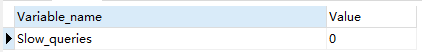

# MySql

## 博客

[Mysql整体架构和sql执行过程](https://mp.weixin.qq.com/s/PEk97JyIlUexuAjFr2pmiw)

[深入底层剖析Mysql索引](https://mp.weixin.qq.com/s/WDeYmrfgPHqg-fGI17qLcw)

[深入底层剖析Mysql各种锁机制（面试必问）](https://mp.weixin.qq.com/s/WgcLdEfjFE3CsWV4FgOefw)

[MySQL 事务机制](https://mp.weixin.qq.com/s/3Zk9Np5c9K0ENz64Y6E92g)

[MySQL 三万字精华总结 + 面试100 问](https://juejin.im/post/6850037271233331208)

## 事务

### 事务特性

原子性（Atomicity）、一致性（Consistency）、隔离性（Isolation）、持久性（Durability） ACID

### 事务隔离级别

| 隔离级别                     | 脏读   | 不可重复读 | 幻读   |
| ---------------------------- | ------ | ---------- | ------ |
| 未提交读（read uncommitted） | 可能   | 可能       | 可能   |
| 提交读（read committed）     | 不可能 | 可能       | 可能   |
| 可重复读（repetition read）  | 不可能 | 不可能     | 可能   |
| 串行化（serializable）       | 不可能 | 不可能     | 不可能 |

### 脏读


第一步，事务A获取到id=1的count=10，第二步，事务B将id=1的count修改成了15但是没有commit，第三步，事务A又获取了一遍id=1的count的值，发现此时count=15，第四步，事务B回滚后，count又变成了10，但是事务A却已经读到脏数据count=10。

### 不可重复读


不可重复读和脏读的区别就是 **读到的修改的数据是否提交**。

### 幻读


幻读和不可重复读都是一个事务读取到另一个事务的已经提交后的数据，区别在于不可重复读是针对于update和delete，而幻读是针对于insert。

事务A在第二次读取到了事务B新增并且已经commit的数据，所以在第二次事务A读到两条数据，这个结果就叫做幻读。

## MVCC

在InnoDB中，给每行增加两个隐藏字段来实现MVCC，一个用来记录数据行的创建时间，另一个用来记录行的过期时间（删除时间）。

在实际操作中，存储的并不是时间，而是事务的版本号，每开启一个新事务，事务的版本号就会递增。

## 锁机制

表级锁、行级锁、页面锁

### 表锁

锁中粒度最大的一种锁，表示当前的操作对整张表加锁，资源开销比行锁少，不会出现死锁的情况，但是发生锁冲突的概率很大。并发性能差

MyISAM和InnoDB都支持

InnoDB支持表锁，但默认行锁，而且**只有在查询或者其他SQL语句通过索引**才会使用行锁。

### 行锁

锁中粒度最小的一种锁，因为锁的粒度很小，所以发生资源争抢的概率也最小，并发性能最大，但是也会造成死锁，每次加锁和释放锁的开销也会变大。

**行锁是基于索引实现的**

InnoDB支持

### 共享锁（S锁，读锁）

多个事务对于同一数据可以共享一把锁，都能访问到数据，但是只能读不能修改。

```sql
select ... lock in share mode
```

### 排他锁（x锁，写锁）

一个事务获取了一个数据行的排他锁，其他事务就不能再获取该行的其他锁

```sql
select ... for update
```

### 意向共享锁、意向排他锁

表级锁

意向共享锁（IS）：事务想要在获得表中某些记录的共享锁，需要在表上先加意向共享锁。

意向互斥锁（IX）：事务想要在获得表中某些记录的互斥锁，需要在表上先加意向互斥锁。

当一个事务在需要获取资源的锁定时，如果该资源已经被排他锁占用，则数据库会自动给该事务申请一个该表的意向锁。如果自己需要一个共享锁定，就申请一个意向共享锁。如果需要的是某行（或者某些行）的排他锁定，则申请一个意向排他锁。

### 乐观锁

不是数据库自带的

在表中的数据进行操作时(更新)，先给数据表加一个**版本(version)**字段，每操作一次，将那条记录的版本号加1。也就是先查询出那条记录，获取出version字段,如果要对那条记录进行操作(更新),则先判断此刻version的值是否与刚刚查询出来时的version的值相等，如果相等，则说明这段期间，没有其他程序对其进行操作，则可以执行更新，将version字段的值加1；如果更新时发现此刻的version值与刚刚获取出来的version的值不相等，则说明这段期间已经有其他程序对其进行操作了，则不进行更新操作。

```sql
SELECT data AS old_data, version AS old_version FROM …;

//根据获取的数据进行业务操作，得到new_data和new_version

UPDATE SET data = new_data, version = new_version WHERE version = old_version

if (updated row > 0) {

// 乐观锁获取成功，操作完成

} else {

// 乐观锁获取失败，回滚并重试

}
```

### 悲观锁

依靠锁机制（排他）

```sql
关闭自动提交后，我们需要手动开启事务。
set autocommit=0;
//1.开始事务

begin; 或者 start transaction;

//2.查询出商品信息，然后通过for update锁定数据防止其他事务修改 排它锁

select status from t_goods where id=1 for update;

//3.根据商品信息生成订单

insert into t_orders (id,goods_id) values (null,1);

//4.修改商品status为2

update t_goods set status=2;

//4.提交事务

commit; --执行完毕，提交事务
```

优点：保证了数据处理时的安全性。

缺点：加锁造成了开销增加，并且增加了**死锁的机会**。降低了并发性。

### 间隙锁

```sql
show variables like 'innodb_locks_unsafe_for_binlog'; # 查看是否开启间隙锁 OFF为开启

SELECT * FROM table WHERE id = 8 FOR UPDATE;

----此时，（7,11）就会被锁定

SELECT * FROM table WHERE id BETWEN 2 AND 5 FOR UPDATE;

----此时，（1,4）和（4,7）就会被锁定
```

间隙锁，作用于 **非唯一索引** 上，主要目的，就是为了防止其他事务在间隔中插入数据，以导致“ **不可重复读** ”。

1. 在普通索引列上，**不管是何种查询，只要加锁，都会产生间隙锁，这跟唯一索引不一样；**
2. 在普通索引跟唯一索引中，数据间隙的分析，数据行是优先根据普通索引排序，再根据唯一索引排序。

### 记录锁

记录锁，它封锁索引记录，作用于 **唯一索引 **上

```sql
select * from t where id=1 for update;
它会在id=1的索引记录上加锁，以阻止其他事务插入，更新，删除id=1的这一行。
需要说明的是：
select * from t where id=4;
则是快照读(SnapShot Read)，它并不加锁，不影响其他事务操作该数据
```

### 临键锁

临键锁，作用于**非唯一索引**上，是记录锁与间隙锁的组合 封锁范围，既包含索引记录，又包含索引之前的区间

UPDATE table SET name = 'javaHuang' WHERE age = 4;

SELECT * FROM table WHERE age = 4 FOR UPDATE;

这两个语句都会锁定（2,4]，(4,7)这两个区间。

即， InnoDB 会获取该记录行的 临键锁 ，并同时获取该记录行下一个区间的间隙锁。

临键锁的出现是为了innodb在rr隔离级别下，解决 **幻读** 问题

### 查看所有锁

```sql
SELECT * FROM INFORMATION_SCHEMA.INNODB_TRX;--查看正在被锁的事务
kill trx_mysql_thread_id；--（trx_mysql_thread_id列的值）
```

## 索引

数据库索引，是数据库管理系统（DBMS）中一个排序的数据结构，以协助快速查询、更新数据库表中数据。

**普通（Normal）**：也叫非唯一索引，是最普通的索引，没有任何的限制。

**唯一（Unique）**：唯一索引要求键值不能重复。另外需要注意的是，主键索引是一种特殊的唯一索引，它还多了一个限制条件，要求键值不能为空。主键索引用 primay key创建。

**全文（Fulltext）**：针对比较大的数据，比如我们存放的是消息内容，有几 KB 的数据的这种情况，如果要解决 like 查询效率低的问题，可以创建全文索引。只有文本类型的字段才可以创建全文索引，比如 char、varchar、text。


数据结构：B+树 和 Hash表


## 优化慢查询

具体场景具体分析：

### 慢日志

根据慢日志定位慢查询SQL（阿里Druid）

```sql
show variables like '%quer%'; #查看慢日志开启状态

set global long_query_time = 1;#设置慢查询时间

show status like '%slow_queries%'; 
```


slow_query_log - > ON 说明开启了慢查询日志

long_query_time -> 查询时间超过10s进行记录



### Explain

explain分析慢sql

```sql
EXPLAIN SELECT
	count( su.name )
FROM
	bus_evaluate be LEFT JOIN sys_user su on be.uid1= su.id
GROUP BY
	su.name DESC
```


#### type：

最优到最差


all全表扫描

#### Extra


## 日志

默认日志以文件存在数据库根目录下

### error log

启动、运行、停止等相关信息

### general log

运行的所有SQL语句或MySQL命令

### binary log

对数据库执行的所有更新语句（不包括select和show语句）

### slow log

执行时间超过long_query_time设置值的SQL语句，或没有使用索引的SQL

## sql语句

查看索引

```sql
select index from 'sys_user'
```


## 主从复制

### 主从复制作用

复制解决的基本问题是让一台服务器的数据与其他服务器保持同步，一台主库的数据可以同步到多台备库上，备库本身也可以被配置成另外一台服务器的主库。主库和备库之间可以有多种不同的组合方式。

MySQL 支持两种复制方式：基于行的复制和基于语句的复制，基于语句的复制也称为逻辑复制，从 MySQL 3.23 版本就已存在，基于行的复制方式在 5.1 版本才被加进来。这两种方式都是通过在主库上记录二进制日志、在备库重放日志的方式来实现异步的数据复制。因此同一时刻备库的数据可能与主库存在不一致，并且无法包装主备之间的延迟。

MySQL 复制大部分是向后兼容的，新版本的服务器可以作为老版本服务器的备库，但是老版本不能作为新版本服务器的备库，因为它可能无法解析新版本所用的新特性或语法，另外所使用的二进制文件格式也可能不同。

复制解决的问题：数据分布、负载均衡、备份、高可用性和故障切换、MySQL 升级测试。

### 主从复制步骤

① 在主库上把数据更改记录到二进制日志（bin log）中。② 备库将主库的日志复制到自己的中继日志中。 ③ 备库读取中继日志中的事件，将其重放到备库数据之上。

第一步是在主库上记录二进制日志，每次准备提交事务完成数据更新前，主库将数据更新的事件记录到二进制日志中。MySQL 会按事务提交的顺序而非每条语句的执行顺序来记录二进制日志，在记录二进制日志后，主库会告诉存储引擎可以提交事务了。

下一步，备库将主库的二进制日志复制到其本地的中继日志中。备库首先会启动一个工作的 IO 线程，IO 线程跟主库建立一个普通的客户端连接，然后在主库上启动一个特殊的二进制转储线程，这个线程会读取主库上二进制日志中的事件。它不会对事件进行轮询。如果该线程追赶上了主库将进入睡眠状态，直到主库发送信号量通知其有新的事件产生时才会被唤醒，备库 IO 线程会将接收到的事件记录到中继日志中。

备库的 SQL 线程执行最后一步，该线程从中继日志中读取事件并在备库执行，从而实现备库数据的更新。当 SQL 线程追赶上 IO 线程时，中继日志通常已经在系统缓存中，所以中继日志的开销很低。SQL 线程执行的时间也可以通过配置选项来决定是否写入其自己的二进制日志中。