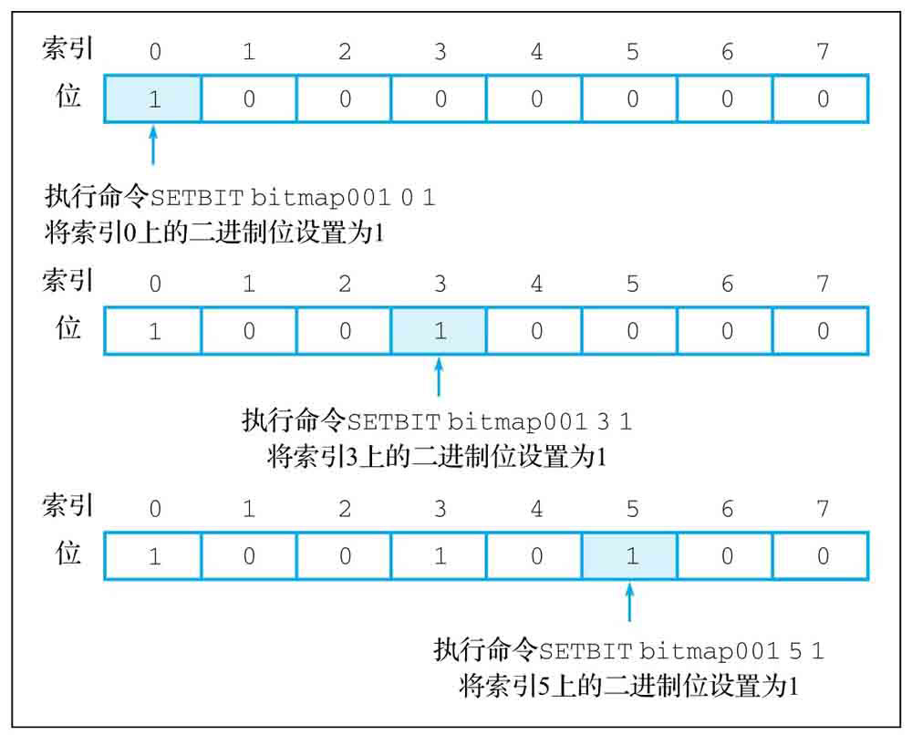
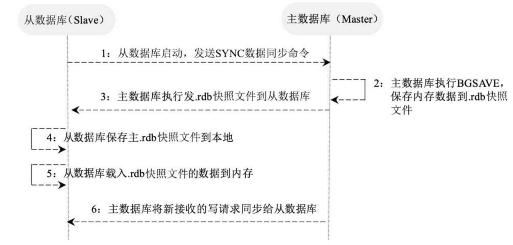
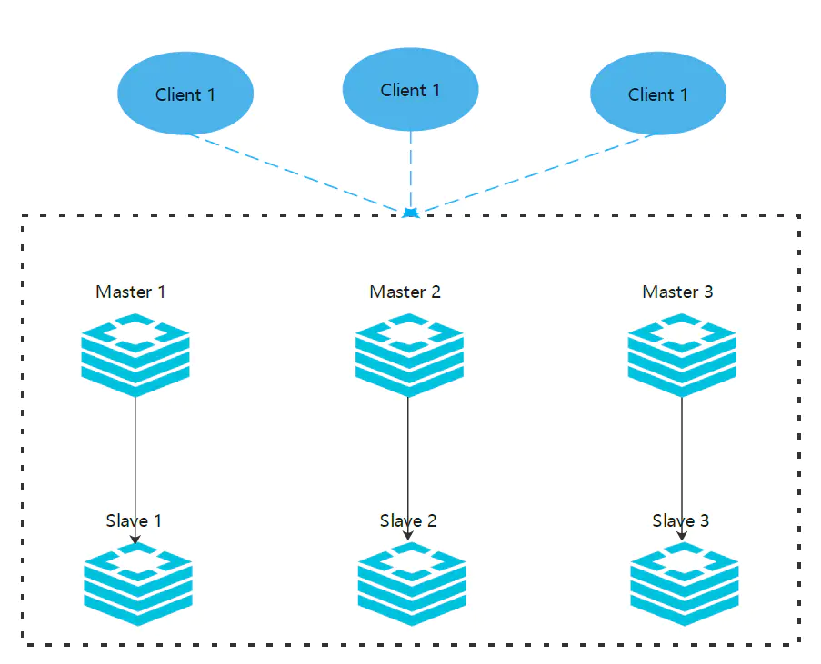

# Redis

---

相关博客

[《我们一起进大厂》系列-Redis哨兵、持久化、主从、手撕LRU](https://juejin.im/post/6844903989184577550)

## 数据结构

- 字符串(string)
- 散列(hash)
- 列表(list)
- 集合(set)
- 有序集合(sorted set，zset)
- HyperLogLog
- 位图(BitMap)
- 地理坐标(GEO，geospatial)
- 流(streams，redis5.0)

### String

键值对、值最大能存储512MB数据 内部的实现是通过 **SDS**（Simple Dynamic String ）来存储的。SDS 类似于 **Java** 中的 **ArrayList**，可以通过预分配冗余空间的方式来减少内存的频繁分配

#### 使用场景

**缓存 **

缓存操作是指把数据存储在内存而不是硬盘上，而访问内存远比访问硬盘的速度要快得多，所以用户可以通过把需要快速访问的数据存储在Redis中来提升应用程序的速度。

可以缓存：

文本数据（网页、文本）、二进制数据（图片、视频）

**锁**

根据给定的字符串键是否有值来判断锁是否已经被获取，而针对锁的**获取**操作和**释放**操作则是分别通过**设置字符串键**和**删除字符串键**来完成的。

acquire获取操作通过SET的NX选项实现

release通过DEL操作是否返回1判断是否执行成功

**储存文章信息**

**批量设置、获取多项信息**

**储存日志**

**ID生成器**

**计数器**

**限速器**

**共享session**

----

#### 命令
set

为字符串键设置值 时间复杂度 $O(1)$

```bash
redis> set key value [NX|XX]
```

可以是二进制数据比如

“redis.jpg” -> “\xff\xd8\x00…”

Redis以无序方式存放数据库键

其中[NX|XX]为参数：

NX 只会在键没有值的情况下执行设置操作，如果已存在就放弃执行设置操作，返回 nil

XX 反过来，只有在键有值的情况下执行设置操作，如果没有值，放弃设置返回 nil

get

从数据库中获取指定字符串键的值 复杂度 $O(1)$

```bash
redis> get key
```

getset

首先获得字符串键目前已有的值，接着为键设置新值，最后把旧值返回（如果不存在，返回nil并设置新值） 复杂度 $O(1)$

```bash
redis> getset key new_value
```

del

接收一个或多个键，尝试删除这些键以及相关值，返回成功被删除的键的数量

```bash
redis> del key [key ...]
```

mset

一次为多个字符串设置值 复杂度 $O(N)$

执行多条SET命令需要客户端和服务器之间进行多次网络通信，并因此耗费大量的时间；而使用一条MSET命令去代替多条SET命令只需要一次网络通信，从而有效地减少程序执行多个设置操作时的时间。

```bash
redis> mset key value [key value ...]
```

msetnx 只有（所有）键（都）不存在的情况下，一次为多个字符串键设置值

------

### Hash

键值对集合

内部编码：Ziplist压缩列表、hashtable 哈希表

-----

### List

字符串链表，按插入顺序排序。可以添加到链表头或尾，最多可以存 $2^{31}-1$ （4亿）个元素

内部编码：ziplist、linkedlist、quicklist

#### 使用场景

消息队列，文章列表

----

### Set

String类型的无序集合，集合通过散列表实现，时间复杂度$O(1)$

内部编码：intset、hashtable

交集、并集、差集 好友列表

----

### Zset

有序集合，String类型元素集合，不允许重复成员，每个元素关联一个double类型分数，通过分数来对集合成员从小到大排序。

内部编码：ziplist、skiplist

----

### BitMap

通过操作二进制位记录数据 使用字符串实现，可以用字符串命令处理位图命令。但是使用字符串命令操作位图时，必须先把命令返回的字符串值转换成二进制值，然后再做后序处理

#### 使用场景

统计用户信息，活跃，不活跃，登录打卡。

用户行为记录器

0-1矩阵

紧凑计数器

布隆过滤器

#### 命令

setbit 设置二进制位的值

```bash
redis> setbit bitmap offset value
```

返回二进制位被设置之前的旧值作为结果



当位图不存在或大小无法满足要求，对位图进行扩展。 扩展以**字节为单位**进行的

偏移量只能为正数

getbit 获取二进制位的值

```bahs
redis> getbit bitmap offset
```

如果offset超过最大偏移量，返回0

bitcount 统计被设置的二进制位数量

```bash
redis> bitcount key [start end]# start - end 范围内（按 字节 和offset不同）
```

可以为负数指倒数

bitpos 查找第一个指定的二进制位值

```bash
redis> bitpos bitmap value [start end]
```

返回偏移量

边界情况处理，尝试对一个不存在的位图或者一个所有位都被设置成0的位图中查找1的二进制位时，bitpos命令将返回-1

bitop 执行二进制位运算

```bash
redis> bitop operation result_key bitmap [bitmap ...]# operation 可以是 AND OR XOR NOT
```

bitfiled 在位图中存储整型

命令允许用户在位图的任意区域(field) 存储指定长度的整数值，并对这些整数值执行加法或减法操作

bitfiled命令支持SET、GET、INCRBY、OVERFLOW 这4个子命令


----

### HyperLogLog

被用于估计一个Set中元素数量的概率性的数据结构。基数统计算法

----

### Geospatial

用于地理关系计算，可以用来存地理位置(经纬度)  基于zset 可以用zset指令

#### 使用场景

具有基本功能的用户地理位置程序

查找附近的用户

#### 命令

geoadd 存储坐标 复杂度 $\log{N} * M$

将一个或多个经纬度坐标存储到位置集合中，并设置相应名字

```bash
redis> geoadd location_set longitude latitude name [longitude latitude name ...]
```

可以用来更新已有坐标

geopos 获取指定位置的坐标 复杂度 $\log{N} * M$

```bash
redis> geopos location_set name [name ...]
```

geodist 计算两个位置间直线距离 复杂度 $\log{N}$

```bash
redis> geodist location_set name1 name2 [unit] # unit参数 m 米 km 千米 mi 英里 ft 英尺
```

georadius 查找指定坐标半径范围内的其他位置 复杂度 $O(N)$

```bash
redis> georadius location_set longitude latitude radius unit [WITHDIST] [WITHCOORD] [asc|desc] [count n] [WITHHASH]# location_set 位置集合 long lat 中心点经纬度 radius半径 unit单位 withdist 返回距离 asc 由近到远 desc 由远到近 count 限制获取数量 withcoord返回被匹配坐标位置 withhash 获取geohash值（数字形式）
```

georadiusbymember 查找指定位置半径范围内的其他位置

与 georadius 区别是通过选择位置集合中的一个位置作为中心点

```bash
redis> georadiusbymember location_set name radius unit [WITHDIST] [WITHCOORD] [ASC|DESC] [COUNT n]
```

geohash 获取指定位置的geohash值

将经纬度换算为哈希值，并且可以还原回原经纬度。

```bash
redis> geohash location_set name name name...# 获取为字符串形式
```

----

### Stream

-----

#### **pub/sub：**

功能是订阅发布功能，可以用作简单的消息队列。

#### **Pipeline：**

可以批量执行一组指令，一次性返回全部结果，可以减少频繁的请求应答。

---

## 自动过期

expire、pexpire设置生存时间

```bash
redis> expire key seconds
redis> setex # set + expire
```

**Redis**的过期策略，是有**定期删除+惰性删除**两种。

定期删除：默认100ms就随机(5个)抽一些设置了过期时间的key，去检查是否过期，过期了就删了。

惰性删除：查询来了，查看过期没，过期就删了还不给你返回，没过期该怎么样就怎么样。

### 内存淘汰机制（默认noeviction）

**noeviction**: 当内存使用达到阈值的时候，所有引起申请内存的命令会报错

**allkeys-lru**: 尝试回收最少使用的键（LRU），使得新添加的数据有空间存放。

**volatile-lru**: 尝试回收最少使用的键（LRU），但仅限于在过期集合的键,使得新添加的数据有空间存放。

**allkeys-random**: 回收随机的键使得新添加的数据有空间存放。

**volatile-random**: 回收随机的键使得新添加的数据有空间存放，但仅限于在过期集合的键。

**volatile-ttl**: 回收在过期集合的键，并且优先回收存活时间（TTL）较短的键,使得新添加的数据有空间存放。

如果没有键满足回收的前提条件的话，策略**volatile-lru**, **volatile-random**以及**volatile-ttl**就和noeviction 差不多了。

LRU需要存放的Next Pre等指针信息占用内存较多

## 集群

### 一致性哈希

[一致性哈希](https://juejin.im/post/6850418113830846471)

数据分片如果使用取余 $hash(orderId)\% N$ ( N台机器)，如果扩容等就得重新计算

一致性哈希就是解决普通取余Hash伸缩性差的问题的算法，主要用于分布式存储系统，可以保证在动态增加和删除节点的情况下尽量有多的请求命中原来的机器节点。

Redis集群没有使用一致性哈希，而是引入了哈希槽slots

[高可用](https://juejin.im/post/6850418111846449165)

### 主从模式

一类是主节点（master节点），一类是从节点（slave节点）。一般主节点可以进行读、写操作，而从节点只能进行读操作。

#### 主从复制

1. 一个从数据库在启动后，会向主数据库发送SYNC命令。
2. 主数据库在接收到SYNC命令后会开始在后台保存快照（即RDB持久化的过程），并将保存快照期间接收到的命令缓存起来。在该持久化过程中会生成一个．rdb快照文件。
3. 在主数据库快照执行完成后，Redis会将快照文件和所有缓存的命令以．rdb快照文件的形式发送给从数据库。
4. 从数据库收到主数据库的．rdb快照文件后，载入该快照文件到本地。
5. 从数据库执行载入后的．rdb快照文件，将数据写入内存中。以上过程被称为复制初始化。
6. 在复制初始化结束后，主数据库在每次收到写命令时都会将命令同步给从数据库，从而保证主从数据库的数据一致。

在Redis中开启复制功能时需要在从数据库配置文件中加入如下配置，对主数据库无须进行任何配置：

```bash
 #slaveof master_address master_port
 slaveof 127.0.0.1 9000
 # 从redis2.6开始，从节点默认是只读的
slave-read-only yes
 #如果master有密码，则需要设置masterauth
 masterauth=123
```


在上述配置中，slaveof后面的配置分别为主数据库的IP地址和端口，在主数据库开启了密码认证后需要将masterauth设置为主数据库的密码，在配置完成后重启Redis，主数据库上的数据就会同步到从数据库上。



---

### 哨兵模式

在主从模式下，redis同时提供了哨兵命令`redis-sentinel`，哨兵是一个独立的进程，作为进程，它会独立运行。其原理是哨兵进程向所有的redis机器发送命令，等待Redis服务器响应，从而监控运行的多个Redis实例。

哨兵可以有多个，一般为了便于决策选举，使用奇数个哨兵。哨兵可以和redis机器部署在一起，也可以部署在其他的机器上。多个哨兵构成一个哨兵集群，哨兵直接也会相互通信，检查哨兵是否正常运行，同时发现master宕机哨兵之间会进行决策选举新的master

哨兵模式的作用:

- 通过发送命令，让Redis服务器返回监控其运行状态，包括主服务器和从服务器;
- 当哨兵监测到master宕机，会自动将slave切换到master，然后通过*发布订阅模式*通过其他的从服务器，修改配置文件，让它们切换主机;
- 然而一个哨兵进程对Redis服务器进行监控，也可能会出现问题，为此，我们可以使用多个哨兵进行监控。各个哨兵之间还会进行监控，这样就形成了多哨兵模式。

reids.conf配置与主从模式一样，不需要改变。

每台机器的哨兵进程都需要一个哨兵的配置文件`sentinel.conf`，三台机器的哨兵配置是一样的。

```bash
# 禁止保护模式
protected-mode no
# 配置监听的主服务器，这里sentinel monitor代表监控，mymaster代表服务器的名称，可以自定义，
# 192.168.1.10代表监控的主服务器，6379代表端口，2代表只有两个或两个以上的哨兵认为主服务器不可用的时候，才会进行failover操作。
sentinel monitor mymaster 192.168.1.10 6379 2
# sentinel author-pass定义服务的密码，mymaster是服务名称，123456是Redis服务器密码
sentinel auth-pass mymaster 123456
```

启动哨兵

```bash
redis-sentinel /path/to/sentinel.conf
```

哨兵模式工作

假设master宕机，sentinel 1先检测到这个结果，系统并不会马上进行 failover(故障转移)选出新的master，仅仅是sentinel 1主观的认为master不可用，这个现象成为**主观下线**。当后面的哨兵也检测到主服务器不可用，并且数量达到一定值时，那么哨兵之间就会进行一次投票，投票的结果由sentinel 1发起，进行 failover 操作。切换成功后，就会通过发布订阅模式，让各个哨兵把自己监控的从服务器实现切换主机，这个过程称为**客观下线**。这样对于客户端而言，一切都是透明的。

- 每个Sentinel（哨兵）进程以每秒钟一次的频率向整个集群中的Master主服务器，Slave从服务器以及其他Sentinel（哨兵）进程发送一个 PING 命令。

- 如果一个实例（instance）距离最后一次有效回复 PING 命令的时间超过 down-after-milliseconds 选项所指定的值， 则这个实例会被 Sentinel（哨兵）进程标记为主观下线（SDOWN）

- 如果一个Master主服务器被标记为主观下线（SDOWN），则正在监视这个Master主服务器的所有 Sentinel（哨兵）进程要以每秒一次的频率确认Master主服务器的确进入了主观下线状态

- 当有足够数量的 Sentinel（哨兵）进程（大于等于配置文件指定的值）在指定的时间范围内确认Master主服务器进入了主观下线状态（SDOWN）， 则Master主服务器会被标记为客观下线（ODOWN）

- 在一般情况下， 每个 Sentinel（哨兵）进程会以每 10 秒一次的频率向集群中的所有Master主服务器、Slave从服务器发送 INFO 命令。

- 当Master主服务器被 Sentinel（哨兵）进程标记为客观下线（ODOWN）时，Sentinel（哨兵）进程向下线的 Master主服务器的所有 Slave从服务器发送 INFO 命令的频率会从 10 秒一次改为每秒一次。

- 若没有足够数量的 Sentinel（哨兵）进程同意 Master主服务器下线， Master主服务器的客观下线状态就会被移除。若 Master主服务器重新向 Sentinel（哨兵）进程发送 PING 命令返回有效回复，Master主服务器的主观下线状态就会被移除。

----

### 集群模式

 Redis 的分布式存储，对数据进行分片，也就是说每台 Redis 节点上存储不同的内容



配置

修改`redis.conf` 的配置文件:

```bash
# 开启redis的集群模式
cluster-enabled yes
# 配置集群模式下的配置文件名称和位置,redis-cluster.conf这个文件是集群启动后自动生成的，不需要手动配置。
cluster-config-file redis-cluster.conf
```

redis-tri.rb

```bash
redis> redis-trib.rb create --replicas 1 192.168.1.11:6379 192.168.1.21:6379 192.168.1.12:6379 192.168.1.22:6379 192.168.1.13:6379 192.168.1.23:6379
```

之后会生成自动配置的redis-cluster.conf文件

登录集群：`redis-cli -c -h 192.168.1.11 -p 6379 -a 123456 # -c，使用集群方式登录`。

查看集群信息：`192.168.1.11:6379> CLUSTER INFO #集群状态`。

列出节点信息：`192.168.1.11:6379> CLUSTER NODES #列出节点信息`。

添加数据

```bash
192.168.1.11:6379> set name aaa
-> Redirected to slot [13680] located at 192.168.1.13:6379                #说明最终将数据写到了192.168.1.13:6379上
OK
```

获取数据

```bash
192.168.1.11:6379> get name
-> Redirected to slot [13680] located at 192.168.1.13:6379                #说明最终到192.168.1.13:6379上读数据
"aaa"
```

运行机制

在 Redis 的每一个节点上，都有这么两个东西，一个是插槽（slot），它的的取值范围是：0-16383，可以从上面`redis-trib.rb`执行的结果看到这16383个slot在三个master上的分布。还有一个就是cluster，可以理解为是一个集群管理的插件，类似的哨兵。

当我们的存取的 Key到达的时候，Redis 会根据 **crc16** 的算法对计算后得出一个结果，然后把结果和 **16384 求余数**，这样每个 key 都会对应一个编号在 0-16383 之间的哈希槽，通过这个值，去找到对应的插槽所对应的节点，然后直接自动跳转到这个对应的节点上进行存取操作。

当数据写入到对应的master节点后，这个数据会同步给这个master对应的所有slave节点。

为了保证高可用，redis-cluster集群引入了主从模式，一个主节点对应一个或者多个从节点。当其它主节点ping主节点master 1时，如果半数以上的主节点与master 1通信超时，那么认为master 1宕机了，就会启用master 1的从节点slave 1，将slave 1变成主节点继续提供服务。

如果master 1和它的从节点slave 1都宕机了，整个集群就会进入fail状态，因为集群的slot映射不完整。如果集群超过半数以上的master挂掉，无论是否有slave，集群都会进入fail状态。

redis-cluster采用去中心化的思想，没有中心节点的说法，客户端与Redis节点直连，不需要中间代理层，客户端不需要连接集群所有节点，连接集群中任何一个可用节点即可。

----

## 持久化

### RDB

在指定时间间隔内对数据进行快照存储。文件格式紧凑，方便进行数据传输和数据恢复；在保存．rdb快照文件时父进程会fork出一个子进程，由子进程完成具体的持久化工作，所以可以最大化Redis的性能；同时，与AOF相比，在恢复大的数据集时会更快一些。

RDB 持久化是把当前进程数据生成快照保存到硬盘的过程，触发 RDB 持久化过程分为手动触发和自动触发。

手动触发分别对应 save 和 bgsave 命令：

- save：阻塞当前 Redis 服务器，直到 RDB 过程完成为止，对于内存比较大的实例会造成长时间阻塞，线上环境不建议使用。 
- bgasve：Redis 进程执行 fork 操作创建子进程，RDB 持久化过程由子进程负责，完成后自动结束。阻塞只发生在 fork 阶段，一般时间很短。bgsave 是针对 save 阻塞问题做的优化，因此 Redis 内部所有涉及 RDB 的操作都采用 bgsave 的方式，而 save 方式已经废弃。 

除了手动触发外 Redis 内部还存在自动触发 RDB 的持久化机制，例如：

- 使用 save 相关配置，如 save m n，表示 m 秒内数据集存在 n 次修改时，自动触发 bgsave。 
- 如果从节点执行全量复制操作，主节点自动执行 bgsave 生成 RDB 文件并发送给从节点。 
- 执行 debug reload 命令重新加载 Redis 时也会自动触发 save 操作。 
- 默认情况下执行 shutdown 命令时，如果没有开启 AOF 持久化功能则自动执行 bgsave。 

#### bgsave 的原理

① 执行 bgsave 命令 Redis 父进程判断当前是否存在正在执行的子进程，如 RDB/AOF 子进程，如果存在 bgsave 命令直接返回。

② 父进程执行 fork 操作创建子进程，fork 操作过程中父进程会阻塞。

③ 父进程 fork 完成后，bgsave 命令返回并不再阻塞父进程，可以继续响应其他命令。

④ 子进程创建 RDB 文件，根据父进程内存生成临时快照文件，完成后对原有文件进行原子替换。

⑤ 进程发送信号给父进程表示完成，父进程更新统计信息。

------

#### RDB 持久化的优点

RDB 是一个紧凑压缩的二进制文件，代表 Redis 在某个时间点上的数据快照。非常适合于备份，全量复制等场景。例如每 6 个消时执行 bgsave 备份，并把 RDB 文件拷贝到远程机器或者文件系统中，用于灾难恢复。

Redis加载 RDB 恢复数据远远快于 AOF 的方式。

------

#### RDB 持久化的缺点

RDB 方式数据无法做到实时持久化/秒级持久化，因为 bgsave 每次运行都要执行 fork 操作创建子进程，属于重量级操作，频繁执行成本过高。针对 RDB 不适合实时持久化的问题，[Redis]() 提供了 AOF 持久化方式。

RDB 文件使用特定二进制格式保存，[Redis]() 版本演进过程中有多个格式的 RDB 版本，存在老版本 [Redis]() 服务无法兼容新版 RDB 格式的问题。

### AOF

记录对服务器的每次写操作，重启时重放这些命令来恢复数据。AOF命令以Redis协议追加和保存每次写操作到文件末尾，Redis还能对AOF文件进行后台重写，使得AOF文件的体积不至于过大。AOF的特点有：可以使用不同的fsync策略（无fsync、每秒fsync、每次写的时候fsync），只有某些操作追加命令到文件中，操作效率高；同时，AOF文件是日志的格式，更容易被操作。

## 事务

redis单条命令保证原子性，但是事务不保证原子性，没有隔离性一说。

redis到事务:

- 开启事务 multi

- 命令入队
- 执行事务 exec

- 取消事务 discard

```bash
127.0.0.1:6379> multi
OK
127.0.0.1:6379> set k1 v1
QUEUED
127.0.0.1:6379> set k2 v2
QUEUED
127.0.0.1:6379> get k2
QUEUED
127.0.0.1:6379> set k3 v3
QUEUED
127.0.0.1:6379> exec
1) OK
2) OK
3) "v2"
4) OK
```

编译型异常（命令错误，所有命令都不执行）

```bash
127.0.0.1:6379> multi
OK
127.0.0.1:6379> set k1 v1
QUEUED
127.0.0.1:6379> set k1
(error) ERR wrong number of arguments for 'set' command
127.0.0.1:6379> set k2 v2
QUEUED
127.0.0.1:6379> set k3 v3
QUEUED
127.0.0.1:6379> exec
(error) EXECABORT Transaction discarded because of previous errors.
127.0.0.1:6379> get k2
(nil)
127.0.0.1:6379> get k3
(nil)
```

运行时异常 如果事务队列中存在语法性，那么执行命令的时候，其他命令是可以正常执行的

```bash
127.0.0.1:6379> set k1 v1
OK
127.0.0.1:6379> multi
OK
127.0.0.1:6379> incr k1
QUEUED
127.0.0.1:6379> set k2 v2
QUEUED
127.0.0.1:6379> exec
1) (error) ERR value is not an integer or out of range
2) OK
127.0.0.1:6379> get k2
"v2"
```

监视 watch

单线：

```bash
127.0.0.1:6379> set money 100
OK
127.0.0.1:6379> set out 0
OK
127.0.0.1:6379> watch money #监控money对象
OK
127.0.0.1:6379> multi #事务正常结束
OK
127.0.0.1:6379> decrby money 20
QUEUED
127.0.0.1:6379> incrby out 20
QUEUED
127.0.0.1:6379> exec
1) (integer) 80
2) (integer) 20
```

多线：

```bash
# 线程1
127.0.0.1:6379> watch money # 监控money对象
OK
127.0.0.1:6379> multi
OK
127.0.0.1:6379> DECRBY money 10
QUEUED
127.0.0.1:6379> INCRBY out 10
QUEUED
127.0.0.1:6379> exec # 执行前另一个线程修改money值
(nil)
```

```bash
# 线程2
127.0.0.1:6379> get money
"80"
127.0.0.1:6379> set money 1000
OK
```

使用watch可以当作乐观锁

```bash
127.0.0.1:6379> UNWATCH # 解锁
OK
127.0.0.1:6379> watch money
OK
```

## 缓存穿透、缓存雪崩、缓存击穿

### 缓存雪崩

缓存雪崩指在同一时刻由于大量缓存失效，导致大量原本应该访问缓存的请求都去查询数据库，而对数据库的CPU和内存造成巨大压力，严重的话会导致数据库宕机，从而形成一系列连锁反应，使整个系统崩溃。一般有以下3种处理方法。

- 请求加锁：对于并发量不是很多的应用，使用请求加锁排队的方案防止过多请求数据库。
- 失效更新：为每一个缓存数据都增加过期标记来记录缓存数据是否失效，如果缓存标记失效，则更新数据缓存。
-  设置不同的失效时间：为不同的数据设置不同的缓存失效时间，防止在同一时刻有大量的数据失效。

### 缓存穿透

缓存穿透指由于缓存系统故障或者用户频繁查询系统中不存在（在系统中不存在，在自然数据库和缓存中都不存在）的数据，而这时请求穿过缓存不断被发送到数据库，导致数据库过载，进而引发一连串并发问题。
比如用户发起一个userName为zhangsan的请求，而在系统中并没有名为zhangsan的用户，这样就导致每次查询时在缓存中都找不到该数据，然后去数据库中再查询一遍。由于zhangsan用户本身在系统中不存在，自然返回空，导致请求穿过缓存频繁查询数据库，在用户频繁发送该请求时将导致数据库系统负载增大，从而可能引发其他问题。常用的解决缓存穿透问题的方法有布隆过滤器和cache null策略。

- 布隆过滤器：指将所有可能存在的数据都映射到一个足够大的Bitmap中，在用户发起请求时首先经过布隆过滤器的拦截，一个一定不存在的数据会被这个布隆过滤器拦截，从而避免对底层存储系统带来查询上的压力。
- cache null策略：指如果一个查询返回的结果为null（可能是数据不存在，也可能是系统故障），我们仍然缓存这个null结果，但它的过期时间会很短，通常不超过5分钟；在用户再次请求该数据时直接返回null，而不会继续访问数据库，从而有效保障数据库的安全。其实cache null策略的核心原理是：在缓存中记录一个短暂的（数据过期时间内）数据在系统中是否存在的状态，如果不存在，则直接返回null，不再查询数据库，从而避免缓存穿透到数据库上。

### 缓存击穿

缓存击穿是指一个Key非常热点，在不停的扛着大并发，大并发集中对这一个点进行访问，当这个Key在失效的瞬间，持续的大并发就穿破缓存，直接请求数据库，就像在一个完好无损的桶上凿开了一个洞。

- 设置热点数据永远不过期。或者加上互斥锁

## 布隆过滤器

[白话布隆过滤器](https://blog.huoding.com/2020/06/22/825)

当一个元素被加入集合时，通过多个哈希函数将元素映射到一个比特数组中的若干个位置，并把它们置为 1 ，查询时，只要看看这些位置是不是都是 1 就知道元素是否（可能）在集合中了：如果这些位置中有任意一个是 0，那么此元素一定不在集合中；如果都是 1，那么此元素可能在集合中，注意是「可能」在，也就是说「可能」不在，这被称作「[False positive](https://brilliant.org/wiki/bloom-filter/#false-positives-analysis)」。

[RedisBloom模块](https://redislabs.com/modules/redis-bloom/)

Bitmap包装成布隆过滤器

## 缓存数据库双写一致性问题

- 先更新数据库，后更新缓存
- 先更新缓存，后更新数据库
- 先删除缓存，后更新数据库 (延时双删 删除缓存 -> 更新数据库，确保事务提交 -> 再删除缓存 )
- 先更新数据库，后删除缓存

[如何保证缓存与数据库的双写一致性？](https://cloud.tencent.com/developer/article/1455107)

[缓存数据库双写一致性问题](https://juejin.im/post/6850418121754050567)

[canal](https://github.com/alibaba/canal)