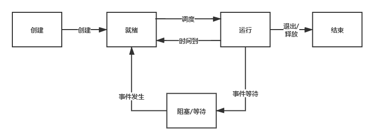
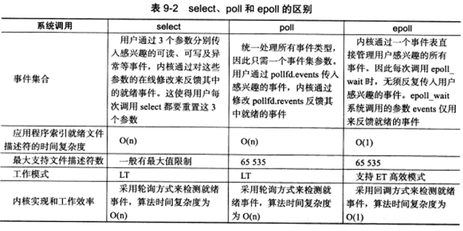

# 操作系统

(linux)

## 进程和线程

### 进程的状态和转换：

创建态、运行态、就绪态、阻塞态（等待态）、结束态

就绪态和阻塞态，其中就绪态是进程仅缺少处理机（CPU），获取就能执行。阻塞态是需要其他资源（CPU外的），或等待某一事件

### 进程调度方式：

非剥夺调度方式（非抢占式）一旦把CPU分配给一个进程，就会保持CPU直到终止或转换到等待态。实现简单、开销少、适合批处理系统不能用于分时系统和大多数实时系统。

剥夺调度方式（抢占式）对提高系统吞吐率和响应效率有好处，主要有：优先权、短进程优先、时间片原则。

## Eopll 多路复用

[epoll的本质](https://zhuanlan.zhihu.com/p/63179839) 

《Linux高性能服务器编程》

### `select`

`select` 两次遍历 开销大 默认只能监视1024个socket

### `epoll `

`epoll`的数据结构:

[epoll的内部实现](https://blog.csdn.net/tianjing0805/article/details/76021440)

就绪队列 `rdlist` 快速插入删除，双向链表。

索引结构 `rbr` 红黑树。

[epoll 水平触发与边缘触发](https://blog.csdn.net/lihao21/article/details/67631516)

两种工作模式：水平触发（level trigger，LT，LT为epoll的默认工作模式）、边缘触发（edge trigger，ET）

Level是指信号只需要处于水平，就一直会触发；而edge则是指信号为上升沿或者下降沿时触发。

LT模式下，只要内核缓冲区中还有未读数据，就会一直返回描述符的就绪状态，即不断地唤醒应用进程。

ET模式下， 缓冲区从**不可读变成可读**，会唤醒应用进程，缓冲区数据变少的情况，则不会再唤醒应用进程。

>  水平触发

1. 对于读操作

只要缓冲内容不为空，LT模式返回读就绪。

 2. 对于写操作

只要缓冲区还不满，LT模式会返回写就绪。

>  边缘触发

1. 对于读操作

（1）当缓冲区由不可读变为可读的时候，即缓冲区由空变为不空的时候。

（2）当有新数据到达时，即缓冲区中的待读数据变多的时候。

（3）当缓冲区有数据可读，且应用进程对相应的描述符进行`EPOLL_CTL_MOD` 修改`EPOLLIN`事件时。

2. 对于写操作

（1）当缓冲区由不可写变为可写时。

（2）当有旧数据被发送走，即缓冲区中的内容变少的时候。

（3）当缓冲区有空间可写，且应用进程对相应的描述符进行`EPOLL_CTL_MOD` 修改`EPOLLOUT`事件时。