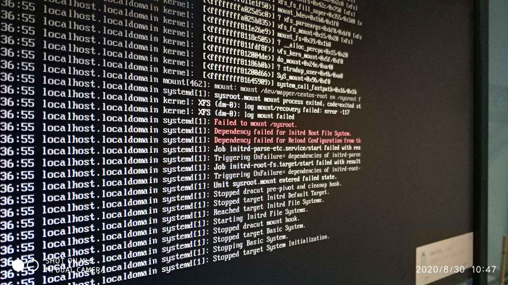

# 服务器异常断电导致无法正常启动解决

## CentOS 7 进入紧急模式

打开CentOS7，显示

```bash
welcome to emergency mode！after logging in ，type “journalctl -xb” to view system logs，“systemctl reboot” to reboot ，“systemctl default” to try again to boot into default mode。
give root password for maintenance
（or type Control-D to continue）：
```

这个错误需要注意可能是异常断电导致外部硬盘、文件等重启时没有挂载导致

解决方法：

查看日志

输入命令：

```bash
journalctl -xb
```

之后会列出较长的日志文件，点回车查看之后的信息。

其中**重点关注标注为红色的错误信息**：



如图所示，其中可以看出：

```bash
Failed to mount /sysroot.
Dependency failed for laitrd Root File System
```

如果遇到以上问题，解决方案如下：

输入命令，强制日志清零

```bash
xfs_repair -v -L /dev/dm-0
```

处理完成后，重启虚拟机、服务器即可。

如果遇到其他问题，可搜索具体问题来解决。

参考博客：

[CentOS系统启动报错Failed to mount /sysroot解决方法](https://blog.csdn.net/u013938484/article/details/82865744)

[CentOS 7进入紧急修复模式解决](https://blog.csdn.net/m0_37886429/article/details/84204722)