# 计算机网络

服务、协议、接口

## TCP/IP模型

OSI参考模型：

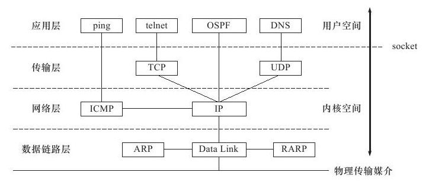

### 物理层

单位 比特 ，透明传输比特流 ，在物理媒体上为数据端设备透明传输原始比特流

### 数据链路层

单位 帧 ，将网络层传来的IP数据报组装层帧。 成帧、差错控制、流量控制、传输管理。**主机到主机**

主要协议 ：HDLC和PPP

### 网络层

单位 数据报， 把网络层协议的数据单元从源端传到目的端，为分组交换网上的不同主机提供通信服务。**点到点** （跳到跳 hop by hop）

对分组进行路由选择、流量控制、拥塞控制、差错控制、网际互联

主要协议 ：IP 、ICMP、ARP 、OSPF

### 传输层

单位 报文段（TCP） 用户数据报（UDP），主要负责主机中两个进程之间的通信，功能是为 **端到端** （end to end）连接提供可靠的传输服务，为端到端连接提供流量控制、差错控制、服务质量、数据传输管理等服务。

主要协议：TCP、UDP、SCTP

### 会话层、表示层、应用层

应用层负责应用程序逻辑，一般 **用户空间** 实现

主要协议：ping（应用程序，利用ICMP）、telnet远程登录协议、OSPF动态路由更新协议、DNS域名服务协议

### TCP/IP模型

网络接口层、网际(IP)层、传输(TCP/UDP)层、应用层

> 通信子网 （数据层、数据链路层、网络层）

#### 封装：

应用程序 - > TCP模块 -> IP模块

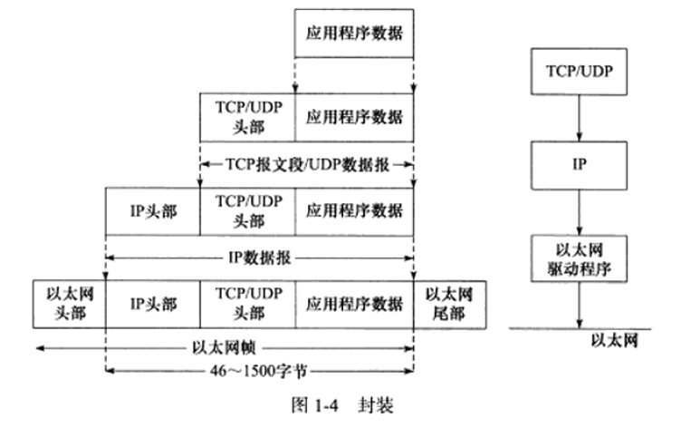

#### 分用：

以太网帧通过2字节类型字段识别 0x800 为 IP 数据报 , 0x806 为ARP，0x835 为RARP

IP数据报头部采用16位协议字段区分TCP/UDP/ICMP等

TCP、UDP通过头部16位端口号区分上层应用程序

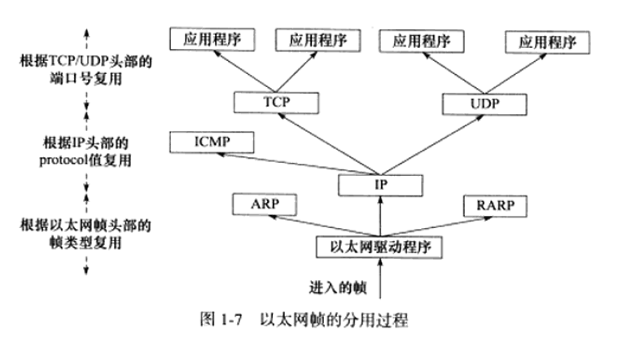

## IP

TCP/IP协议族动力，==无状态、无连接、不可靠==。

无状态 IP数据报发送、传输、接收都是相互独立没有上下文关系的，无法处理乱序和重复的IP数据报。优点：简单高效

无连接 IP通信双方都不长久地维持对方的任何信息。所以需要上层（TCP/UDP）每次发送数据明确指定对方IP

不可靠 不能保证IP数据报准确到达接收端，尽最大努力。（TTL超时、效验错误）不会重传

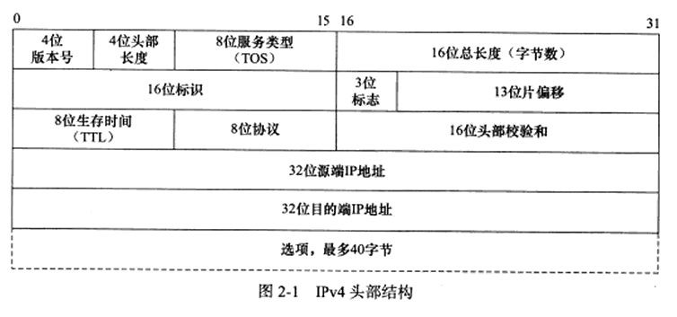

## TCP/UDP

为==进程之间==提供逻辑通信

端口：用来识别主机中的应用进程 端口号 $0 - 2^{16}$ 

0~1023 为熟知端口号 1024~49151为登记端口号 49152~65535为客户端端口号

套接字（socket）：识别端点 **套接字 =（主机IP地址，端口号）**

### TCP

实现可靠的数据传输协议，解决传输可靠、有序、无丢失、不重复问题

- 面向连接
- 每条TCP连接只能有两个端点，一对一
- 保证数据无差错、不丢失、不重复、有序
- 全双工，两端都设有发送缓存和接收缓存（准备发送的数据、已发送但未收到确认、按序到达但未被读取、不按序到达）
- 面向**字节流** stream，虽然应用程序和TCP交互是一次一个数据块，但TCP把应用程序交下来的数据仅视为一连串的无结构字符串。基于流，数据**没有边界限制** 。

TCP协议通信双方必须先建立TCP连接，并在 **内核** 中为改连接维持一些必要的数据结构（连接的状态、读写缓冲区、诸多定时器）

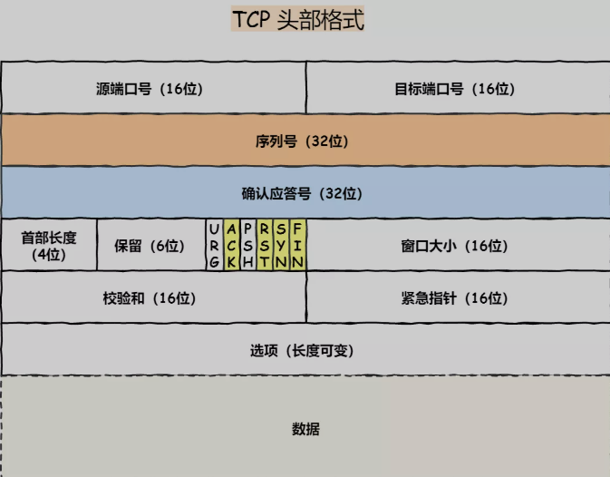

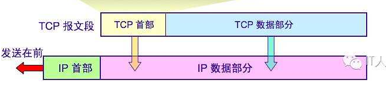

#### 重传

##### 超时重传：

RTT 记录报文段发出的时间，以及收到确认的时间，两个时间之差称为报文段往返时间

$new RRT_s = (1-\alpha)\times (oldRTT_s)+\alpha\times(newRTT_s)$

$\alpha$ 推荐为0.125

RTO 超时重传时间

$RTO=RTT_s+4\times RTT_D$

$newRTT_D= (1-\beta)\times(oldRTT_D)+\beta\times|RTT_s-newRTT样本|$

$\beta$ 同样推荐为0.125

##### 冗余ACK

冗余确认，超时重传超时周期过长，所以通过注意冗余ACK来检测丢包情况，检测到冗余ACK后重传相应数据段（快速重传）

冗余ACK 再次确认某个报文段的ACK，而发送方先前就已经收到过该报文段的确认

[全图解被问千百遍的TCP三次握手和四次挥手面试题](https://mp.weixin.qq.com/s/lFnyBaaP3f0eNcKGW5RtCg)

### 为什么是三次握手

- 避免历史重复连接
- 同步双方初始序列号
- 避免资源浪费

不使用「两次握手」和「四次握手」的原因：

- 「两次握手」：无法防止历史连接的建立，会造成双方资源的浪费，也无法可靠的同步双方序列号；
- 「四次握手」：三次握手就已经理论上最少可靠连接建立，所以不需要使用更多的通信次数。

### 为什么是四次挥手

- 关闭连接时，客户端向服务端发送 `FIN` 时，仅仅表示客户端不再发送数据了但是还能接收数据。
- 服务器收到客户端的 `FIN` 报文时，先回一个 `ACK` 应答报文，而服务端可能还有数据需要处理和发送，等服务端不再发送数据时，才发送 `FIN` 报文给客户端来表示同意现在关闭连接。

> 为什么 TIME_WAIT 等待时间是 2 MSL

（参考 [全图解被问千百遍的TCP三次握手和四次挥手面试题](https://mp.weixin.qq.com/s/lFnyBaaP3f0eNcKGW5RtCg)）

`MSL` 是 Maximum Segment Lifetime，**报文最大生存时间**，它是任何报文在网络上存在的最长时间，超过这个时间报文将被丢弃。因为 TCP 报文基于是 IP 协议的，而 IP 头中有一个 `TTL` 字段，是 IP 数据报可以经过的最大路由数，每经过一个处理他的路由器此值就减 1，当此值为 0 则数据报将被丢弃，同时发送 ICMP 报文通知源主机。

MSL 与 TTL 的区别：MSL 的单位是时间，而 TTL 是经过路由跳数。所以 **MSL 应该要大于等于 TTL 消耗为 0 的时间**，以确保报文已被自然消亡。

TIME_WAIT 等待 2 倍的 MSL，比较合理的解释是：网络中可能存在来自发送方的数据包，当这些发送方的数据包被接收方处理后又会向对方发送响应，所以**一来一回需要等待 2 倍的时间**。

比如，如果被动关闭方没有收到断开连接的最后的 ACK 报文，就会触发超时重发 Fin 报文，另一方接收到 FIN 后，会重发 ACK 给被动关闭方， 一来一去正好 2 个 MSL。

`2MSL` 的时间是从**客户端接收到 FIN 后发送 ACK 开始计时的**。如果在 TIME-WAIT 时间内，因为客户端的 ACK 没有传输到服务端，客户端又接收到了服务端重发的 FIN 报文，那么 **2MSL 时间将重新计时**。

在 Linux 系统里 `2MSL` 默认是 `60` 秒，那么一个 `MSL` 也就是 `30` 秒。**Linux 系统停留在 TIME_WAIT 的时间为固定的 60 秒**。

主动发起关闭连接的一方，才会有 `TIME-WAIT` 状态。

 **需要 TIME-WAIT 状态，主要是两个原因：** 

- 防止具有相同「四元组」的「旧」数据包被收到；
- 保证「被动关闭连接」的一方能被正确的关闭，即保证最后的 ACK 能让被动关闭方接收，从而帮助其正常关闭；

如果 TIME-WAIT 等待足够长的情况就会遇到两种情况：

- 服务端正常收到四次挥手的最后一个 `ACK` 报文，则服务端正常关闭连接。
- 服务端没有收到四次挥手的最后一个 `ACK` 报文时，则会重发 `FIN` 关闭连接报文并等待新的 `ACK` 报文。

所以客户端在 `TIME-WAIT` 状态等待 `2MSL` 时间后，就可以**保证双方的连接都可以正常的关闭。**

### TCP粘包拆包

由于TCP是**面向字节流的协议**，流式没有分段，不知道什么时候开始，什么时候结束，根据缓存区情况进行拆包、粘包。

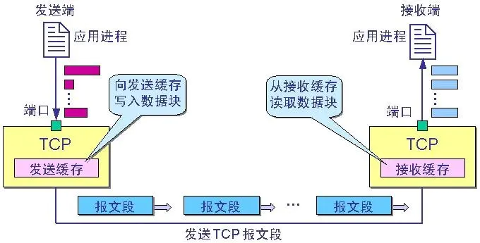

常见发生原因：

- 要发送的数据大于TCP发送缓冲区剩余空间大小，将会发生拆包。
- 待发送数据大于MSS（最大报文长度），TCP在传输前将进行拆包。
- 要发送的数据小于TCP发送缓冲区的大小，TCP将多次写入缓冲区的数据一次发送出去，将会发生粘包。
- 接收数据端的应用层没有及时读取接收缓冲区中的数据，将发生粘包。

解决方法：

- 在报文末尾增加换行符表明一条完整的消息，这样在接收端可以根据这个换行符来判断消息是否完整。
- 将消息分为消息头、消息体。可以在消息头中声明消息的长度，根据这个长度来获取报文（比如 808 协议）。
- 规定好报文长度，不足的空位补齐，取的时候按照长度截取即可。

Netty解决办法：

- `LineBasedFrameDecoder` 可以基于换行符解决。
- `DelimiterBasedFrameDecoder`可基于分隔符解决。
- `FixedLengthFrameDecoder`可指定长度解决。

###  封装

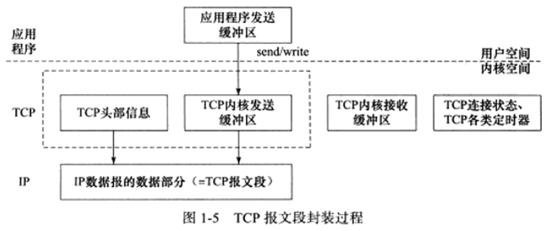

### TCP 滑动窗口

RTT和RTO

**确认重传机制**

拆分成段发送，使用滑动窗口做流量控制与乱序重排

保证TCP可靠性，保证TCP流控特性

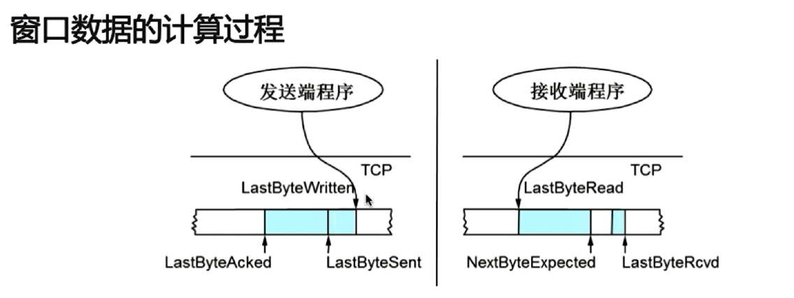

### 拥塞控制

慢启动（slow start）、拥塞避免（congestion avoidance）、快速重传（fast retransmit）、快速恢复（fast recovery）

Linux实现：Reno算法、Vegas算法、cubic算法。

## HTTP和HTTPS

超文本传输协议 

优点： 简单、灵活易扩展、应用广泛跨平台 

缺点：无状态、明文传输、不安全

 `Cookie` 通过在请求和响应报文中写入 Cookie 信息来控制客户端的状态。

相当于，**在客户端第一次请求后，服务器会下发一个装有客户信息的「小贴纸」，后续客户端请求服务器的时候，带上「小贴纸」，服务器就能认得了**

### 常见字段

host: 指定服务器域名

content-length: 回应数据长度

connection: TCP持久连接，以便其他请求复用（WebSocket 长连接) keep-alive

content-type: 本次数据格式 text/html; charset = utf-8 

accept: 声明自己可以接受哪些数据格式

content-encoding: 数据压缩方法

### 状态码

#### *1xx*

`1xx` 类状态码属于**提示信息**，是协议处理中的一种中间状态，实际用到的比较少。

#### *2xx*

`2xx` 类状态码表示服务器**成功**处理了客户端的请求，也是我们最愿意看到的状态。

「**200 OK**」是最常见的成功状态码，表示一切正常。如果是非 `HEAD` 请求，服务器返回的响应头都会有 body 数据。

「**204 No Content**」也是常见的成功状态码，与 200 OK 基本相同，但响应头没有 body 数据。

「**206 Partial Content**」是应用于 HTTP 分块下载或断电续传，表示响应返回的 body 数据并不是资源的全部，而是其中的一部分，也是服务器处理成功的状态。

#### *3xx*

`3xx` 类状态码表示客户端请求的资源发送了变动，需要客户端用新的 URL 重新发送请求获取资源，也就是**重定向**。

「**301 Moved Permanently**」表示永久重定向，说明请求的资源已经不存在了，需改用新的 URL 再次访问。

「**302 Found**」表示临时重定向，说明请求的资源还在，但暂时需要用另一个 URL 来访问。

301 和 302 都会在响应头里使用字段 `Location`，指明后续要跳转的 URL，浏览器会自动重定向新的 URL。

「**304 Not Modified**」不具有跳转的含义，表示资源未修改，重定向已存在的缓冲文件，也称缓存重定向，用于缓存控制。

#### *4xx*

`4xx` 类状态码表示客户端发送的**报文有误**，服务器无法处理，也就是错误码的含义。

「**400 Bad Request**」表示客户端请求的报文有错误，但只是个笼统的错误。

「**403 Forbidden**」表示服务器禁止访问资源，并不是客户端的请求出错。

「**404 Not Found**」表示请求的资源在服务器上不存在或未找到，所以无法提供给客户端。

#### *5xx*

`5xx` 类状态码表示客户端请求报文正确，但是**服务器处理时内部发生了错误**，属于服务器端的错误码。

「**500 Internal Server Error**」与 400 类型，是个笼统通用的错误码，服务器发生了什么错误，我们并不知道。

「**501 Not Implemented**」表示客户端请求的功能还不支持，类似“即将开业，敬请期待”的意思。

「**502 Bad Gateway**」通常是服务器作为网关或代理时返回的错误码，表示服务器自身工作正常，访问后端服务器发生了错误。

「**503 Service Unavailable**」表示服务器当前很忙，暂时无法响应服务器，类似“网络服务正忙，请稍后重试”的意思。

### 加密过程

> HTTP和HTTPS区别

1. HTTP 是超文本传输协议，信息是明文传输，存在安全风险的问题。HTTPS 则解决 HTTP 不安全的缺陷，在 TCP 和 HTTP 网络层之间加入了 SSL/TLS 安全协议，使得报文能够加密传输。
2. HTTP 连接建立相对简单， TCP 三次握手之后便可进行 HTTP 的报文传输。而 HTTPS 在 TCP 三次握手之后，还需进行 SSL/TLS 的握手过程，才可进入加密报文传输。
3. HTTP 的端口号是 80，HTTPS 的端口号是 443。
4. HTTPS 协议需要向 CA（证书权威机构）申请数字证书，来保证服务器的身份是可信的。

> HTTPS 采用的是**对称加密**和**非对称加密**结合的「混合加密」方式：

- 在通信建立前采用**非对称加密**的方式交换「会话秘钥」，后续就不再使用非对称加密。
- 在通信过程中全部使用**对称加密**的「会话秘钥」的方式加密明文数据。

采用「混合加密」的方式的原因：

- **对称加密**只使用一个密钥，运算速度快，密钥必须保密，无法做到安全的密钥交换。
- **非对称加密**使用两个密钥：公钥和私钥，公钥可以任意分发而私钥保密，解决了密钥交换问题但速度慢。

在HTTP和TCP间加入了加密

| HTTP | HTTPS |
| ---- |---|
| HTTP | HTTP |
|  | SSL/TLS |
| TCP | TCP |
| IP | IP |
| MAC | MAC |

> 摘要算法

摘要算法实现完整性，校验数据完整性。

> 数字证书

客户端先向服务器端索要公钥，然后用公钥加密信息，服务器收到密文后，用自己的私钥解密。

> 非对称加密 [维基百科]

在非对称加密中，爱丽丝使用鲍伯的公钥加密明文，得到密文，而只有鲍伯因为持有私钥才可以解密，得到明文。

在数学上，$d(c(x))=x$，让我们使用典型的[爱丽丝与鲍伯](https://zh.wikipedia.org/wiki/愛麗絲與鮑伯)假设来解释：

1. 爱丽丝与鲍伯事先互不认识，也没有可靠安全的沟通渠道，但爱丽丝现在却要透过不安全的互联网向鲍伯发送信息
2. 爱丽丝撰写好原文，原文在未加密的状态下称之为明文 $x$
3. 鲍伯使用[密码学安全伪随机数生成器](https://zh.wikipedia.org/wiki/密码学安全伪随机数生成器)产生一对密钥，其中一个作为公钥为$c$，另一个作为私钥$d$ 
4. 鲍伯可以用任何方法发送公钥 $c$ 给爱丽丝，即使伊夫在中间窃听到$c$ 也没问题
5. 爱丽丝用公钥$c$ 把明文 $x$ 进行加密，得到密文$c(x)$
6. 爱丽丝可以用任何方法传输密文 $c(x)$ 给鲍伯，即使伊夫在中间窃听到密文$c(x)$ 也没问题
7. 鲍伯收到密文，用私钥 $d$ 对密文进行解密，$d(c(x))=x$得到爱丽丝撰写的明文 $x$
8. 由于伊夫没有得到鲍伯的私钥 $d$，所以无法得知明文 $x$
9. 如果爱丽丝丢失了她自己撰写的原文 $x$，在没有得到鲍伯的私钥 $d$的情况下，她的处境将等同伊夫，即无法透过鲍伯的公钥 $c$和密文重新得$c(x)$到原文  $x$

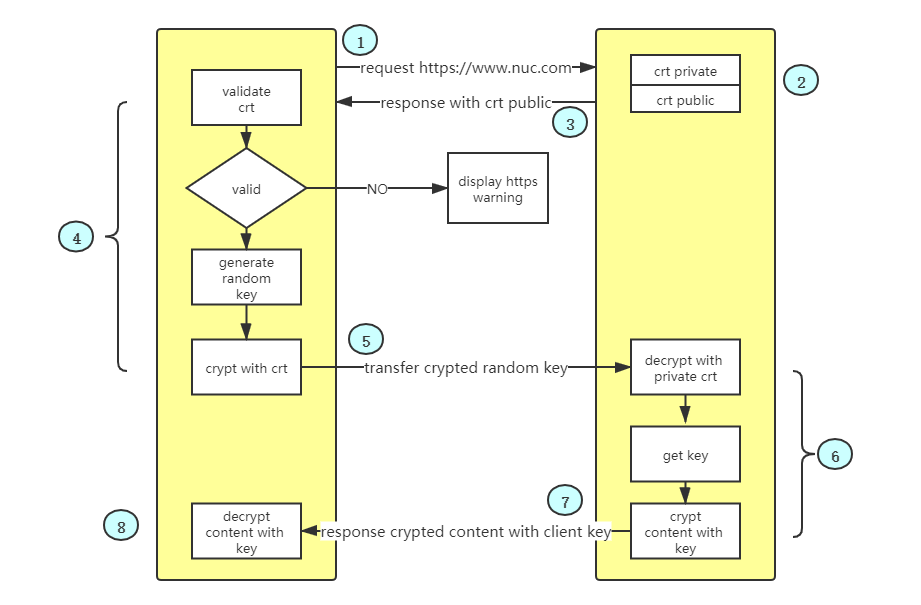

#### HTTPS连接建立

SSL/TLS 协议基本流程：

- 客户端向服务器索要并验证服务器的公钥。
- 双方协商生产「会话秘钥」。
- 双方采用「会话秘钥」进行加密通信。

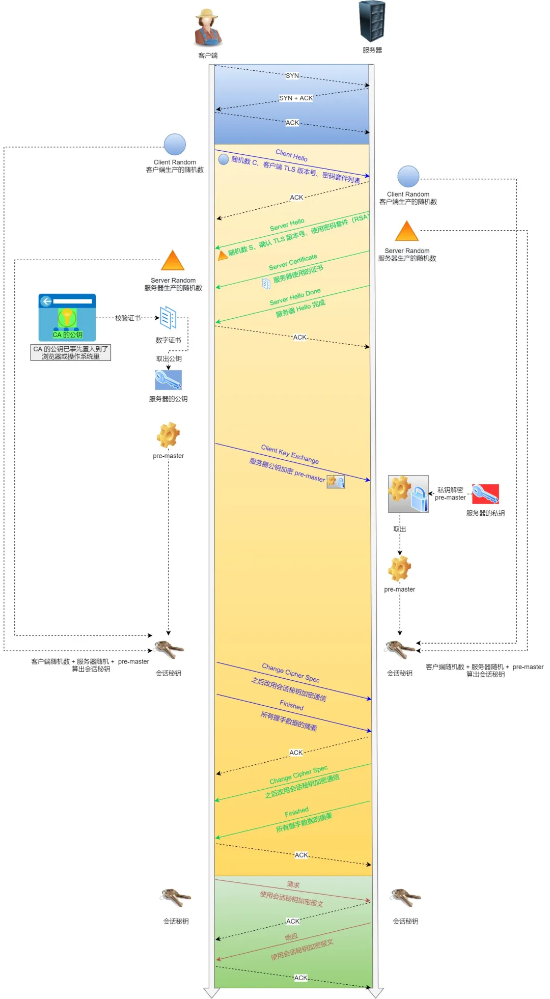

SSL/TLS 协议建立的详细流程：

*1. ClientHello*

首先，由客户端向服务器发起加密通信请求，也就是 `ClientHello` 请求。

在这一步，客户端主要向服务器发送以下信息：

（1）客户端支持的 SSL/TLS 协议版本，如 TLS 1.2 版本。

（2）客户端生产的随机数（`Client Random`），后面用于生产「会话秘钥」。

（3）客户端支持的密码套件列表，如 RSA 加密算法。

*2. SeverHello*

服务器收到客户端请求后，向客户端发出响应，也就是 `SeverHello`。服务器回应的内容有如下内容：

（1）确认 SSL/ TLS 协议版本，如果浏览器不支持，则关闭加密通信。

（2）服务器生产的随机数（`Server Random`），后面用于生产「会话秘钥」。

（3）确认的密码套件列表，如 RSA 加密算法。

（4）服务器的数字证书。

*3.客户端回应*

客户端收到服务器的回应之后，首先通过浏览器或者操作系统中的 CA 公钥，确认服务器的数字证书的真实性。

如果证书没有问题，客户端会从数字证书中取出服务器的公钥，然后使用它加密报文，向服务器发送如下信息：

（1）一个随机数（`pre-master key`）。该随机数会被服务器公钥加密。

（2）加密通信算法改变通知，表示随后的信息都将用「会话秘钥」加密通信。

（3）客户端握手结束通知，表示客户端的握手阶段已经结束。这一项同时把之前所有内容的发生的数据做个摘要，用来供服务端校验。

上面第一项的随机数是整个握手阶段的第三个随机数，这样服务器和客户端就同时有三个随机数，接着就用双方协商的加密算法，**各自生成**本次通信的「会话秘钥」。

*4. 服务器的最后回应*

服务器收到客户端的第三个随机数（`pre-master key`）之后，通过协商的加密算法，计算出本次通信的「会话秘钥」。然后，向客户端发生最后的信息：

（1）加密通信算法改变通知，表示随后的信息都将用「会话秘钥」加密通信。

（2）服务器握手结束通知，表示服务器的握手阶段已经结束。这一项同时把之前所有内容的发生的数据做个摘要，用来供客户端校验。

至此，整个 SSL/TLS 的握手阶段全部结束。接下来，客户端与服务器进入加密通信，就完全是使用普通的 HTTP 协议，只不过用「会话秘钥」加密内容。

## 比特-字节-字符

### bit 比特 位

1bit : 0  1

2bit : 01 10 11 00

### byte 字节 

(计算机信息技术用于计量存储容量的一种计量单位 **TCP面向字节流**)

1B = 8bit

1KB = 1024B

1MB = 1024KB

### 字符

ascii 一个英文字符占1个字节 8bit

utf8 可变编码

## Session和Cookie

Session是在服务端保存的一个数据结构，用来跟踪用户的状态，这个数据可以保存在集群、数据库、文件中；
Cookie是客户端保存用户信息的一种机制，用来记录用户的一些信息，也是实现Session的一种方式。