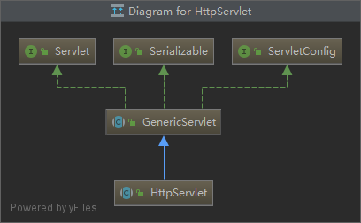
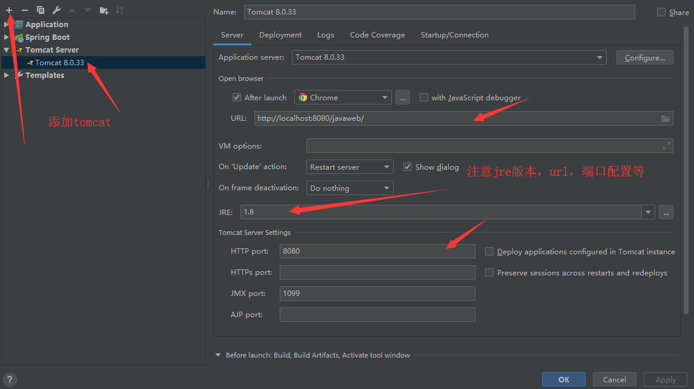
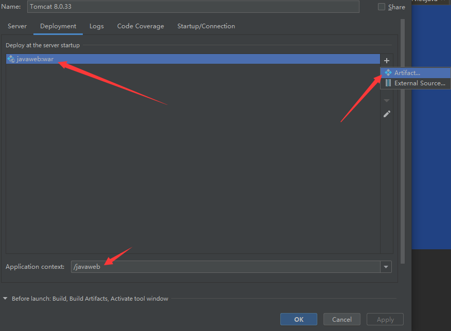
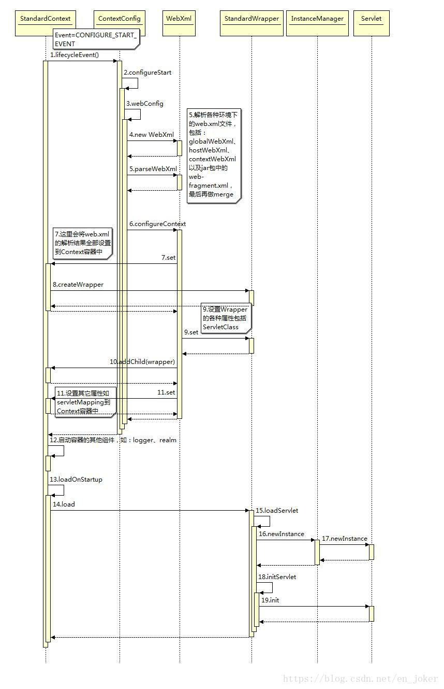
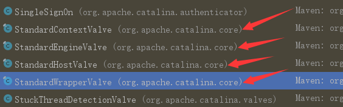

# Java Web

## Demo

maven创建`webapp`项目，导入servlet相关依赖

```xml
        <!-- https://mvnrepository.com/artifact/javax.servlet/javax.servlet-api -->
        <dependency>
            <groupId>javax.servlet</groupId>
            <artifactId>javax.servlet-api</artifactId>
            <version>4.0.1</version>
        </dependency>

        <!-- https://mvnrepository.com/artifact/javax.servlet.jsp/javax.servlet.jsp-api -->
        <dependency>
            <groupId>javax.servlet.jsp</groupId>
            <artifactId>javax.servlet.jsp-api</artifactId>
            <version>2.3.3</version>
        </dependency>
```

编写逻辑代码，继承`HttpServlet`

```java
//tomcat7.0 + servlet 3.0支持注解的方式，可以不配置web.xml
@WebServlet("/hello")
```

```java
public class HelloServlet extends HttpServlet {
	
    //doGet方法用来接受get请求，这里响应也是HttpServlet模板方法
    @Override
    protected void doGet(HttpServletRequest req, HttpServletResponse resp) throws ServletException, IOException {
        PrintWriter writer = resp.getWriter();
        writer.print("hello servlet");
    }

    @Override
    protected void doPost(HttpServletRequest req, HttpServletResponse resp) throws ServletException, IOException {
        doGet(req,resp);
    }
}
```

其中Servlet接口->GenericServlet抽象类->HttpServlet抽象类



```xml
<!--之后配置web.xml，将servlet注册进来（Tomcat容器可以读到相应的类）-->
<?xml version="1.0" encoding="UTF-8"?>
<web-app xmlns="http://xmlns.jcp.org/xml/ns/javaee"
         xmlns:xsi="http://www.w3.org/2001/XMLSchema-instance"
         xsi:schemaLocation="http://xmlns.jcp.org/xml/ns/javaee
http://xmlns.jcp.org/xml/ns/javaee/web-app_4_0.xsd"
         version="4.0"
         metadata-complete="true">
    <!--注册servlet-->
    <servlet>
        <servlet-name>hello</servlet-name>
        <servlet-class>com.nuc.meerkatx.HelloServlet</servlet-class>
    </servlet>

    <!--servlet请求路径-->
    <servlet-mapping>
        <servlet-name>hello</servlet-name>
        <url-pattern>/hello</url-pattern>
    </servlet-mapping>

</web-app>
```

最后将应用放置到tomcat的webapp下，将项目打包成war包

或者配置idea





配置好之后直接run就可以了

## Servlet原理

servlet是由web服务器调用，web服务器在收到浏览器请求之后

tomcat即一种**web容器**，类似于spring是bean的容器一样，tomcat连接后通过xml配置文件等实例化servlet

web容器接受到浏览器http请求后，会产生请求和响应

> 请求 request

请求头，请求体

> 响应 response

响应头，响应体

之后调用 Servlet 接口中的 service 

### Service

```java
//Servlet接口中的
public void service(ServletRequest req, ServletResponse res) throws ServletException, IOException;
```

web容器根据xml生成我们自己写的实际逻辑类，通过接口回调调用响应的逻辑代码

HttpServlet.java下的实现的service方法：

```java

    @Override
    public void service(ServletRequest req, ServletResponse res)
        throws ServletException, IOException
    {
        HttpServletRequest  request;
        HttpServletResponse response;
        
        if (!(req instanceof HttpServletRequest &&
                res instanceof HttpServletResponse)) {
            throw new ServletException("non-HTTP request or response");
        }

        request = (HttpServletRequest) req;
        response = (HttpServletResponse) res;

        service(request, response);//转发到实际service
    }
```

同样是HttpServlet.java具体service方法

```java
protected void service(HttpServletRequest req, HttpServletResponse resp)
    throws ServletException, IOException
{
    String method = req.getMethod();//获取请求方法，get post put delete

    if (method.equals(METHOD_GET)) {
        long lastModified = getLastModified(req);
        if (lastModified == -1) {
            // servlet doesn't support if-modified-since, no reason
            // to go through further expensive logic
            
            doGet(req, resp);//这一块回调子类方法，即自己编写的逻辑代码。 属于模板设计模式
            
        } else {
            long ifModifiedSince = req.getDateHeader(HEADER_IFMODSINCE);
            if (ifModifiedSince < lastModified) {
                // If the servlet mod time is later, call doGet()
                // Round down to the nearest second for a proper compare
                // A ifModifiedSince of -1 will always be less
                maybeSetLastModified(resp, lastModified);
                doGet(req, resp);
            } else {
                resp.setStatus(HttpServletResponse.SC_NOT_MODIFIED);
            }
        }

    } else if (method.equals(METHOD_HEAD)) {
        long lastModified = getLastModified(req);
        maybeSetLastModified(resp, lastModified);
        doHead(req, resp);

    } else if (method.equals(METHOD_POST)) {
        doPost(req, resp);
        
    } else if (method.equals(METHOD_PUT)) {
        doPut(req, resp);
        
    } else if (method.equals(METHOD_DELETE)) {
        doDelete(req, resp);
        
    } else if (method.equals(METHOD_OPTIONS)) {
        doOptions(req,resp);
        
    } else if (method.equals(METHOD_TRACE)) {
        doTrace(req,resp);
        
    } else {
        //
        // Note that this means NO servlet supports whatever
        // method was requested, anywhere on this server.
        //

        String errMsg = lStrings.getString("http.method_not_implemented");
        Object[] errArgs = new Object[1];
        errArgs[0] = method;
        errMsg = MessageFormat.format(errMsg, errArgs);
        
        resp.sendError(HttpServletResponse.SC_NOT_IMPLEMENTED, errMsg);
    }
}
```

Request从service拿到请求，并把请求之后的响应丢给response

### ServletConfig

获取Servlet的一些配置属性。实际传入为StandardWrapperFacade

```java
public interface ServletConfig {
        public String getServletName();
        public ServletContext getServletContext();
        public String getInitParameter(String name);
        public Enumeration<String> getInitParameterNames();
}
```

### ServletContext

web容器在启动的时候，它会为每个web程序都创建一个对应的ServletContext对象，代表当前web应用。

tomcat实际传入为 ApplicationContextFacade 为 ServletContext 门面类（门面设计模式）避免获取到不能获取的数据。

“握手型的交互式” 

​        所谓“握手型的交互式”就是两个模块为了交换数据通常都会准备一个交易场景，这个场景一直跟随个这个交易过程直到这个交易完成为止。这个交易场景的初始化是根据这次交易对象指定的参数来定制的，这些指定参数通常就会是一个配置类。所以对号入座，交易场景就由 ServletContext 来描述，而定制的参数集合就由 ServletConfig 来描述，而 ServletRequest 和 ServletResponse 就是要交互的具体对象了。

- 共享数据

```java
ServletContext servletContext = this.getServletContext();
servletContext.setAttribute("name", "meerkatx");
```

```java
ServletContext servletContext = this.getServletContext();
String name = (String) servletContext.getAttribute("name");
```

- 来获取初始化参数

```xml
<!--web.xml-->
<context-param>
    <param-name>name</param-name>
    <param-value>hello</param-value>
</context-param>
```

```java
ServletContext servletContext = this.getServletContext();
String value = servletContext.getInitParameter("value");
```

- 请求转发（转发路径是不会变的，重定向才会变路径）

```java
ServletContext servletContext = this.getServletContext();
RequestDispatcher requestDispatcher = servletContext.getRequestDispatcher("/hello");
requestDispatcher.forward(req,resp);
```

- 浏览资源文件

在resource下新建配置文件 config.yml

```java
InputStream in = this.getServletContext().getResourceAsStream("/WEB-INF/classes/config.yml");
Properties properties = new Properties();
properties.load(in);
String name = properties.getProperty("name");
String passwd = properties.getProperty("passwd");
resp.getWriter().print(name + ": " + passwd);
```

### ServletContext具体方法

参考api文档更好一点

```java
public interface ServletContext {

}
```

### HttpServletRequest & HttpServletResponse

tomcat启动后，Connector 通过ServerSocket，或者NIO的ServerSocketChannel监听端口，建立连接之后解析数据，封装成request和response之后交给容器Container来处理。这一点与netty中HttpServerCodec编解码器有相似点。

分别封装了请求头，输入输出流等内容。

## Filter

### 过滤器用法

注解方式配置web应用，这样就不用在web.xml中编写了。、

实现Filter接口，必须实现init ,  doFilter,  destory三个方法 通常逻辑代码在doFilter中编写

```java
@WebFilter(urlPatterns = "/servlet/hello3")//配置相关过滤路径 “ /* ” 即所有
public class MyFilter implements Filter {
    //初始化
    @Override
    public void init(FilterConfig filterConfig) throws ServletException {
        //web服务启动就初始化了过滤器
    }

    @Override
    public void doFilter(ServletRequest request, ServletResponse response, FilterChain chain) throws IOException, ServletException {

        request.setCharacterEncoding("utf-8");
        response.setCharacterEncoding("utf-8");
        response.setContentType("text/html;charset=UTF-8");

        System.out.println("Filter 执行前");
        chain.doFilter(request,response); //需要继续吧请求传到下一个filter
        System.out.println("Filter 执行后");
    }

    //销毁 web服务器关闭的时候
    @Override
    public void destroy() {

    }
}
```

### 过滤器原理：

```java
public interface Filter {
    //初始化接口
        default public void init(FilterConfig filterConfig) throws ServletException {}
    //请求进来的时候调用，责任链设计模式
        public void doFilter(ServletRequest request, ServletResponse response,
                         FilterChain chain)
            throws IOException, ServletException;
    //销毁时被调用
        default public void destroy() {}
}
```

```java
public interface FilterChain {
    //责任链，调用下一个Filter
    public void doFilter(ServletRequest request, ServletResponse response) throws IOException, ServletException;
}
```

具体Tomcat中实现：

Filter的url-pattern匹配在创建ApplicationFilterChain对象时进行，会把所有定义的Filter的url-pattern与当期URL匹配，如果匹配成功，就将这个Filter保存到filters数组中。

```java
public final class ApplicationFilterChain implements FilterChain {
	//所有的拦截相同url的 filter
    private ApplicationFilterConfig[] filters = new ApplicationFilterConfig[0];


    /**
     * The int which is used to maintain the current position
     * in the filter chain. 当前责任链执行到数组哪里了
     */
    private int pos = 0;


    /**
     * The int which gives the current number of filters in the chain.总长度
     */
    private int n = 0;    
    
    /**
     * The servlet instance to be executed by this chain.执行完毕后，调用servlet.service方法
     */
    private Servlet servlet = null;
    
    private void internalDoFilter(ServletRequest request,
                                  ServletResponse response)
        throws IOException, ServletException {

        // Call the next filter if there is one
        if (pos < n) {
            //责任链在这里累加，当前一个filter再次调用doFilter方法时，进入该方法，进行累加
            ApplicationFilterConfig filterConfig = filters[pos++];//获取下一个filter
                Filter filter = filterConfig.getFilter();
			//省略
                filter.doFilter(request, response, this);//执行下一个filter
			//省略
            return;
        }

        // We fell off the end of the chain -- call the servlet instance
        try {
            if (ApplicationDispatcher.WRAP_SAME_OBJECT) {
                lastServicedRequest.set(request);
                lastServicedResponse.set(response);
            }

            if (request.isAsyncSupported() && !servletSupportsAsync) {
                request.setAttribute(Globals.ASYNC_SUPPORTED_ATTR,
                        Boolean.FALSE);
            }
            // Use potentially wrapped request from this point
            if ((request instanceof HttpServletRequest) &&
                    (response instanceof HttpServletResponse) &&
                    Globals.IS_SECURITY_ENABLED ) {
                //省略
            } else {
                servlet.service(request, response);//如果前面filter完全执行完毕，就到这里了
            }
        }
    }
}
```

## Tomcat

tomcat启动逻辑基于监听器模式，所有容器都会继承Lifecycle接口，所有容器的修改和状态改变都会由它通知已经注册的观察者（Listener）

主要类启动时序图：


### Tomcat启动类

```java
public class Tomcat{
	public static void main(String[] args) throws Exception {
        //获取classloader
        SecurityClassLoad.securityClassLoad(Thread.currentThread().getContextClassLoader());
        //实例化tomcat
        org.apache.catalina.startup.Tomcat tomcat = new org.apache.catalina.startup.Tomcat();
        
        tomcat.init(null);
        
        //for循环处理参数
        for (int i = 0; i < args.length; i++) {
            //如果是war包
            File war = new File(args[i]);
            tomcat.addWebapp(path, war.getAbsolutePath());
        }
        
        tomcat.start();//开启tomcat服务 server.start();
        //具体调用的是StandardSetver.start()方法，该方法继承自父类的父类。
    }

	public Context addWebapp(Host host, String contextPath, String docBase,
            LifecycleListener config) {
        silence(host, contextPath);
        //...
        //StandardContext 添加一个web应用时会创建一个standardContext容器
        Context ctx = createContext(host, contextPath);//反射实例化
        
        ctx.setPath(contextPath);//访问路径
        ctx.setDocBase(docBase);//实际物理路径
        
        //...
        //实例化ContextConfig，并添加到ctx的监听队列中。
        //ContextConfig ctxCfg = new ContextConfig(); 这块是旧版代码中的，新tomcat这块有改动
        //LifecycleListener config 在调用addWebapp前实例化（反射）ContextConfig并且传入参数config
        
        //ContextConfig负责整个Web应用配置解析工作
        ctx.addLifecycleListener(config);
        
        if (addDefaultWebXmlToWebapp && (config instanceof ContextConfig)) {
            // prevent it from looking ( if it finds one - it'll have dup error )
            ((ContextConfig) config).setDefaultWebXml(noDefaultWebXmlPath());
            //设置web.xml
        }
        
        //添加当前容器到父容器Host中。
        if (host == null) {
            getHost().addChild(ctx);//如果为null就先初始化父类容器 StandardHost
        } else {
            host.addChild(ctx);
        }

    }
 }
```

StandardServer父类 LifecycleMBeanBase 的父类 

```java
public abstract class LifecycleBase implements Lifecycle {
    @Override
    public final synchronized void start() throws LifecycleException {
        //...省略
         startInternal();//模板方法，调用的是子类的方法。应该是StandardService?
        //...省略
    }
}
```

开始初始化context

```java
public class StandardContext extends ContainerBase
        implements Context, NotificationEmitter {
    
	protected synchronized void startInternal() throws LifecycleException {
        
    }
}
```

### tomcat载入servlet等：

```java
public class ContextConfig implements LifecycleListener {
    //...省略
    //启动 主要解析web.xml 将web.xml配置写入到WebXml类中
    protected synchronized void configureStart() {
    	
    }
    //...省略
    //将WebXml对象中属性设置到Context容器中，包括创建servlet对象、filter、listener等。
    private void configureContext(WebXml webxml) {
        //过滤器
        for (FilterDef filter : webxml.getFilters().values()) {
            if (filter.getAsyncSupported() == null) {
                filter.setAsyncSupported("false");
            }
            context.addFilterDef(filter);
        }
        //过滤器对应的地址
        for (FilterMap filterMap : webxml.getFilterMappings()) {
            context.addFilterMap(filterMap);
        }
        
        context.setJspConfigDescriptor(webxml.getJspConfigDescriptor());
        //监听器
        for (String listener : webxml.getListeners()) {
            context.addApplicationListener(listener);
        }
        
        //servlet 包装成 Warpper
        for (ServletDef servlet : webxml.getServlets().values()) {
            Wrapper wrapper = context.createWrapper();
            // Description is ignored
            // Display name is ignored
            // Icons are ignored

            // jsp-file gets passed to the JSP Servlet as an init-param

            if (servlet.getLoadOnStartup() != null) {
                wrapper.setLoadOnStartup(servlet.getLoadOnStartup().intValue());
            }
            if (servlet.getEnabled() != null) {
                wrapper.setEnabled(servlet.getEnabled().booleanValue());
            }
            wrapper.setName(servlet.getServletName());
            Map<String,String> params = servlet.getParameterMap();
            for (Entry<String, String> entry : params.entrySet()) {
                wrapper.addInitParameter(entry.getKey(), entry.getValue());
            }
            wrapper.setRunAs(servlet.getRunAs());
            Set<SecurityRoleRef> roleRefs = servlet.getSecurityRoleRefs();
            for (SecurityRoleRef roleRef : roleRefs) {
                wrapper.addSecurityReference(
                        roleRef.getName(), roleRef.getLink());
            }
            wrapper.setServletClass(servlet.getServletClass());
            MultipartDef multipartdef = servlet.getMultipartDef();
            if (multipartdef != null) {
                long maxFileSize = -1;
                long maxRequestSize = -1;
                int fileSizeThreshold = 0;

                if(null != multipartdef.getMaxFileSize()) {
                    maxFileSize = Long.parseLong(multipartdef.getMaxFileSize());
                }
                if(null != multipartdef.getMaxRequestSize()) {
                    maxRequestSize = Long.parseLong(multipartdef.getMaxRequestSize());
                }
                if(null != multipartdef.getFileSizeThreshold()) {
                    fileSizeThreshold = Integer.parseInt(multipartdef.getFileSizeThreshold());
                }

                wrapper.setMultipartConfigElement(new MultipartConfigElement(
                        multipartdef.getLocation(),
                        maxFileSize,
                        maxRequestSize,
                        fileSizeThreshold));
            }
            if (servlet.getAsyncSupported() != null) {
                wrapper.setAsyncSupported(
                        servlet.getAsyncSupported().booleanValue());
            }
            wrapper.setOverridable(servlet.isOverridable());
            context.addChild(wrapper);//最后将wrapper作为子容器添加到Context
            //ContainerBase类中
            //protected final HashMap<String, Container> children = new HashMap<>();应该是通过map保存
            //当然期间有很多异常，权限判断等。
        }
    }
}
```

### Servlet实例化

注意一个Wrapper对应一个Servlet

参数 loadOnStartup 大于 0 在 Context 容器启动的时候就实例化。

剩下就是在 Wrapper.loadServlet 方法中开始实例化，初始化在 StandardWrapper 的 initServlet 方法，将包装了StandardWrapper对象的StandardWrapperFacade作为ServletConfig传给Servlet。

（门面设计模式，包装了StandardWarpper类，避免Servlet拿到不该拿到的数据，同理ServletContext也是这样）

```java
protected final StandardWrapperFacade facade = new StandardWrapperFacade(this);

private synchronized void initServlet(Servlet servlet)
            throws ServletException {
    //调用具体Servlet的init方法。StandardWrapperFacade作为servletConfig传入servlet
     servlet.init(facade);
    /*
    public abstract class GenericServlet{
        public void init(ServletConfig config) throws ServletException {
            this.config = config;
            this.init();
        }
    }
    */
}
```

```java
public synchronized Servlet loadServlet() throws ServletException {
    // Nothing to do if we already have an instance or an instance pool
    //tomcat中如果没有实现SingleThreadModel则 servlet 是 单例
    if (!singleThreadModel && (instance != null))
        return instance;
    
    
    InstanceManager instanceManager = ((StandardContext)getParent()).getInstanceManager();
    //实例化servlet
    servlet = (Servlet) instanceManager.newInstance(servletClass);//servletClass是在web.xml中传入的
    //初始化servlet
    initServlet(servlet);
    fireContainerEvent("load", this);//监听，传播容器事件
    
    return servlet;//最后返回加载完成的servlet
}
```

初始化Servlet时序图：



### Tomcat中几大设计模式

#### 门面设计模式

各种Facade

#### 观察者设计模式

```java
Lifecycle
LifecycleSupport //这个东西在8.5的时候消失了
LifecycleEvent //将事件抽象出来，定义了事件类别，可以对不同事件区别处理
LifecycleBase //主题对多观察者的处理管理。
//之后通过lifecycleBase来完成
public abstract class LifecycleBase implements Lifecycle {
    private final List<LifecycleListener> lifecycleListeners = new CopyOnWriteArrayList<>();//通过列表保存监听者
    
    @Override
    public void addLifecycleListener(LifecycleListener listener) {
        lifecycleListeners.add(listener);
    }
    
    //发生事件，将事件传递给每个监听者
    protected void fireLifecycleEvent(String type, Object data) {
        LifecycleEvent event = new LifecycleEvent(this, type, data);
        for (LifecycleListener listener : lifecycleListeners) {
            //遍历监听者
            listener.lifecycleEvent(event);
        }
    }
    
}
//监听者接口，这样所有可以统一回调，见上面代码
public interface LifecycleListener {
    public void lifecycleEvent(LifecycleEvent event);
}
```

#### 命令设计模式

#### 责任链设计模式

Tomcat容器设置，Engine -> Host -> Context -> Wapper 通过一个链传递请求

```java
public interface Pipeline extends Contained {

}


//pipline实现类，主要是一个单链表，用来管理Valve，这里Valve相当于一个链表的 Node
public class StandardPipeline extends LifecycleBase implements Pipeline {
     /**
     * The basic Valve (if any) associated with this Pipeline.每个piline都应该有一个基础阀门Valve做基础处理，链表尾
     */
    protected Valve basic = null;


    /**
     * The Container with which this Pipeline is associated.
     */
    protected Container container = null;


    /**
     * The first valve associated with this Pipeline.链表头，next 在 Valve 节点中
     */
    protected Valve first = null;
    
    
    @Override
    public void addValve(Valve valve) {
    	//...省略...
        // Add this Valve to the set associated with this Pipeline
        if (first == null) {
            first = valve;
            valve.setNext(basic);//调用value的setNext方法，实际调用的是抽象类ValueBase，将basic赋值给
        } else {
            Valve current = first;
            while (current != null) {
                if (current.getNext() == basic) {//添加到basic前，也就是链表尾部前面
                    current.setNext(valve);
                    valve.setNext(basic);
                    break;
                }
                current = current.getNext();
            }
        }
    }
}


public interface Valve {
    /**
     * @return the next Valve in the pipeline containing this Valve, if any.
     */
    public Valve getNext();


    /**
     * Set the next Valve in the pipeline containing this Valve.
     *
     * @param valve The new next valve, or <code>null</code> if none
     */
    public void setNext(Valve valve);
    
    //责任链模式调用的方法，传递request和response
    public void invoke(Request request, Response response)
        throws IOException, ServletException;
}

//实现了Value接口，保存了pipline的next
public abstract class ValveBase extends LifecycleMBeanBase implements Contained, Valve {
    /**
     * The next Valve in the pipeline this Valve is a component of.
     */
    protected Valve next = null;
}
```



纵向：

获取下一个要传递的子容器，通过获取它的pipline头，传递下去

```java
host.getPipeline().getFirst().invoke(request, response);//engine
context.getPipeline().getFirst().invoke(request, response);//host
wrapper.getPipeline().getFirst().invoke(request, response);//context
//最后在wrapper的invoke方法中将request和response传递给具体的servlet，期间调用filter方法等
```

横向：

每个容器都有一个pipline，从头开始一个Value传递到下一个Value

```
//ErrorReportValve
getNext().invoke(request, response);
```


#### Filter的责任链

Filter责任链首次调用是在WrapperValve.invoke方法中

具体实现可以见前面Filter过滤器原理

#### 两者对比：

| 管道/阀门                                            | 过滤器链/过滤器                                |
| ---------------------------------------------------- | ---------------------------------------------- |
| 管道（Pipeline）                                     | 过滤器链（FilterChain）                        |
| 阀门（Valve）                                        | 过滤器（Filter）                               |
| 底层实现为具有头（first）、尾（basic）指针的单向链表 | 底层实现为数组                                 |
| Valve的核心方法invoke(request,response)              | Filter核心方法doFilter(request,response,chain) |
| pipeline.getFirst().invoke(request,response)         | filterchain.doFilter(request,response)         |