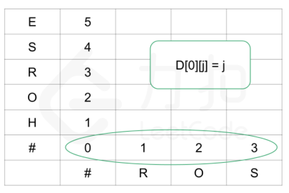
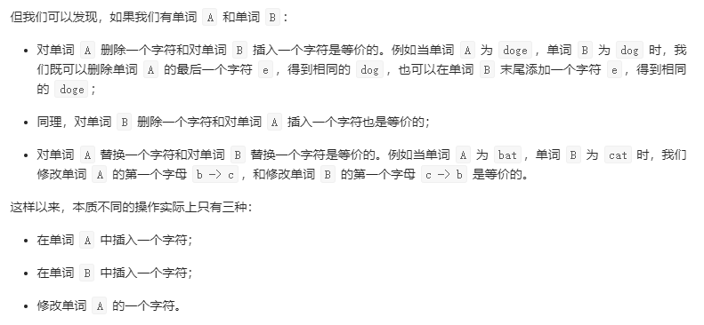
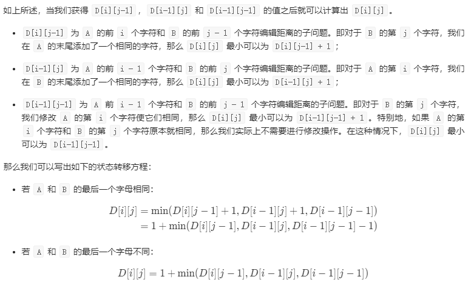

# 算法

## KMP

子字符串查找算法

主要思想是提前判断如何重新开始查找，不会回退文本指针 i ，而是使用一个数组 `dfa[][]` 来记录匹配失败时模式指针 j 应该回退多远。

DFA **确定有限状态自动机**


## 排序

各种排序算法性能特点


| 算法         | 是否稳定 | 是否原地排序 | 时间复杂度            | 空间复杂度 | 备注                                       |
| ------------ | -------- | ------------ | --------------------- | ---------- | ------------------------------------------ |
| 选择排序     | 不稳定    | 是           | $N^2$                 | 1          | 取决于元素排列情况                         |
| 插入排序   | 稳定     | 是           | $N$ 和 $N^2$ 之间     | 1          | 取决于元素排列情况                         |
| 希尔排序     | 不稳定    | 是           | $NlogN$ ? $N^{6/5}$ ? | 1          | 取决于元素排列情况                         |
| 快速排序     | 不稳定    | 是           | $NlogN$               | $lgN$      | 运行效率由概率保证                         |
| 三向快速排序 | 不稳定    | 是           | $N$ 和$NlogN$ 之间    | $lgN$      | 运行效率由概率保证<br />取决于元素排列情况 |
| 归并排序     | 稳定     | 否           | $NlogN$               | $N$        |                                            |
| 堆排序       | 不稳定    | 是           | $NlogN$               | 1          |                                            |
| 基数排序     | 稳定 |              | $O(N*d)$ | $N+d$ |                                            |
| 桶排序       | 稳定 |              | $N$和$N^2$            | $N+d$ |                                            |
|计数排序|稳定||$N$|$N+d$||
时间复杂度中 $log$ 说明是二叉树（子树、递归）结构

### 堆排序

[code](../main/java/sort/MaxPQ.java)

完全二叉树：除最后一层，其他节点个数都是满的，最后一层的节点都是左排列。可以只用数组而不用指针来表示。


在二叉堆中 位置k 的节点的父节点位置为 k/2 ，两个子节点位置为 2k 和 2k+1

#### 上浮：

插入优先队列通常是将元素添加到数组末尾，然后上浮到合适位置

```java
private void swim(int k) {
    while (k > 1 && pq[k] > pq[k / 2]) {
        // 和父节点比较，如果比父节点大就往上一直换
        swap(k, k / 2);
        k = k / 2;
    }
}
```

#### 下沉：

删除最大/最小元素通常将最后一个元素放到顶端，减小堆大小并让这个元素下沉到合适位置

```java
private void sink(int k) {
    while (2 * k < N) {
        int j = 2 * k;//子节点
        if (j < N && pq[j] > pq[j + 1])//选择两个子节点中较大的元素
            j++;
        if (pq[j] > pq[k])//如果子节点大于父节点，交换
            swap(j, k);
        else
            break;
        k = j;//不断下沉
    }
}
```

## 查找

### 二分查找

有序数组：

`leetcode` 中有关二分查找的问题中，有序数组可以是：`[5,9,11,13,1,2,4]`类型、`[1,3,6,7,9.11,13]`类型、或者提供一个范围。

其中细节：mid是否加一减一，while是<=还是< 

要考虑清楚查找区域是开空间还是闭空间即是`()` 还是`(]` `[]` ，mid是否需要查找等，left是否会等于right。

[code](../main/java/bs)

```java
//简单的二分查找伪代码：
public int binarySearch(int[] nums int target){
    int left=0; int right = nums.length-1; // 这里是 [left,right] 闭空间类型
    while(left<=right){
        int mid = left + (right-left)/2; // (low + high) >>> 1; java源码 
        //其中 (low + high)/2 或 (left+right)>>2 可能会溢出
        if(nums[mid]==target){...}
        else if(nums[mid]<target){ left=mid+1; }
        else if(nums[mid]>target){ right=mid-1; }
    }
    return ...;
}
```

### 二叉查找树


### 2-3树

二叉平衡树

左左型（右转）、右右型（左转）

### 红黑树

《算法》 -275页

实现2-3树，通过标准二叉查找树和额外信息表示2-3树。

红链接：将两个2结点连在一起构成一个3结点。（左斜即均为左连接、没有一个结点同时和两条红链接相连）

黑链接：普通链接

完美黑色平衡：任意空连接到根节点的路径上的黑链接数量相同。

指向自己的链接是什么颜色，自己就是什么结点（红、黑），也就是链接颜色保存再指向的结点中。

```java
//旋转
//左旋
//其中h可能是红色或黑色
//实际要做的就是把 h 的右节点 变成 父节点
Node rotateLeft(Node h) {
    Node x = h.right;//获取右节点（红色）
    h.right = x.left;//将 x 的 左节点 挂在 右节点 上，2-3节点的中间节点
    x.left = h;
    x.color = h.color;//这里可能导致两节点都是红色
    h.color = RED;
    x.N = h.N;
    h.N = 1 + size(h.left) + size(h.right);
    return x;
}

//右旋
//同理
Node rotateRight(Node h) {
    Node x = h.left;
    h.left = x.right;
    x.right = h;
    x.color = h.color;
    h.color = RED;
    x.N = h.N;
    h.N = 1 + size(h.left) + size(h.right);
    return x;
}

void flipColors(Node h) {
    h.color = RED;
    h.left.color = BLACK;
    h.right.color = BLACK;
}

private int size(Node x) {
    if (x == null) return 0;
    else return x.N;
}
```

添加结点，会有以下几种情况

```java
private Node put(Node h,int val){
    if(h == null) return new Node(val,1,RED);

    int cmp = val - h.val;//判断大于小于，小于就放左侧，大于就放右侧
    if (cmp<0) h.left = put(h.left,val);
    else if(cmp>0) h.right = put(h.right,val);
    else h.val = val;

    //左转、右转、变色
    //右转、变色
    //变色

    if (isRed(h.right) && !isRed(h.left)) h = rotateLeft(h);//保持红链接为左连接
    if (isRed(h.left)&& isRed(h.left.left)) h=rotateRight(h);//如果前一步，或者传入的h为两个红结点相连，右转
    if (isRed(h.left)&&isRed(h.right)) flipColors(h);//如果h的左右都是红结点，就变黑。前一步操作可能导致这种情况

    h.N = size(h.left) + size(h.right) + 1;
    return h;
}
```

JDK1.8中`HashMap`改为红黑树实现

## 动态规划

状态、选择

### 背包问题

#### 0-1背包问题

[分割等和子集](https://leetcode-cn.com/problems/partition-equal-subset-sum/)

解决的基本思路是：物品一个一个选，容量也一点一点增加去考虑(子问题)

**状态：**物品、容量两个状态

**选择：**装入背包和不装入背包


背包问题状态转移方程：

$F[i,v]=max\{F[i-1,v],F[i-1,v-C_i]+W_i\}$

$F[i,v]$ 前 $i$ 件物品恰放入容量为 $v$ 的背包可以获得的最大价值，两种情况放与不放(重量$C_i$  价值$W_i$)

如何理解容量要一点一点增加：

​        两种情况，放入背包和不放入背包。dp数组保存的是最优值（当前最大价值）。如果要放入背包，则需要容量 $C_i$ ，那么容量 `dp[i-1][v-Ci]` 就是 **之前容量** 为 $v-C_i$ 的最优值，`dp[i][j-c[i]]+w[i]` 加最优值，`Math.max(dp[i-1][j],dp[i][j-c[i]]+w[i])` 找到最优值。

```java
int[][] dp = new int[][];
//每个物品
for (int i = 1; i < len; i++) {
    //背包，容量一点一点增加
    for (int j = 0; j <= target; j++) {
    	dp[i][j] = Math.max(dp[i-1][j],dp[i][j-c[i]]+w[i]);
    }
}
```

优化空间复杂度

「0-1 背包问题」常规优化：「状态数组」从二维降到一维，减少空间复杂度。

- 在「填表格」的时候，当前行只参考了上一行的值，因此状态数组可以只设置 2 行，使用「滚动数组」的技巧「填表格」即可；

- 实际上，在「滚动数组」的基础上还可以优化，在「填表格」的时候，当前行总是参考了它上面一行 「头顶上」 那个位置和「左上角」某个位置的值。因此，我们可以只开一个一维数组，从后向前依次填表即可。

#### 完全背包问题

[518. 零钱兑换 II](https://leetcode-cn.com/problems/coin-change-2/)

每种物品有无限件可用 

**状态：**物品、容量两个状态 

**选择：**装入背包和不装入背包

完全背包问题的简单优化：若两件物品 $i$ 、$j$ 满足 $C_i<=C_j$ 且 $W_i >= Wj$ ，则将可以将物品 $j$ 直接去掉，不用考虑

任何情况下价值小耗费高的 j 换成 价值高耗费小的 i, 得到的方案不会更差。

#### 多重背包问题


### 编辑距离

[72. 编辑距离](https://leetcode-cn.com/problems/edit-distance/)

**状态：**两个字符串长度

**选择：** 修改（三种：插入、删除、替换）和不修改

`dp`数组存的结果：最短编辑距离（即最优解）状态有两个采用二维数组 `dp[i][j]` 

初始条件：

字符串 A 为空，如从空字符串转换到 `ro`，显然编辑距离为字符串 B 的长度，这里是 2；

字符串 B 为空，如从 `horse` 转换到 空字符串 ，显然编辑距离为字符串 A 的长度，这里是 5。

```java
//初始条件
for (int i = 1; i < len1 + 1; i++) dp[i][0] = i;
for (int i = 1; i < len2 + 1; i++) dp[0][i] = i;
```



状态转移：



不修改：`dp[i][j] = dp[i-1][j-1];` 当字符相同时，不修改

在A中添加：`dp[i][j] = dp[i-1][j] + 1;` 

在B中添加：`dp[i][j] = dp[i][j-1] + 1;` 

修改单词：`dp[i][j] = dp[i-1][j-1] + 1;`



从递归到动态规划：

[编辑距离](https://labuladong.gitbook.io/algo/dong-tai-gui-hua-xi-lie/bian-ji-ju-li)

```python
    def dp(i, j):
        # base case
        if i == -1: return j + 1
        if j == -1: return i + 1

        if s1[i] == s2[j]:
            return dp(i - 1, j - 1)  # 啥都不做
        else:
            return min(
                dp(i, j - 1) + 1,    # 插入
                dp(i - 1, j) + 1,    # 删除
                dp(i - 1, j - 1) + 1 # 替换
            )

dp(i, j - 1) + 1,    # 插入
# 解释：
# 我直接在 s1[i] 插入一个和 s2[j] 一样的字符
# 那么 s2[j] 就被匹配了，前移 j，继续跟 i 对比
# 别忘了操作数加一

dp(i - 1, j) + 1,    # 删除
# 解释：
# 我直接把 s[i] 这个字符删掉
# 前移 i，继续跟 j 对比
# 操作数加一

dp(i - 1, j - 1) + 1 # 替换
# 解释：
# 我直接把 s1[i] 替换成 s2[j]，这样它俩就匹配了
# 同时前移 i，j 继续对比
# 操作数加一
```

### 最长公共子序列

[最长公共子序列](https://leetcode-cn.com/problems/longest-common-subsequence/)

**状态：**两个字符串长度

**选择：**在或不在最长子序列中