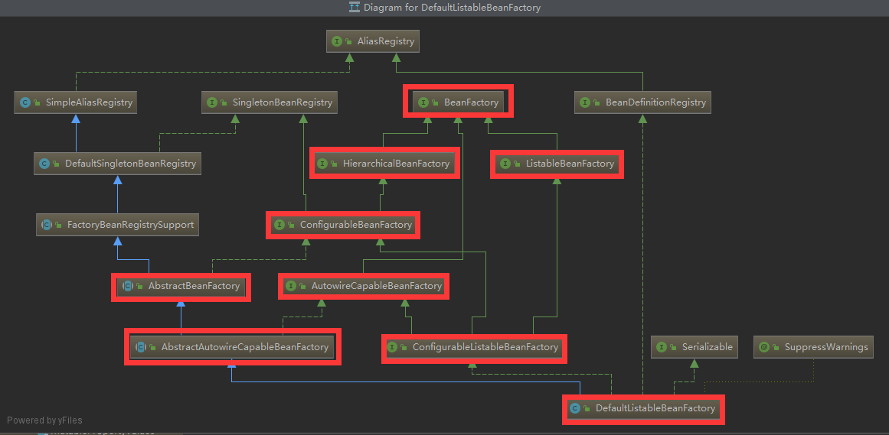
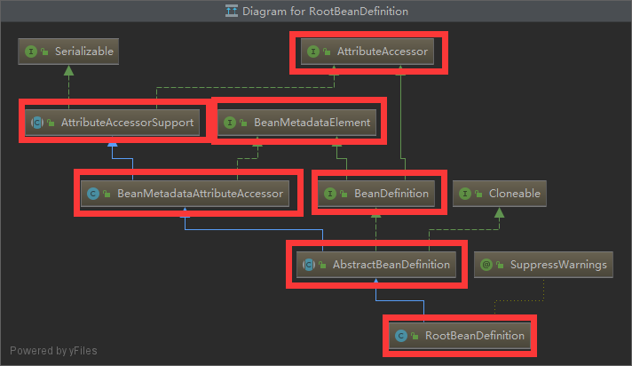

# spring

重点**refresh**函数是核心必须要看

体系结构：


核心组件 bean、core、context 。Spring面向Bean的编程，BOP，把对象之间的依赖关系转而用配置文件、配置类来管理(**依赖注入**)

**Context**发现每个Bean之间的关系，为他们建立这种关系并且维护好这种关系。Context即Bean关系的集合 IOC容器

**Core**发现、建立、维护每个Bean之间关系所需要的一系列工具 Util。

## Bean

org.springframework.beans 主要解决 Bean定义、Bean的创建、Bean的解析

Bean的创建： 工厂方法



针对不同情况有不同的接口：

ListableBeanFactory 表示这些 Bean 是可列表的

AutoWireCapableBeanFactory 接口定义Bean的自动装配规则

HierarchicalBeanFactory 表示这些Bean是有继承关系的。

最终实现类：

DefaultListableBeanFactory

Bean的定义：



主要由BeanDefinition描述

## Context

## Core


## Spring IOC容器

### refresh 

梦开始的地方 AbstractApplicationContext 抽象类的 refresh方法

```java
public abstract class AbstractApplicationContext extends DefaultResourceLoader
		implements ConfigurableApplicationContext {
    
    
    @Override
    public void refresh() throws BeansException, IllegalStateException {
       synchronized (this.startupShutdownMonitor) {
          // Prepare this context for refreshing.
          prepareRefresh();

          // Tell the subclass to refresh the internal bean factory.
          ConfigurableListableBeanFactory beanFactory = obtainFreshBeanFactory();

          // Prepare the bean factory for use in this context.
          // 配置beanfactory，添加一些本身需要的工具类
          prepareBeanFactory(beanFactory);

          try {
             // Allows post-processing of the bean factory in context subclasses.
             // 注册实现了BeanPostProcessor接口的beans
             postProcessBeanFactory(beanFactory);

             // Invoke factory processors registered as beans in the context.
             // 初始化和执行 BeanFactoryPostProcessors beans
             invokeBeanFactoryPostProcessors(beanFactory);

             // Register bean processors that intercept bean creation.
             // 初始化和执行 bean processors beans
             registerBeanPostProcessors(beanFactory);

             // Initialize message source for this context.
             // 初始化 message source
             initMessageSource();

             // 初始化 event multicaster 
             // Initialize event multicaster for this context.
             initApplicationEventMulticaster();

             // 刷新子类实现的方法
             // Initialize other special beans in specific context subclasses.
             onRefresh();

             // 检测注册事件
             // Check for listener beans and register them.
             registerListeners();

             // 初始化 non-lazy-init 单例 bean
             // Instantiate all remaining (non-lazy-init) singletons.
             finishBeanFactoryInitialization(beanFactory);

             // Last step: publish corresponding event.
             // 执行LifecycleProcessor.onFresh和 ContextRefreshedEvent事件
             finishRefresh();
          }

          catch (BeansException ex) {
             if (logger.isWarnEnabled()) {
                logger.warn("Exception encountered during context initialization - " +
                      "cancelling refresh attempt: " + ex);
             }

             // Destroy already created singletons to avoid dangling resources.
             destroyBeans();

             // Reset 'active' flag.
             cancelRefresh(ex);

             // Propagate exception to caller.
             throw ex;
          }

          finally {
             // Reset common introspection caches in Spring's core, since we
             // might not ever need metadata for singleton beans anymore...
             resetCommonCaches();
          }
       }
    }
}
```

创建、刷新 BeanFactory

ConfigurableListableBeanFactory beanFactory = obtainFreshBeanFactory();

```java
//AbstractApplicationContext
protected ConfigurableListableBeanFactory obtainFreshBeanFactory() {
   refreshBeanFactory();//调用子类实现的方法
   return getBeanFactory();//同样调用子类实现的方法
}
```

子类 AbstractRefreshableApplicationContext 和 GenericApplicationContext

子类 GenericApplicationContext

```java
public class GenericApplicationContext extends AbstractApplicationContext implements BeanDefinitionRegistry {
    
    private final DefaultListableBeanFactory beanFactory;//保存BeanFactory
    
    public GenericApplicationContext() {
		this.beanFactory = new DefaultListableBeanFactory();
	}
    
    @Override
	public final ConfigurableListableBeanFactory getBeanFactory() {
		return this.beanFactory;//get方法
	}
    
    //refreshBeanFactory什么都不做，在最开始new的时候就已经实例化了，不再刷新了
    @Override
	protected final void refreshBeanFactory() throws IllegalStateException {
		if (!this.refreshed.compareAndSet(false, true)) {
			throw new IllegalStateException(
					"GenericApplicationContext does not support multiple refresh attempts: just call 'refresh' once");
		}
		this.beanFactory.setSerializationId(getId());
	}

}
```

另一个子类

AnnotationConfigWebApplicationContext的父类

```java
public abstract class AbstractRefreshableApplicationContext extends AbstractApplicationContext {
    
    @Override
	public final ConfigurableListableBeanFactory getBeanFactory() {
		return this.beanFactory;//get方法
	}
    
    @Override
    protected final void refreshBeanFactory() throws BeansException {
       if (hasBeanFactory()) {//判断有没有实例化beanfactory
          destroyBeans();
          closeBeanFactory();
       }
       try {
          DefaultListableBeanFactory beanFactory = createBeanFactory();//没有的话创建
          beanFactory.setSerializationId(getId());
          customizeBeanFactory(beanFactory);
          loadBeanDefinitions(beanFactory);//加载、解析Bean的定义
          synchronized (this.beanFactoryMonitor) {
             this.beanFactory = beanFactory;
          }
       }
       catch (IOException ex) {
          throw new ApplicationContextException("I/O error parsing bean definition source for " + getDisplayName(), ex);
       }
    }
}
```

通过xml配置的applicationcontext

```java
public abstract class AbstractXmlApplicationContext extends AbstractRefreshableConfigApplicationContext {
    @Override
    protected void loadBeanDefinitions(DefaultListableBeanFactory beanFactory) throws BeansException, IOException {
       // Create a new XmlBeanDefinitionReader for the given BeanFactory.
       XmlBeanDefinitionReader beanDefinitionReader = new XmlBeanDefinitionReader(beanFactory);

       // Configure the bean definition reader with this context's
       // resource loading environment.
       beanDefinitionReader.setEnvironment(this.getEnvironment());
       beanDefinitionReader.setResourceLoader(this);
       beanDefinitionReader.setEntityResolver(new ResourceEntityResolver(this));

       // Allow a subclass to provide custom initialization of the reader,
       // then proceed with actually loading the bean definitions.
       initBeanDefinitionReader(beanDefinitionReader);
       loadBeanDefinitions(beanDefinitionReader);//重载
    }
    
    //Load the bean definitions with the given XmlBeanDefinitionReader.
    //加载类定义
    protected void loadBeanDefinitions(XmlBeanDefinitionReader reader) throws BeansException, IOException {
		Resource[] configResources = getConfigResources();
		if (configResources != null) {
			reader.loadBeanDefinitions(configResources);
		}
		String[] configLocations = getConfigLocations();
		if (configLocations != null) {
			reader.loadBeanDefinitions(configLocations);
		}
	}
}
```

通过设置类来配置ApplicationContext

```java
public class AnnotationConfigWebApplicationContext extends AbstractRefreshableWebApplicationContext
		implements AnnotationConfigRegistry {
    
    @Override
    protected void loadBeanDefinitions(DefaultListableBeanFactory beanFactory) {
       AnnotatedBeanDefinitionReader reader = getAnnotatedBeanDefinitionReader(beanFactory);
       ClassPathBeanDefinitionScanner scanner = getClassPathBeanDefinitionScanner(beanFactory);

       BeanNameGenerator beanNameGenerator = getBeanNameGenerator();
       if (beanNameGenerator != null) {
          reader.setBeanNameGenerator(beanNameGenerator);
          scanner.setBeanNameGenerator(beanNameGenerator);
          beanFactory.registerSingleton(AnnotationConfigUtils.CONFIGURATION_BEAN_NAME_GENERATOR, beanNameGenerator);
       }

       ScopeMetadataResolver scopeMetadataResolver = getScopeMetadataResolver();
       if (scopeMetadataResolver != null) {
          reader.setScopeMetadataResolver(scopeMetadataResolver);
          scanner.setScopeMetadataResolver(scopeMetadataResolver);
       }

       if (!this.componentClasses.isEmpty()) {
          if (logger.isDebugEnabled()) {
             logger.debug("Registering component classes: [" +
                   StringUtils.collectionToCommaDelimitedString(this.componentClasses) + "]");
          }
          reader.register(ClassUtils.toClassArray(this.componentClasses));
       }

       if (!this.basePackages.isEmpty()) {
          if (logger.isDebugEnabled()) {
             logger.debug("Scanning base packages: [" +
                   StringUtils.collectionToCommaDelimitedString(this.basePackages) + "]");
          }
          scanner.scan(StringUtils.toStringArray(this.basePackages));
       }

       String[] configLocations = getConfigLocations();
       if (configLocations != null) {
          for (String configLocation : configLocations) {
             try {
                Class<?> clazz = ClassUtils.forName(configLocation, getClassLoader());
                if (logger.isTraceEnabled()) {
                   logger.trace("Registering [" + configLocation + "]");
                }
                reader.register(clazz);
             }
             catch (ClassNotFoundException ex) {
                if (logger.isTraceEnabled()) {
                   logger.trace("Could not load class for config location [" + configLocation +
                         "] - trying package scan. " + ex);
                }
                int count = scanner.scan(configLocation);
                if (count == 0 && logger.isDebugEnabled()) {
                   logger.debug("No component classes found for specified class/package [" + configLocation + "]");
                }
             }
          }
       }
    }
}
```

## aop

[面向切面编程学习代码](./src/main/java/aop)

主要是以aspectJ注解为主

## ioc 
[控制翻转学习代码](./src/main/java/ioc)

类定义
`Map<String,BeanDefinition> m1 = new ConcurrentHashMap<String,BeanDefinition>();`

类
`Map<String,Object> m2 = new ConcurrentHashMap<String,Object>();`


- BeanDefinitionReader 解析xml、注解、配置类中类的定义

- BeanFactory 生成bean实例的工厂方法

- BeanPostProcessor 在生成bean前后的处理（扩展）

- BeanFactoryPostProcessor

- IOC容器

循环依赖三级缓存：

`DefaultSingletonBeanRegistry`

```java
    //一级缓存
	/** Cache of singleton objects: bean name to bean instance. */
	private final Map<String, Object> singletonObjects = new ConcurrentHashMap<>(256);

    //三级缓存
	/** Cache of singleton factories: bean name to ObjectFactory. */
	private final Map<String, ObjectFactory<?>> singletonFactories = new HashMap<>(16);

    //二级缓存
	/** Cache of early singleton objects: bean name to bean instance. */
	private final Map<String, Object> earlySingletonObjects = new HashMap<>(16);
```

首先创建A的实例化-> 将A 和 工厂（匿名内部类） 放到三级缓存 singletonFactories -> 开始解决依赖 B ，B没有再任何缓存中
那么B初始化->将B 和 工厂（匿名内部类） 放到三级缓存 -> 开始解决依赖A -> 发现A在三级缓存则调用工厂方法并放到二级缓存->从二级缓存获取A
后完成初始化，将B放到以及缓存（同时移除B的三级缓存）->获取B后将A放到一级缓存（同时移除A的二级缓存和三级缓存）

为什么必须三级缓存：

理论上二级缓存可以解决循环依赖问题，但是需要考虑代理问题AOP

在三级缓存中放置的是生成具体对象的一个匿名内部类，这个匿名内部类可能是代理类，也可能是普通的代理对象，而使用三级缓存就保证了不管是否
要代理对象，都保证使用的是一个对象，而不会出现，前面是普通bean，后面使用代理类

```java
//DefaultSingletonBeanRegistry

protected Object getSingleton(String beanName, boolean allowEarlyReference) {
		Object singletonObject = this.singletonObjects.get(beanName);
		if (singletonObject == null && isSingletonCurrentlyInCreation(beanName)) {
			synchronized (this.singletonObjects) {
				singletonObject = this.earlySingletonObjects.get(beanName);
				if (singletonObject == null && allowEarlyReference) {
					ObjectFactory<?> singletonFactory = this.singletonFactories.get(beanName);
					if (singletonFactory != null) {
						singletonObject = singletonFactory.getObject(); //三级缓存匿名内部类 ObjectFactory
						this.earlySingletonObjects.put(beanName, singletonObject); //放到二级缓存
						this.singletonFactories.remove(beanName); //从三级缓存中删除
					}
				}
			}
		}
		return singletonObject;
	}
```

---------------------------
常用注解：

@Component @AutoWired @ComponentScan

-----------
想要成为一个框架，首先要考虑一定是扩展性

spring提供的扩展性有：

1、在对象创建前添加某些功能

2、在容器初始化前添加某些功能

3、在不同阶段发出不同的事件，完成一些事情

4、抽象出一堆接口来帮助扩展

5、面向接口编程

## spring-mvc

[code](./src/main/java/com/nuc/meerkatx/spmvc)