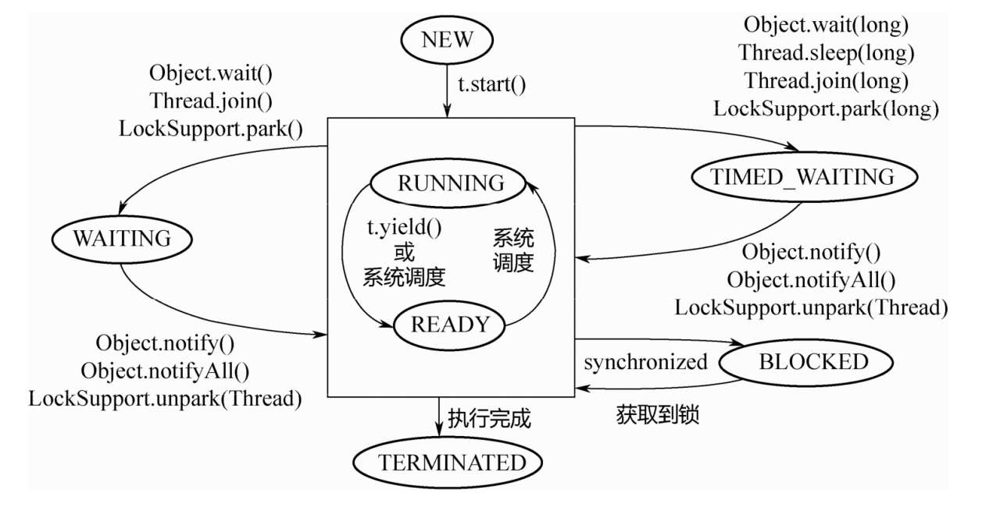

# Thread

## Java线程状态

```java
//Thread.java
public enum State {
        /**
         * Thread state for a thread which has not yet started.
         */
        NEW,

        /**
         * Thread state for a runnable thread.  A thread in the runnable
         * state is executing in the Java virtual machine but it may
         * be waiting for other resources from the operating system
         * such as processor.
         */
        RUNNABLE,

        /**
         * Thread state for a thread blocked waiting for a monitor lock.
         * A thread in the blocked state is waiting for a monitor lock
         * to enter a synchronized block/method or
         * reenter a synchronized block/method after calling
         * {@link Object#wait() Object.wait}.
         */
        BLOCKED,

        /**
         * Thread state for a waiting thread.
         * A thread is in the waiting state due to calling one of the
         * following methods:
         * <ul>
         *   <li>{@link Object#wait() Object.wait} with no timeout</li>
         *   <li>{@link #join() Thread.join} with no timeout</li>
         *   <li>{@link LockSupport#park() LockSupport.park}</li>
         * </ul>
         *
         * <p>A thread in the waiting state is waiting for another thread to
         * perform a particular action.
         *
         * For example, a thread that has called <tt>Object.wait()</tt>
         * on an object is waiting for another thread to call
         * <tt>Object.notify()</tt> or <tt>Object.notifyAll()</tt> on
         * that object. A thread that has called <tt>Thread.join()</tt>
         * is waiting for a specified thread to terminate.
         */
        WAITING,

        /**
         * Thread state for a waiting thread with a specified waiting time.
         * A thread is in the timed waiting state due to calling one of
         * the following methods with a specified positive waiting time:
         * <ul>
         *   <li>{@link #sleep Thread.sleep}</li>
         *   <li>{@link Object#wait(long) Object.wait} with timeout</li>
         *   <li>{@link #join(long) Thread.join} with timeout</li>
         *   <li>{@link LockSupport#parkNanos LockSupport.parkNanos}</li>
         *   <li>{@link LockSupport#parkUntil LockSupport.parkUntil}</li>
         * </ul>
         */
        TIMED_WAITING,

        /**
         * Thread state for a terminated thread.
         * The thread has completed execution.
         */
        TERMINATED;
    }
```



## Java线程池状态

```java
/*
	 * The runState provides the main lifecycle control, taking on values:
     *
     *   RUNNING:  Accept new tasks and process queued tasks
     *   SHUTDOWN: Don't accept new tasks, but process queued tasks
     *   STOP:     Don't accept new tasks, don't process queued tasks,
     *             and interrupt in-progress tasks
     *   TIDYING:  All tasks have terminated, workerCount is zero,
     *             the thread transitioning to state TIDYING
     *             will run the terminated() hook method
     *   TERMINATED: terminated() has completed
*/
```


#### 线程池任务调度

1. 首先检测线程池运行状态，如果不是RUNNING，则直接拒绝，线程池要保证在RUNNING的状态下执行任务。
2. 如果workerCount < corePoolSize，则创建并启动一个线程来执行新提交的任务。
3. 如果workerCount >= corePoolSize，且线程池内的阻塞队列未满，则将任务添加到该阻塞队列中。
4. 如果workerCount >= corePoolSize && workerCount < maximumPoolSize，且线程池内的阻塞队列已满，则创建并启动一个线程来执行新提交的任务。
5. 如果workerCount >= maximumPoolSize，并且线程池内的阻塞队列已满, 则根据拒绝策略来处理该任务, 默认的处理方式是直接抛异常。

```java
//线程池任务调度相关源码：ThreadPoolExecutor
public void execute(Runnable command) {
        if (command == null)
            throw new NullPointerException();
        /*
         * Proceed in 3 steps:
         *
         * 1. If fewer than corePoolSize threads are running, try to
         * start a new thread with the given command as its first
         * task.  The call to addWorker atomically checks runState and
         * workerCount, and so prevents false alarms that would add
         * threads when it shouldn't, by returning false.
         *
         * 2. If a task can be successfully queued, then we still need
         * to double-check whether we should have added a thread
         * (because existing ones died since last checking) or that
         * the pool shut down since entry into this method. So we
         * recheck state and if necessary roll back the enqueuing if
         * stopped, or start a new thread if there are none.
         *
         * 3. If we cannot queue task, then we try to add a new
         * thread.  If it fails, we know we are shut down or saturated
         * and so reject the task.
         */
    
    	//addWorker函数添加线程 if(workerAdded) t.start();
        int c = ctl.get();
        if (workerCountOf(c) < corePoolSize) {
            if (addWorker(command, true))
                return;
            c = ctl.get();
        }
        if (isRunning(c) && workQueue.offer(command)) {
            int recheck = ctl.get();
            if (! isRunning(recheck) && remove(command))
                reject(command);
            else if (workerCountOf(recheck) == 0)
                addWorker(null, false);
        }
        else if (!addWorker(command, false))
            reject(command);
    }
```

ThreadPoolExecutor线程池内部线程工作类Worker

```java
//继承了AQS实现了锁，实现了Runnable
private final class Worker
        extends AbstractQueuedSynchronizer
        implements Runnable
    {
        /**
         * This class will never be serialized, but we provide a
         * serialVersionUID to suppress a javac warning.
         */
        private static final long serialVersionUID = 6138294804551838833L;

        /** Thread this worker is running in.  Null if factory fails. */
        final Thread thread;
        /** Initial task to run.  Possibly null. */
        Runnable firstTask;
        /** Per-thread task counter */
        volatile long completedTasks;

        /**
         * Creates with given first task and thread from ThreadFactory.
         * @param firstTask the first task (null if none)
         */
        Worker(Runnable firstTask) {
            setState(-1); // inhibit interrupts until runWorker
            this.firstTask = firstTask;
            
            //通过线程工厂创建线程 实现Runnable方法
            //如果是callable传入的就是FutureTask(submit方法)
            this.thread = getThreadFactory().newThread(this);
        }

        /** Delegates main run loop to outer runWorker  */
        public void run() {
            runWorker(this);//传入this即自己
        }
    }
//Main worker run loop.此处注释解释了很多问题，建议详细看一看
final void runWorker(Worker w) {
        Thread wt = Thread.currentThread();
        Runnable task = w.firstTask;
        w.firstTask = null;
        w.unlock(); // allow interrupts
        boolean completedAbruptly = true;
        try {
            while (task != null || (task = getTask()) != null) {
                // getTask()就是从阻塞队列中取出任务 
                
                /*
                Runnable r = timed ?
                    workQueue.poll(keepAliveTime, TimeUnit.NANOSECONDS) :
                    workQueue.take();
                if (r != null)
                    return r;
                */
                
             	// 这里为什么加锁？？ 原因可以在java doc或函数前注释中找到
                w.lock();
                // If pool is stopping, ensure thread is interrupted;
                // if not, ensure thread is not interrupted.  This
                // requires a recheck in second case to deal with
                // shutdownNow race while clearing interrupt
                if ((runStateAtLeast(ctl.get(), STOP) ||
                     (Thread.interrupted() &&
                      runStateAtLeast(ctl.get(), STOP))) &&
                    !wt.isInterrupted())
                    wt.interrupt();
                try {
                    beforeExecute(wt, task);
                    Throwable thrown = null;
                    try {
                        //这一步开始执行传入的任务 task是一个runnable，命令
                        task.run(); 
                    } catch (RuntimeException x) {
                        thrown = x; throw x;
                    } catch (Error x) {
                        thrown = x; throw x;
                    } catch (Throwable x) {
                        thrown = x; throw new Error(x);
                    } finally {
                        afterExecute(task, thrown);
                    }
                } finally {
                    task = null;//任务执行完毕后重新设置为null，开始新一轮循环。
                    w.completedTasks++;
                    w.unlock();
                }
            }
            completedAbruptly = false;
        } finally {
            processWorkerExit(w, completedAbruptly);
        }
    }
```

#### Worker加锁原因

Class Worker mainly maintains interrupt control state for threads running tasks, along with other minor bookkeeping. This class opportunistically extends AbstractQueuedSynchronizer to simplify acquiring and releasing a lock surrounding each task execution. **This protects against interrupts that are intended to wake up a worker thread waiting for a task from instead interrupting a task being run. ** We implement a simple non-reentrant mutual exclusion lock rather  than use ReentrantLock because we do not want worker tasks to be able to reacquire the lock when they invoke pool control methods like setCorePoolSize.  Additionally, to suppress interrupts until  the thread actually starts running tasks, we initialize lock state to a negative value, and clear it upon start (in  runWorker).

~~但是还是没能完全理解~~

对于任务`runWorker`而言：

Before running any task, the lock is acquired to prevent other pool interrupts while the task is executing, and then we ensure that unless pool is stopping, this thread does not have  its interrupt set.

防止其他线程池中断，保护线程运行

“这里在执行具体任务期间加锁，是为了避免在任务运行期间，其他线程调用了shutdown后正在执行的任务被中断。

shutdown只会中断当前被阻塞挂起的线程”		——《Java并发编程之美》

## Runnable 和 Callable

### Runnable

```java
@FunctionalInterface //函数式接口
public interface Runnable {
    /**
     命令模式,Runnable就是一个命令，放到执行器Thread中进行执行，解耦了命令和执行器
     * When an object implementing interface <code>Runnable</code> is used
     * to create a thread, starting the thread causes the object's
     * <code>run</code> method to be called in that separately executing
     * thread.
     * <p>
     * The general contract of the method <code>run</code> is that it may
     * take any action whatsoever.
     *
     * @see     java.lang.Thread#run()
     */
    public abstract void run();
}
```

### Callable

```java
@FunctionalInterface
public interface Callable<V> {
    /**
     可以获取返回值的Runnable
     * Computes a result, or throws an exception if unable to do so.
     *
     * @return computed result 
     * @throws Exception if unable to compute a result
     */
    V call() throws Exception;
}
```

### Future

异步计算，一般用法：

利用 Future + 线程池 . submit

```java
Future<String> future = executor.submit(()->"hello");
System.out.println(future.get());//就会输出 "相应结果" future.get方法是一个阻塞方法。
```

利用FutureTask + Thread

```java
FutureTask<String> futureTask = new FutureTask(new Callable() {
            @Override
            public String call() throws Exception {
                return "hello";
            }
        });
new Thread(futureTask).start();//对于Thread来说，需要通过FutureTask包装
//FutureTask 实现了RunnableFuture 而 RunnableFuture有继承了Runnable, Future
System.out.println(futureTask.get());
```

Future接口：

```java
public interface Future<V> {
    boolean cancel(boolean mayInterruptIfRunning);
    boolean isCancelled();
    boolean isDone();
    V get() throws InterruptedException, ExecutionException; //阻塞调用者线程，可以被中断
    V get(long timeout, TimeUnit unit)
        throws InterruptedException, ExecutionException, TimeoutException;
}
//针对get方法有不同实现
//常见有：FutureTask,AbstractFuture（netty）

//AbstractFuture
@Override
    public V get() throws InterruptedException, ExecutionException {
        await();//阻塞等待目标是否完成
        /*
        while (!isDone()) {
        		//result != null && result != UNCANCELLABLE;判断标志位
                incWaiters();
                try {
                    wait();
                } finally {
                    decWaiters();
                }
            }
        */

        Throwable cause = cause();
        if (cause == null) {
            return getNow();
        }
        if (cause instanceof CancellationException) {
            throw (CancellationException) cause;
        }
        throw new ExecutionException(cause);
    }

//FutureTask

    public V get() throws InterruptedException, ExecutionException {
        int s = state;
        if (s <= COMPLETING)//同样判断标志位，是否计算完成了
            s = awaitDone(false, 0L);//没有完成的话，就等完成
        return report(s);
    }

	private int awaitDone(boolean timed, long nanos)
        throws InterruptedException {
        final long deadline = timed ? System.nanoTime() + nanos : 0L;
        WaitNode q = null;
        boolean queued = false;
        for (;;) {
            if (Thread.interrupted()) {
                //判断是否中断
                removeWaiter(q);//如果中断了就移除等待队列 CAS
                throw new InterruptedException();
            }
/*
    private volatile int state;
    private static final int NEW          = 0;
    private static final int COMPLETING   = 1;
    private static final int NORMAL       = 2;
    private static final int EXCEPTIONAL  = 3;
    private static final int CANCELLED    = 4;
    private static final int INTERRUPTING = 5;
    private static final int INTERRUPTED  = 6;
*/

            int s = state; //判断标志位
            if (s > COMPLETING) {
                if (q != null)
                    q.thread = null;
                return s;
            }
            else if (s == COMPLETING) // cannot time out yet
                Thread.yield();//主动让出cpu
            else if (q == null)
                q = new WaitNode();
            else if (!queued)
                queued = UNSAFE.compareAndSwapObject(this, waitersOffset,
                                                     q.next = waiters, q);
            else if (timed) {
                //定时等待
                nanos = deadline - System.nanoTime();
                if (nanos <= 0L) {
                    removeWaiter(q);
                    return state;
                }
                LockSupport.parkNanos(this, nanos);
            }
            else
                LockSupport.park(this);//阻塞当前线程 具体见 LockSupport
        }
    }

    private V report(int s) throws ExecutionException {//根据s状态返回不同结果，抛异常等
        Object x = outcome;
        if (s == NORMAL)
            return (V)x;
        if (s >= CANCELLED)
            throw new CancellationException();
        throw new ExecutionException((Throwable)x);
    }
```

## 线程优雅关闭：

### IO密集型：

[code](./src/main/java/Interrupt.java)

#### 轻量级阻塞：

能被中断的阻塞 线程状态为 WAITING 或者 TIME_WAITING 通常 NIO中可响应中断，如select()方法，其他如wait、join、park、sleep这些都是轻量级阻塞

可以使用 `t.interrupted() `来中断，可以唤醒轻量级阻塞 

#### 重量级阻塞：

不能被中断的阻塞 线程状态为 BLOCKED 通常synchronized等待锁

#### 阻塞IO:

阻塞IO无法响应中断，但线程状态为 RUNNABLE，一般通过关闭通道、流（关闭底层资源）等关闭线程

[java线程状态](https://my.oschina.net/goldenshaw/blog/705397)

### CPU密集型：

因为没有阻塞，所以可以隔一段时间，一些运算然后检查一次标志位（即安全点）

[code](./src/main/java/Future/ListenableFutureDemo.java)

```java
for (; ; ) {
	Thread.sleep(interval); //cpu密集型 用sleep模仿做一些计算
	total += interval;
	if (total > m) break;
	if (cancelled) return 2;//cancelled 隔一段时间检查一次safe point
}
```

## AbstractQueuedSynchronizer

### Node

AQS内部类，链表节点

```java
static final class Node {
        /** Marker to indicate a node is waiting in shared mode */
        static final Node SHARED = new Node();
        /** Marker to indicate a node is waiting in exclusive mode */
        static final Node EXCLUSIVE = null;   //标记线程是获取独占锁被阻塞的

        /** waitStatus value to indicate thread has cancelled */
        static final int CANCELLED =  1;  //线程被取消了
        /** waitStatus value to indicate successor's thread needs unparking */
        static final int SIGNAL    = -1;  //线程需要被唤醒
        /** waitStatus value to indicate thread is waiting on condition */
        static final int CONDITION = -2;  //线程在条件队列(condition)里等待
        /**
         * waitStatus value to indicate the next acquireShared should
         * unconditionally propagate
         */
        static final int PROPAGATE = -3;  //释放共享资源时需要通知其他节点

        /**
         * Status field, taking on only the values:
         *   SIGNAL:     The successor of this node is (or will soon be)
         *               blocked (via park), so the current node must
         *               unpark its successor when it releases or
         *               cancels. To avoid races, acquire methods must
         *               first indicate they need a signal,
         *               then retry the atomic acquire, and then,
         *               on failure, block.
         *   CANCELLED:  This node is cancelled due to timeout or interrupt.
         *               Nodes never leave this state. In particular,
         *               a thread with cancelled node never again blocks.
         *   CONDITION:  This node is currently on a condition queue.
         *               It will not be used as a sync queue node
         *               until transferred, at which time the status
         *               will be set to 0. (Use of this value here has
         *               nothing to do with the other uses of the
         *               field, but simplifies mechanics.)
         *   PROPAGATE:  A releaseShared should be propagated to other
         *               nodes. This is set (for head node only) in
         *               doReleaseShared to ensure propagation
         *               continues, even if other operations have
         *               since intervened.
         *   0:          None of the above
         *
         * The values are arranged numerically to simplify use.
         * Non-negative values mean that a node doesn't need to
         * signal. So, most code doesn't need to check for particular
         * values, just for sign.
         *
         * The field is initialized to 0 for normal sync nodes, and
         * CONDITION for condition nodes.  It is modified using CAS
         * (or when possible, unconditional volatile writes).
         */
        volatile int waitStatus;

        /**
         * Link to predecessor node that current node/thread relies on
         * for checking waitStatus. Assigned during enqueuing, and nulled
         * out (for sake of GC) only upon dequeuing.  Also, upon
         * cancellation of a predecessor, we short-circuit while
         * finding a non-cancelled one, which will always exist
         * because the head node is never cancelled: A node becomes
         * head only as a result of successful acquire. A
         * cancelled thread never succeeds in acquiring, and a thread only
         * cancels itself, not any other node.
         */
        volatile Node prev;//前驱节点

        /**
         * Link to the successor node that the current node/thread
         * unparks upon release. Assigned during enqueuing, adjusted
         * when bypassing cancelled predecessors, and nulled out (for
         * sake of GC) when dequeued.  The enq operation does not
         * assign next field of a predecessor until after attachment,
         * so seeing a null next field does not necessarily mean that
         * node is at end of queue. However, if a next field appears
         * to be null, we can scan prev's from the tail to
         * double-check.  The next field of cancelled nodes is set to
         * point to the node itself instead of null, to make life
         * easier for isOnSyncQueue.
         */
        volatile Node next;//后继节点

        /**
         * The thread that enqueued this node.  Initialized on
         * construction and nulled out after use.
         */
        volatile Thread thread;//存放进入AQS队列里面的线程

        /**
         * Link to next node waiting on condition, or the special
         * value SHARED.  Because condition queues are accessed only
         * when holding in exclusive mode, we just need a simple
         * linked queue to hold nodes while they are waiting on
         * conditions. They are then transferred to the queue to
         * re-acquire. And because conditions can only be exclusive,
         * we save a field by using special value to indicate shared
         * mode.
         */
        Node nextWaiter;
}
```

### AQS

```java
public abstract class AbstractOwnableSynchronizer{
    private transient Thread exclusiveOwnerThread;//用来记录锁被哪个线程拥有
}
```

```java
public abstract class AbstractQueuedSynchronizer
    extends AbstractOwnableSynchronizer
    implements java.io.Serializable {
    
    private transient volatile Node head;//链表头
    private transient volatile Node tail;//尾
    private volatile int state;//记录锁的状态 CAS
}
```

在AQS中维持了一个单一的状态信息state，可以通过getState、setState、compareAndSetState函数修改其值。

- 对于ReentrantLock的实现来说，state可以用来表示当前线程获取锁的可重入次数；
- 对于读写锁ReentrantReadWriteLock来说，state的高16位表示读状态，也就是获取该读锁的次数，低16位表示获取到写锁的线程的可重入次数；
- 对于semaphore来说，state用来表示当前可用信号的个数；
- 对于CountDownlatch来说，state用来表示计数器当前的值。

#### 关键部分

##### acquire

```java
//需要注意的是这些代码分别运行在不同的线程中，这些线程分别要访问临界资源。

public final void acquire(int arg) {//tryAcquire由子类实现 如 ReentrantLock 中 FairSync 和 NonfairSync
    if (!tryAcquire(arg) &&
        acquireQueued(addWaiter(Node.EXCLUSIVE), arg))//addWaiter不是Condition的等待队列，是加入到AQS的同步队列，而且线程没有被阻塞。之后再acquireQueued中判断进行阻塞
        //acquireQueued即循环获取锁(同步状态)
        
        selfInterrupt();//如果阻塞期间被中断了，就自己给自己发送中断信号 设置中断为True
}
```

##### acquireQueued

```java
final boolean acquireQueued(final Node node, int arg) {
    boolean failed = true;
    try {
        boolean interrupted = false;
        for (;;) {//因为park被唤醒可能有4中情况 unpark 中断 虚假唤醒 等原因，所以写在for(;;)死循环（自旋）中，除了获得锁以外一律继续阻塞 park
            final Node p = node.predecessor();
            
            //被唤醒，如果自己在队列头，尝试拿锁 tryAcquire 成功 AQS就会将该线程记录为获得同步状态的线程
            //即exclusiveOwnerThread
            if (p == head && tryAcquire(arg)) {
                //只有前驱节点是头结点的才有资格获取锁
                setHead(node); //拿锁成功，出队 （head 指针向前移动一个节点。并且把 Node 的thread = null，所以head仍旧是空节点。）
                p.next = null; // help GC
                failed = false;
                return interrupted;//返回阻塞期间是否被中断过
            }
            //判断进行阻塞 park
            if (shouldParkAfterFailedAcquire(p, node) &&
                parkAndCheckInterrupt())
                //parkAndCheckInterrupt函数 先park 之后被唤醒检查中断状态 被阻塞之后就暂停了for循环
                interrupted = true;//如果被中断了，就设置标志位true
        }
    } finally {
        if (failed)
            cancelAcquire(node);
    }
}
```

##### release

```java
	//同样是模板方法，调用子类方法释放锁修改 state
    public final boolean release(int arg) {
        if (tryRelease(arg)) {//调用子类实现
            Node h = head;
            if (h != null && h.waitStatus != 0)
                unparkSuccessor(h);//唤醒队列中后继者
            return true;
        }
        return false;
    }
```

##### unparkSuccessor

```java
    //唤醒队列中后继者
    private void unparkSuccessor(Node node) {
        /*
         * If status is negative (i.e., possibly needing signal) try
         * to clear in anticipation of signalling.  It is OK if this
         * fails or if status is changed by waiting thread.
         */
        int ws = node.waitStatus;
        if (ws < 0)
            compareAndSetWaitStatus(node, ws, 0);

        /*
         * Thread to unpark is held in successor, which is normally
         * just the next node.  But if cancelled or apparently null,
         * traverse backwards from tail to find the actual
         * non-cancelled successor.
         */
        Node s = node.next;
        if (s == null || s.waitStatus > 0) {
            s = null;
            for (Node t = tail; t != null && t != node; t = t.prev)
                if (t.waitStatus <= 0)
                    s = t;
        }
        if (s != null)
            LockSupport.unpark(s.thread);//唤醒
    }
```

##### doAcquireInterruptibly

可中断 lock 核心方法

```java
private void doAcquireInterruptibly(int arg)
    throws InterruptedException {
    final Node node = addWaiter(Node.EXCLUSIVE);
    boolean failed = true;
    try {
        for (;;) {
            final Node p = node.predecessor();
            if (p == head && tryAcquire(arg)) {
                setHead(node);
                p.next = null; // help GC
                failed = false;
                return;
            }
            //与acquireQueued不同点主要在这里
            if (shouldParkAfterFailedAcquire(p, node) &&
                parkAndCheckInterrupt())
                throw new InterruptedException(); // 如果被中断了直接抛中断异常
        }
    } finally {
        if (failed)
            cancelAcquire(node);
    }
}
```

### ConditionObject

AQS内部类 可以直接访问state和AQS队列，每个ConditionObject对应一个条件队列，存放调用条件变量的await方法后被阻塞的线程。

见Condition实例化那一章


AQS有同步队列 Condition有等待队列 两者使用的都是==AQS$Node==，都是阻塞队列

等待队列维护等待Signal信号的队列，同步队列维护当前等待资源的队列。**每个线程只能存在于同步队列或等待队列中的一个**。

具体说来应该是这么一个流程：

1. 同步队列的初始状态为 AQS-> nodeA -> nodeB，同步队列中包含线程A(节点A)和线程B(节点B)，线程调用reentrantLock.lock()时，线程被加入到AQS同步队列中
2. 线程A(节点A)调用condition.await()方法时，线程A(节点A)从AQS同步队列中被移除，对应操作是锁的释放； 线程A(节点A)接着被加入到Condition等待队列，因为线程需要singal信号。AQS->nodeB   |    ConditionWaiter -> nodeA
3. 线程B(节点B)由于线程A(节点A)释放锁被唤醒，判断成为同步队列头结点且同步状态为0可以获取锁；线程B(节点B)获取锁。
4. 线程B(节点B)调用singal()方法，Condition等待队列中有一个节点A，把它取出来加入到AQS同步队列中。**这时候线程A(节点A)并没有被唤醒**。AQS->nodeA  |   ConditionWaiter
5. 线程B(节点B)singal方法执行完毕，调用reentrantLock.unLock()方法释放锁。线程A(节点A)成为AQS首节点并且同步状态可获取，线程A(节点A)被唤醒，继续执行。
6. AQS从头到尾顺序唤醒线程，直到等待队列中的线程被执行完毕结束。

[怎么理解Condition](http://ifeve.com/understand-condition/) 以及《Java并发编程的艺术》150页

## Lock

为了实现一把具有阻塞或唤醒功能的锁，需要几个核心要素：
① 需要一个state变量，标记该锁的状态。state变量至少有两个值：0、1。对state变量的操作，要确保线程安全，也就是会用到CAS。
② 需要记录当前是哪个线程持有锁。
③ 需要底层支持对一个线程进行阻塞或唤醒操作。
④ 需要有一个队列维护所有阻塞的线程。这个队列也必须是线程安全的无锁队列，也需要用到CAS。

```java
public interface Lock {

    void lock();//注意 lock 不可以被中断

    //相对应这个方法可以被中断 对应到ReentrantLock 是调用了 AQS 的模板方法 acquireInterruptibly 
    // doAcquireInterruptibly 
    void lockInterruptibly() throws InterruptedException; 

    boolean tryLock();

    boolean tryLock(long time, TimeUnit unit) throws InterruptedException;

    void unlock();

    Condition newCondition(); //所有的Condition都是从Lock中构造出来的,如ReentrantLock$sync
}
```

### ReentrantLock

可重入锁离不开 AQS 其中 lock 调用 （AQS模板方法）acquire 调用 tryAcquire （子类 NonFair/FairSync实现）+ acquireQueued( addWaiter ) ，需要结合着看

#### 加锁

```java
public class ReentrantLock implements Lock, java.io.Serializable{
    private final Sync sync;
    //继承自AQS有state同步队列，AQS父类保存了获取同步状态的线程
    abstract static class Sync extends AbstractQueuedSynchronizer{}
    
    //非公平锁实现
    static final class NonfairSync extends Sync{
        final void lock() {
            if (compareAndSetState(0, 1))//非公平锁，加锁就直接抢锁，通过CAS设置锁归自己所有
                setExclusiveOwnerThread(Thread.currentThread());
            else
                acquire(1);//AQS的模板方法 ，失败了就继续执行相关操作（tryAcquire 加入同步队列等）
        }
    }
    //公平锁实现
    static final class FairSync extends Sync{
        final void lock() {
            acquire(1);//直接执行AQS模板方法，无法获得锁就加到同步队列后面
        }
        
        //acquire内调用 见AQS中acquire源码
        protected final boolean tryAcquire(int acquires) {
            final Thread current = Thread.currentThread();
            int c = getState();
            if (c == 0) {//没人持有锁
                //排到第一个的话才能设置state获取锁。 非公平锁没有hasQueuedPredecessors，直接抢锁。
                if (!hasQueuedPredecessors() &&
                    compareAndSetState(0, acquires)) {
                    setExclusiveOwnerThread(current);//获取成功的话，标记自己的线程是获取同步状态的线程
                    return true;
                }
            }
            //如果是重入，则直接累加state变量。
            else if (current == getExclusiveOwnerThread()) {
                int nextc = c + acquires;
                if (nextc < 0)
                    throw new Error("Maximum lock count exceeded");
                setState(nextc);
                return true;
            }
            return false;
        }
    }
}
```

#### 解锁

```java
public class ReentrantLock implements Lock, java.io.Serializable {
	public void unlock() {
        sync.release(1);//这里就是AQS的模板方法 见AQS部分release
    }
    abstract static class Sync extends AbstractQueuedSynchronizer {
        
        //解锁具体实现，没有公平锁、非公平锁区分
        protected final boolean tryRelease(int releases) {
            int c = getState() - releases;
            if (Thread.currentThread() != getExclusiveOwnerThread())//首先判断是不是拥有锁
                throw new IllegalMonitorStateException();
            boolean free = false;
            if (c == 0) {//没调用一次tryReleas就减去相应release (一般是 1) 直到减到0才表示锁被释放（可重入锁特性）
                free = true;
                setExclusiveOwnerThread(null);
            }
            setState(c);//没有CAS 直接set 因为此时仍然持有锁，只有一个线程能修改state
            return free;
        }
    }
}

```


### Condition

类似 wait 和 notify方法，常与锁搭配使用 比如上面的 `Condition newCondition();`

wait 和 norify 必须和 synchronized 搭配使用。在调用这两个方法前必须先获得锁对象

```java
private final LinkedList<Runnable> jobs = new LinkedList<>();
synchronized (jobs) {
    jobs.addLast(job);
    jobs.notify();//通知**随机**一个阻塞的jobs
}

while (jobs.isEmpty()) {
	jobs.wait();//阻塞，当添加任务后被唤醒(随机notify)进入run方法
}
```

```java
public interface Condition {

    /**
     * 让当前线程等待直到中断或者调用了signal
     
     * Causes the current thread to wait until it is signalled or
     * {@linkplain Thread#interrupt interrupted}.
     
     * 当await的时候，锁就释放了，并且不能被线程调度了。除非以下4种情况发生
     
     * <p>The lock associated with this {@code Condition} is atomically
     * released and the current thread becomes disabled for thread scheduling
     * purposes and lies dormant until <em>one</em> of four things happens:
     * <ul>
     
     调用了signal、signalAll、被其他线程中断、虚假唤醒（大概就是一些底层的原因导致的 所以一般把await放到while循环里）
     
     * <li>Some other thread invokes the {@link #signal} method for this
     * {@code Condition} and the current thread happens to be chosen as the
     * thread to be awakened; or
     * <li>Some other thread invokes the {@link #signalAll} method for this
     * {@code Condition}; or
     * <li>Some other thread {@linkplain Thread#interrupt interrupts} the
     * current thread, and interruption of thread suspension is supported; or
     * <li>A &quot;<em>spurious wakeup</em>&quot; occurs.
     * </ul>
     *
     * <p>In all cases, before this method can return the current thread must
     * re-acquire the lock associated with this condition. When the
     * thread returns it is <em>guaranteed</em> to hold this lock.
     *
     * <p>If the current thread:
     * <ul>
     * <li>has its interrupted status set on entry to this method; or
     * <li>is {@linkplain Thread#interrupt interrupted} while waiting
     * and interruption of thread suspension is supported,
     * </ul>
     * then {@link InterruptedException} is thrown and the current thread's
     * interrupted status is cleared. It is not specified, in the first
     * case, whether or not the test for interruption occurs before the lock
     * is released.
     *
     * <p><b>Implementation Considerations</b>
     *
     * <p>The current thread is assumed to hold the lock associated with this
     * {@code Condition} when this method is called.
     * It is up to the implementation to determine if this is
     * the case and if not, how to respond. Typically, an exception will be
     * thrown (such as {@link IllegalMonitorStateException}) and the
     * implementation must document that fact.
     *
     * <p>An implementation can favor responding to an interrupt over normal
     * method return in response to a signal. In that case the implementation
     * must ensure that the signal is redirected to another waiting thread, if
     * there is one.
     *
     * @throws InterruptedException if the current thread is interrupted
     *         (and interruption of thread suspension is supported)
     */
    void await() throws InterruptedException;

    /**
     * Causes the current thread to wait until it is signalled.
     *
     * <p>The lock associated with this condition is atomically
     * released and the current thread becomes disabled for thread scheduling
     * purposes and lies dormant until <em>one</em> of three things happens:
     * <ul>
     * <li>Some other thread invokes the {@link #signal} method for this
     * {@code Condition} and the current thread happens to be chosen as the
     * thread to be awakened; or
     * <li>Some other thread invokes the {@link #signalAll} method for this
     * {@code Condition}; or
     * <li>A &quot;<em>spurious wakeup</em>&quot; occurs.
     * </ul>
     *
     * <p>In all cases, before this method can return the current thread must
     * re-acquire the lock associated with this condition. When the
     * thread returns it is <em>guaranteed</em> to hold this lock.
     *
     * <p>If the current thread's interrupted status is set when it enters
     * this method, or it is {@linkplain Thread#interrupt interrupted}
     * while waiting, it will continue to wait until signalled. When it finally
     * returns from this method its interrupted status will still
     * be set.
     *
     * <p><b>Implementation Considerations</b>
     *
     * <p>The current thread is assumed to hold the lock associated with this
     * {@code Condition} when this method is called.
     * It is up to the implementation to determine if this is
     * the case and if not, how to respond. Typically, an exception will be
     * thrown (such as {@link IllegalMonitorStateException}) and the
     * implementation must document that fact.
     */
    void awaitUninterruptibly();

    /**
     * Causes the current thread to wait until it is signalled or interrupted,
     * or the specified waiting time elapses.
     *
     * <p>The lock associated with this condition is atomically
     * released and the current thread becomes disabled for thread scheduling
     * purposes and lies dormant until <em>one</em> of five things happens:
     * <ul>
     * <li>Some other thread invokes the {@link #signal} method for this
     * {@code Condition} and the current thread happens to be chosen as the
     * thread to be awakened; or
     * <li>Some other thread invokes the {@link #signalAll} method for this
     * {@code Condition}; or
     * <li>Some other thread {@linkplain Thread#interrupt interrupts} the
     * current thread, and interruption of thread suspension is supported; or
     * <li>The specified waiting time elapses; or
     * <li>A &quot;<em>spurious wakeup</em>&quot; occurs.
     * </ul>
     *
     * <p>In all cases, before this method can return the current thread must
     * re-acquire the lock associated with this condition. When the
     * thread returns it is <em>guaranteed</em> to hold this lock.
     *
     * <p>If the current thread:
     * <ul>
     * <li>has its interrupted status set on entry to this method; or
     * <li>is {@linkplain Thread#interrupt interrupted} while waiting
     * and interruption of thread suspension is supported,
     * </ul>
     * then {@link InterruptedException} is thrown and the current thread's
     * interrupted status is cleared. It is not specified, in the first
     * case, whether or not the test for interruption occurs before the lock
     * is released.
     *
     * <p>The method returns an estimate of the number of nanoseconds
     * remaining to wait given the supplied {@code nanosTimeout}
     * value upon return, or a value less than or equal to zero if it
     * timed out. This value can be used to determine whether and how
     * long to re-wait in cases where the wait returns but an awaited
     * condition still does not hold. Typical uses of this method take
     * the following form:
     *
     *  <pre> {@code
     * boolean aMethod(long timeout, TimeUnit unit) {
     *   long nanos = unit.toNanos(timeout);
     *   lock.lock();
     *   try {
     *     while (!conditionBeingWaitedFor()) {
     *       if (nanos <= 0L)
     *         return false;
     *       nanos = theCondition.awaitNanos(nanos);
     *     }
     *     // ...
     *   } finally {
     *     lock.unlock();
     *   }
     * }}</pre>
     *
     * <p>Design note: This method requires a nanosecond argument so
     * as to avoid truncation errors in reporting remaining times.
     * Such precision loss would make it difficult for programmers to
     * ensure that total waiting times are not systematically shorter
     * than specified when re-waits occur.
     *
     * <p><b>Implementation Considerations</b>
     *
     * <p>The current thread is assumed to hold the lock associated with this
     * {@code Condition} when this method is called.
     * It is up to the implementation to determine if this is
     * the case and if not, how to respond. Typically, an exception will be
     * thrown (such as {@link IllegalMonitorStateException}) and the
     * implementation must document that fact.
     *
     * <p>An implementation can favor responding to an interrupt over normal
     * method return in response to a signal, or over indicating the elapse
     * of the specified waiting time. In either case the implementation
     * must ensure that the signal is redirected to another waiting thread, if
     * there is one.
     *
     * @param nanosTimeout the maximum time to wait, in nanoseconds
     * @return an estimate of the {@code nanosTimeout} value minus
     *         the time spent waiting upon return from this method.
     *         A positive value may be used as the argument to a
     *         subsequent call to this method to finish waiting out
     *         the desired time.  A value less than or equal to zero
     *         indicates that no time remains.
     * @throws InterruptedException if the current thread is interrupted
     *         (and interruption of thread suspension is supported)
     */
    long awaitNanos(long nanosTimeout) throws InterruptedException;

    /**
     * Causes the current thread to wait until it is signalled or interrupted,
     * or the specified waiting time elapses. This method is behaviorally
     * equivalent to:
     *  <pre> {@code awaitNanos(unit.toNanos(time)) > 0}</pre>
     *
     * @param time the maximum time to wait
     * @param unit the time unit of the {@code time} argument
     * @return {@code false} if the waiting time detectably elapsed
     *         before return from the method, else {@code true}
     * @throws InterruptedException if the current thread is interrupted
     *         (and interruption of thread suspension is supported)
     */
    boolean await(long time, TimeUnit unit) throws InterruptedException;

    /**
     * Causes the current thread to wait until it is signalled or interrupted,
     * or the specified deadline elapses.
     *
     * <p>The lock associated with this condition is atomically
     * released and the current thread becomes disabled for thread scheduling
     * purposes and lies dormant until <em>one</em> of five things happens:
     * <ul>
     * <li>Some other thread invokes the {@link #signal} method for this
     * {@code Condition} and the current thread happens to be chosen as the
     * thread to be awakened; or
     * <li>Some other thread invokes the {@link #signalAll} method for this
     * {@code Condition}; or
     * <li>Some other thread {@linkplain Thread#interrupt interrupts} the
     * current thread, and interruption of thread suspension is supported; or
     * <li>The specified deadline elapses; or
     * <li>A &quot;<em>spurious wakeup</em>&quot; occurs.
     * </ul>
     *
     * <p>In all cases, before this method can return the current thread must
     * re-acquire the lock associated with this condition. When the
     * thread returns it is <em>guaranteed</em> to hold this lock.
     *
     *
     * <p>If the current thread:
     * <ul>
     * <li>has its interrupted status set on entry to this method; or
     * <li>is {@linkplain Thread#interrupt interrupted} while waiting
     * and interruption of thread suspension is supported,
     * </ul>
     * then {@link InterruptedException} is thrown and the current thread's
     * interrupted status is cleared. It is not specified, in the first
     * case, whether or not the test for interruption occurs before the lock
     * is released.
     *
     *
     * <p>The return value indicates whether the deadline has elapsed,
     * which can be used as follows:
     *  <pre> {@code
     * boolean aMethod(Date deadline) {
     *   boolean stillWaiting = true;
     *   lock.lock();
     *   try {
     *     while (!conditionBeingWaitedFor()) {
     *       if (!stillWaiting)
     *         return false;
     *       stillWaiting = theCondition.awaitUntil(deadline);
     *     }
     *     // ...
     *   } finally {
     *     lock.unlock();
     *   }
     * }}</pre>
     *
     * <p><b>Implementation Considerations</b>
     *
     * <p>The current thread is assumed to hold the lock associated with this
     * {@code Condition} when this method is called.
     * It is up to the implementation to determine if this is
     * the case and if not, how to respond. Typically, an exception will be
     * thrown (such as {@link IllegalMonitorStateException}) and the
     * implementation must document that fact.
     *
     * <p>An implementation can favor responding to an interrupt over normal
     * method return in response to a signal, or over indicating the passing
     * of the specified deadline. In either case the implementation
     * must ensure that the signal is redirected to another waiting thread, if
     * there is one.
     *
     * @param deadline the absolute time to wait until
     * @return {@code false} if the deadline has elapsed upon return, else
     *         {@code true}
     * @throws InterruptedException if the current thread is interrupted
     *         (and interruption of thread suspension is supported)
     */
    boolean awaitUntil(Date deadline) throws InterruptedException;

    /**
     * Wakes up one waiting thread.
     *
     * <p>If any threads are waiting on this condition then one
     * is selected for waking up. That thread must then re-acquire the
     * lock before returning from {@code await}.
     *
     * <p><b>Implementation Considerations</b>
     *
     * <p>An implementation may (and typically does) require that the
     * current thread hold the lock associated with this {@code
     * Condition} when this method is called. Implementations must
     * document this precondition and any actions taken if the lock is
     * not held. Typically, an exception such as {@link
     * IllegalMonitorStateException} will be thrown.
     */
    void signal();

    /**
     * Wakes up all waiting threads.
     *
     * <p>If any threads are waiting on this condition then they are
     * all woken up. Each thread must re-acquire the lock before it can
     * return from {@code await}.
     *
     * <p><b>Implementation Considerations</b>
     *
     * <p>An implementation may (and typically does) require that the
     * current thread hold the lock associated with this {@code
     * Condition} when this method is called. Implementations must
     * document this precondition and any actions taken if the lock is
     * not held. Typically, an exception such as {@link
     * IllegalMonitorStateException} will be thrown.
     */
    void signalAll();
}
```

#### 使用场景

阻塞队列实现方式**classic two-condition algorithm** 生产者消费者模型 ：

阻塞队列相当于只是个容器，具体阻塞操作是由 lock + two-condition 针对**线程**的（**同步队列 + 等待队列**）完成的

##### LinkedBlockingDequeue实现方式

```java
    /** Main lock guarding all access */
    final ReentrantLock lock = new ReentrantLock();

    /** Condition for waiting takes */
    private final Condition notEmpty = lock.newCondition();

    /** Condition for waiting puts */
    private final Condition notFull = lock.newCondition();
```

##### ArrayBlockingQueue实现方式

避免了wait/notify 生产者通知生产者，消费者通知消费者

```java
public class ArrayBlockingQueue<E> extends AbstractQueue<E>
        implements BlockingQueue<E>, java.io.Serializable {/** The queued items */
    final Object[] items;

    /** items index for next take, poll, peek or remove */
    int takeIndex;

    /** items index for next put, offer, or add */
    int putIndex;

    /** Number of elements in the queue */
    int count;

    /*
     * Concurrency control uses the **** classic two-condition algorithm ****
     * found in any textbook.
     */
    
    //          一个锁两个Condition

    /** Main lock guarding all access */
    final ReentrantLock lock;

    /** Condition for waiting takes */
    private final Condition notEmpty;

    /** Condition for waiting puts */
    private final Condition notFull;
    
    public ArrayBlockingQueue(int capacity, boolean fair) {
        if (capacity <= 0)
            throw new IllegalArgumentException();
        this.items = new Object[capacity];
        lock = new ReentrantLock(fair);
        notEmpty = lock.newCondition();//Condition只能通过锁new
        notFull =  lock.newCondition();
    }
    
    public void put(E e) throws InterruptedException {
        checkNotNull(e);
        final ReentrantLock lock = this.lock;
        lock.lockInterruptibly();//加锁，可中断锁
        try {
            while (count == items.length) //队列满了，等着
                notFull.await();
            enqueue(e);
        } finally {
            lock.unlock();
        }
    }
    
    public E take() throws InterruptedException {
        final ReentrantLock lock = this.lock;
        lock.lockInterruptibly();//加锁，可中断锁
        try {
            while (count == 0) //队列空了，等着
                notEmpty.await();
            return dequeue();
        } finally {
            lock.unlock();
        }
    }
    
    private void enqueue(E x) {
        // assert lock.getHoldCount() == 1;
        // assert items[putIndex] == null;
        final Object[] items = this.items;
        items[putIndex] = x; //入队就是标准的容器入队 不存在扩容操作。
        if (++putIndex == items.length)
            putIndex = 0;
        count++;
        notEmpty.signal();//新加入的元素，通知非空，唤醒被阻塞的线程
    }
    
    private E dequeue() {
        // assert lock.getHoldCount() == 1;
        // assert items[takeIndex] != null;
        final Object[] items = this.items;
        @SuppressWarnings("unchecked")
        E x = (E) items[takeIndex];
        items[takeIndex] = null;
        if (++takeIndex == items.length)
            takeIndex = 0;
        count--;
        if (itrs != null)
            itrs.elementDequeued();
        notFull.signal(); //同理唤醒
        return x;
    }
}
```

#### 实例化

每一个Condition对象上都阻塞了多个线程，ConditionObject复用了AQS中的Node 参数 nextWaiter只指向下一个等待线程 是单链表

```java
//ReentrantLock$Sync
final ConditionObject newCondition() {
    return new ConditionObject();
}
//AQS$ConditionObject
public class ConditionObject implements Condition{
        /** First node of condition queue. */
        private transient Node firstWaiter;
        /** Last node of condition queue. */
        private transient Node lastWaiter;
}
```

##### await()

拿到了锁就从同步队列中出队了，也就是同步队列的头结点。

线程调用await肯定先拿到了锁，所以addConditionWaiter不需要CAS

addConditionWaiter是构造一个新节点 Node 放到Condition等待队列中，队尾

线程从wait中唤醒，必须用acquireQueued函数重新获得锁

isOnSyncQueue判断该Node是否在同步队列中，初始的时候Node只在Condition队列里，不在AQS队列，执行signal会放到AQS同步队列。

```java
        public final void await() throws InterruptedException {
            if (Thread.interrupted())
                throw new InterruptedException();
            Node node = addConditionWaiter();//加入到Condition等待队列
            
            //阻塞在Condition前必须先释放锁，否则会死锁 synchronized 关键字同理
            int savedState = fullyRelease(node);
            
            int interruptMode = 0;
            while (!isOnSyncQueue(node)) {
                LockSupport.park(this);//阻塞自己，利用LockSupport工具类
                if ((interruptMode = checkInterruptWhileWaiting(node)) != 0)
                    //checkInterruptWhileWaiting 当被唤醒，判断是否被中断。
                    break;
            }
            //acquireQueued 重新获得锁
            if (acquireQueued(node, savedState) && interruptMode != THROW_IE)//重新拿锁
                interruptMode = REINTERRUPT;
            if (node.nextWaiter != null) // clean up if cancelled
                unlinkCancelledWaiters();
            if (interruptMode != 0)
                reportInterruptAfterWait(interruptMode);//被中断唤醒，抛出中断异常
        }

		//加入Condition等待队列
		private Node addConditionWaiter() {
            Node t = lastWaiter;//找到尾节点
            // If lastWaiter is cancelled, clean out.
            if (t != null && t.waitStatus != Node.CONDITION) {
                unlinkCancelledWaiters();
                t = lastWaiter;
            }
            Node node = new Node(Thread.currentThread(), Node.CONDITION);
            if (t == null)
                firstWaiter = node;
            else
                t.nextWaiter = node;
            lastWaiter = node;
            return node;
        }
```

##### signal()

调用前必须先拿到锁，因为前面调用await把锁释放了。

从队列中取出 firstWaiter 唤醒，在通过 unpark 唤醒前，先enq到互斥锁 AQS 对应的阻塞队列中。

```java
public final void signal() {
    if (!isHeldExclusively())//判断是否持有线程的锁，只有持有锁才能调用signal
        throw new IllegalMonitorStateException();
    Node first = firstWaiter;
    if (first != null)
        doSignal(first);//唤醒第一个，队列头的等待线程
}
```

doSignal

```java
private void doSignal(Node first) {
    do {
        if ( (firstWaiter = first.nextWaiter) == null)
            lastWaiter = null;
        first.nextWaiter = null;
    } while (!transferForSignal(first) &&
             (first = firstWaiter) != null);
}
```

transferForSignal

```java
final boolean transferForSignal(Node node) {
    /*
     * If cannot change waitStatus, the node has been cancelled.
     */
    if (!compareAndSetWaitStatus(node, Node.CONDITION, 0))
        return false;

    /*
     * Splice onto queue and try to set waitStatus of predecessor to
     * indicate that thread is (probably) waiting. If cancelled or
     * attempt to set waitStatus fails, wake up to resync (in which
     * case the waitStatus can be transiently and harmlessly wrong).
     * 
     * 先把Node放到互斥锁同步队列中，再调用 unpark，这一步对应 await 中 while(!isOnSyncQueue)
     */
    Node p = enq(node);//AQS同步队列的enq，等待队列的头节点线程 安全的移动到同步队列
    int ws = p.waitStatus;
    if (ws > 0 || !compareAndSetWaitStatus(p, ws, Node.SIGNAL))
        LockSupport.unpark(node.thread);
    return true;
}
```

### LockSupport

创建锁和其他同步类的基础

```java
//AQS实现Condition接口的实际方式
public final void await() throws InterruptedException {
    //...省略...
            while (!isOnSyncQueue(node)) {
                LockSupport.park(this);
                if ((interruptMode = checkInterruptWhileWaiting(node)) != 0)
                    break;
            }
    //...省略...
}
```

具体函数：

再深就到JDK了

```java
    public static void unpark(Thread thread) {
        //可以唤醒指定线程
        if (thread != null)
            UNSAFE.unpark(thread);
    }

	//被中断不会抛异常 InterruptedException 调用方法前不需要获取锁对象对比wait方法
    public static void park() {
        UNSAFE.park(false, 0L);
    }

```

在其他线程调用unpark（Thread thread）方法并且将当前线程作为参数时，调用park方法而被阻塞的线程会返回。另外，如果其他线程调用了阻塞线程的interrupt（）方法，设置了中断标志或者线程被虚假唤醒，则阻塞线程也会返回。**所以在调用park方法时最好也使用循环条件判断方式。**——《Java并发编程之美》

许可，底层用\_counter来记录，底层park方法会先获取\_counter > 0 如果为真，将\_counter设置为0后返回。

所以许可不可叠加，是一次性的。

[【细谈Java并发】谈谈LockSupport](https://www.jianshu.com/p/1f16b838ccd8)

[code](./src/main/java/lockSupport/LockSupportDemo.java)

## 阻塞队列

> 一把锁，两个条件

ArrayBlockingQueue数组环形队列（有界）

LinkedBlockingQueue单向链表阻塞队列 **可指定总容量** （某种意义上来说也算有界），默认Integer.MAX_VALUE （无界）

> 一把锁，一个条件

PriorityBlockingQueue按照元素优先级从小到大出队 优先队列 默认大小 11 会扩容 `tryGrow` （无界）

DelayQueue 延迟队列 按延迟时间从小到大出队的 优先队列 PriorityQueue。（无界）

SynchronousQueue 没有容量。先调用put线程会阻塞，直到另一个线程调用了take才同时解锁 （无界）

LinkedTransferQueue 链表无界阻塞队列

LinkedBlockingDeque 一个由链表结构组成的双向阻塞队列

### PriorityBlockingQueue

```java
public class PriorityBlockingQueue<E> extends AbstractQueue<E>
    implements BlockingQueue<E>, java.io.Serializable {
    private transient Object[] queue;
    
    //一把锁，一个非空条件
    private final ReentrantLock lock;
    private final Condition notEmpty;
    
    private transient volatile int allocationSpinLock;    
    private PriorityQueue<E> q;
}
```

### DelayQueue

```java
//<E extends Delayed> 容器内放的内容必须实现 Delayed 接口
public class DelayQueue<E extends Delayed> extends AbstractQueue<E>
    implements BlockingQueue<E> {
    private final transient ReentrantLock lock = new ReentrantLock();//一把锁
    private final PriorityQueue<E> q = new PriorityQueue<E>();//内部采用预先队列作为容器
    private final Condition available = lock.newCondition();//一个非空条件
}
```

## volatile

>64位写入原子性 （Half write）
>
>内存可见性
>
>指令重排序

## Synchronized

